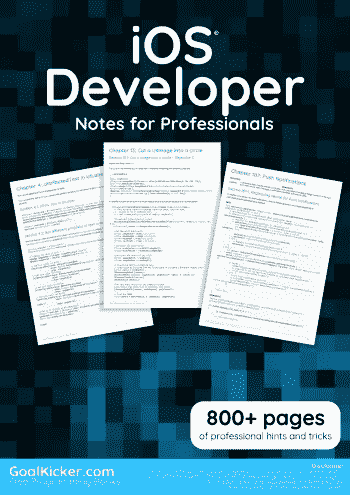
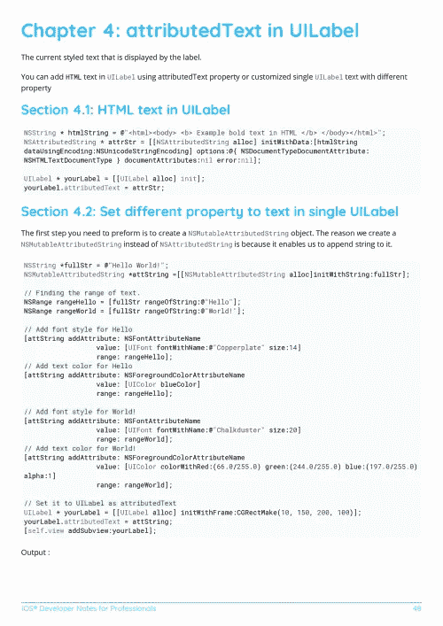
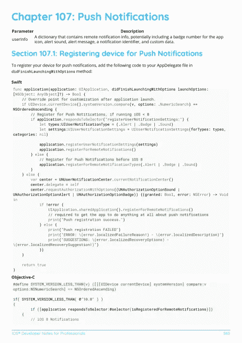

# 电子书:面向专业人士的 iOS 开发者笔记

> 原文：<https://medium.easyread.co/e-book-ios-developer-notes-for-professionals-book-fddb88512a75?source=collection_archive---------2----------------------->

## 免费下载 GoalKicker.com 的 iOS 开发者电子书

**下载这里:**[**【http://goalkicker.com/iOSBook/】**](http://goalkicker.com/iOSBook/)

*《iOS 开发者笔记专业人士用书》由* [*栈溢出文档*](https://archive.org/details/documentation-dump.7z) *编译而成，内容由栈溢出的漂亮人士撰写。文本内容由-SA 在知识共享协议下发布。见本书末尾的致谢，感谢对各章节做出贡献的人。除非另有说明，图像可能是其各自所有者的版权*

*本书为教育目的而创作，不隶属于 iOS 开发团队、公司或 Stack Overflow。所有商标属于其各自的公司所有者*

*886 页，2018 年 1 月出版*

# 章

1.  iOS 入门
2.  UILabel
3.  UILabel 文本下划线
4.  UILabel 中的 attributedText
5.  UIButton
6.  UIDatePicker
7.  局部通知
8.  UIImage
9.  将 NSAttributedString 转换为 UIImage
10.  UIImagePickerController
11.  UIImageView
12.  调整 UIImage 的大小
13.  将 UIImage 剪成圆形
14.  UITableView
15.  UITableViewController
16.  UIRefreshControl 表视图
17.  UITableViewCell
18.  选择 UITableViewCells 的自定义方法
19.  选择 UITableViewCells 的自定义方法
20.  UIView
21.  UIView 的快照
22.  UIAlertController
23.  UIColor
24.  UITextView
25.  UITextField 委托
26.  UINavigationController
27.  UIGestureRecognizer
28.  UIBarButtonItem
29.  UIScrollView
30.  UIStackView
31.  动态更新 UIStackView
32.  带有 StackView 子级的 UIScrollView
33.  UIScrollView 自动布局
34.  UITextField
35.  自定义 UITextField
36.  UIViewController
37.  UISwitch
38.  UICollectionView
39.  UISearchController
40.  UITabBarController
41.  UIWebView
42.  UIActivityViewController
43.  UIControl —用块处理事件
44.  UISplitViewController
45.  UISlider
46.  户外广告牌
47.  UIPageViewController
48.  UISplitViewController
49.  UIFont
50.  UIDevice
51.  使选择的 UIView 角变圆
52.  来自 XIB 文件的自定义 ui 视图
53.  UIBezierPath
54.  UIPickerView
55.  UIFeedbackGenerator
56.  UIAppearance
57.  具有 UICollectionView 的 UIKit 动态
58.  UIPheonix——简单、灵活、动态且高度可伸缩的 UI 框架
59.  UIKit 动态
60.  用户界面测试
61.  更改状态栏颜色
62.  UISegmentedControl
63.  在视图控制器之间传递数据
64.  管理键盘
65.  检查网络连接
66.  易接近
67.  自动布局
68.  MKMapView
69.  NSArray
70.  非属性字符串
71.  将 HTML 转换为无属性字符串，反之亦然
72.  NSTimer
73.  NSDate
74.  NSNotificationCenter
75.  NSURLSession
76.  NSUserDefaults
77.  NSHTTPCookieStorage
78.  NSURLConnection
79.  NSURL
80.  NSData
81.  NSInvocation
82.  不活跃
83.  n 预测
84.  NSBundle
85.  计算机动画
86.  并发
87.  CAGradientLayer
88.  Safari 服务
89.  卡拉耶
90.  iOS——用 Robbie Hanson 框架实现 XMPP
91.  Swift 和 Objective-C 互操作性
92.  自定义字体
93.  语音合成器
94.  本地化
95.  阿拉莫菲尔
96.  iBeacon
97.  CLLocation
98.  检查 iOS 版本
99.  通用链接
100.  在 iOS 中创建 PDF
101.  应用内购买
102.  CGContext 参考
103.  核心位置
104.  FacebookSDK
105.  AFNetworking
106.  CTCallCenter
107.  推送通知
108.  丰富推送通知的扩展— iOS 10。
109.  丰富的通知
110.  键值编码-键值观察
111.  初始化习惯用法
112.  故事板
113.  背景模式和事件
114.  浪子
115.  卡沙皮勒
116.  WKWebView
117.  UUID(全球唯一标识符)
118.  种类
119.  处理 URL 方案
120.  领域
121.  自动参考计数
122.  动态类型
123.  SWRevealViewController
124.  调度组
125.  大中央调度
126.  尺寸等级和适应性
127.  IBOutlets
128.  AWS SDK
129.  调试崩溃
130.  云套件
131.  游戏工具包
132.  从命令行构建和归档 Xcode
133.  XCTest 框架—单元测试
134.  AVPlayer 和 AVPlayerViewController
135.  iOS 中的深度链接
136.  核心图形
137.  塞格斯
138.  事件工具包
139.  诗丽吉
140.  联系人框架
141.  iOS 10 语音识别 API
142.  商店工具包
143.  代码签名
144.  创造。要使用 Applicationloader 上传到 appstore 的 ipa 文件
145.  尺寸等级和适应性
146.  MKDistanceFormatter
147.  3D 触摸
148.  GameCenter 排行榜
149.  钥匙链
150.  使用宏处理多种环境
151.  设置视图背景
152.  街区
153.  自动布局中的内容拥抱/内容压缩
154.  iOS Google Places API
155.  导航栏
156.  应用范围内的运营
157.  核心图像过滤器
158.  使用 CoreImage/OpenCV 进行人脸检测
159.  MPMediaPickerDelegate
160.  图表(核心图)
161.  Swift 中的 FCM 报文传送
162.  在 iOS 中创建自定义框架
163.  自定义键盘
164.  隔空投送
165.  SLComposeViewController
166.  iOS 中的 AirPrint 教程
167.  Carthage iOS 设置
168.  健康工具包
169.  iOS 中的核心亮点
170.  核心运动
171.  二维码扫描仪
172.  plist iOS
173.  WCSessionDelegate
174.  应用委托
175.  应用提交流程
176.  文件句柄
177.  基本文本文件输入输出
178.  iOS TTS
179.  MPVolumeView
180.  目标-C 关联对象
181.  在视图控制器之间传递数据(使用 MessageBox-Concept)
182.  MVVM
183.  缓存在线图像
184.  队列中的链块(使用 MKBlockQueue)
185.  模拟器
186.  背景模式
187.  OpenGL
188.  MVP 架构
189.  使用 CoreBluetooth 配置信标
190.  核心数据
191.  使用仪器的配置文件
192.  申请评级/审查请求
193.  MyLayout
194.  模拟器构建
195.  使用 GPX 文件模拟位置
196.  SqlCipher 集成
197.  安全性
198.  App 传输安全(ATS)
199.  选择最佳 iOS 架构模式的指南
200.  多播代理
201.  使用图像集
202.  Objective-C 中的运行时
203.  模型演示样式
204.  CydiaSubstrate tweak
205.  从图像创建视频
206.  可编码的
207.  异步加载图像
208.  添加 Swift 桥接报头
209.  创建应用 ID
210.  Swift:更改 AppDelegate 中的 rootViewController 以呈现主流程或登录/入职流程