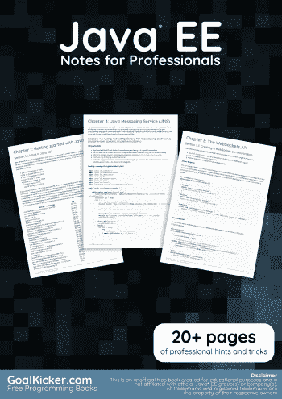
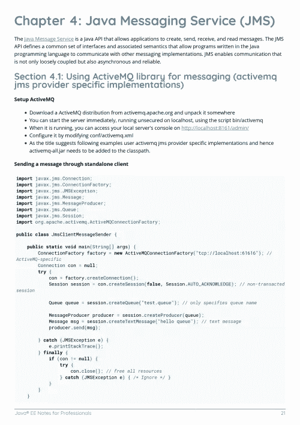
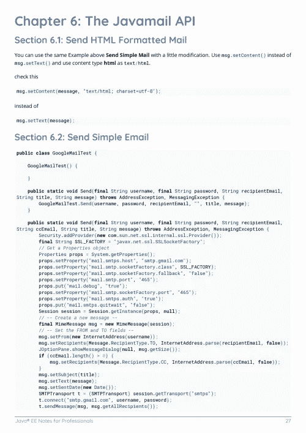

# 电子书:面向专业人士的 Java EE 笔记

> 原文：<https://medium.easyread.co/e-book-java-ee-notes-for-professionals-book-f722b804882c?source=collection_archive---------3----------------------->

## GoalKicker.com 免费下载 Java EE 的电子书

**下载这里:**[**【http://books.goalkicker.com/JavaEEBook/】**](http://books.goalkicker.com/JavaEEBook/)

*Java EE Notes for Professionals 本书由* [*栈溢出文档*](https://archive.org/details/documentation-dump.7z) *编译而成，内容是美人们在栈溢出时写的。文本内容由-SA 在知识共享协议下发布。见本书末尾的致谢，感谢对各章节做出贡献的人。除非另有说明，图像可能是其各自所有者的版权*

*为教育目的创建的图书，不隶属于 Java EE 组、公司或 Stack Overflow。所有商标属于其各自的公司所有者*

*32 页，2018 年 1 月出版*

# 章

1.  Java EE 入门
2.  Java RESTful Web 服务(JAX-RS)
3.  WebSockets API
4.  Java 消息服务(JMS)
5.  Java 连接器架构(JCA)
6.  Javamail API