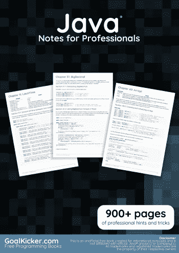
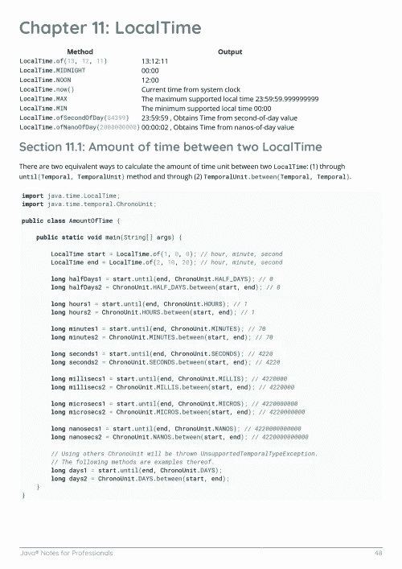
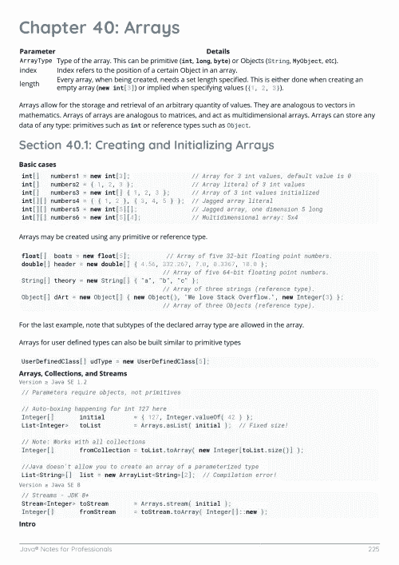

# 电子书:面向专业人士的 Java 笔记

> 原文：<https://medium.easyread.co/e-book-java-notes-for-professionals-book-7803693c1566?source=collection_archive---------3----------------------->

## GoalKicker.com 免费下载 Java 的电子书

**下载这里:**[**【http://goalkicker.com/JavaBook/】**](http://goalkicker.com/JavaBook/)

*《Java 专业人士笔记》一书由* [*栈溢出文档*](https://archive.org/details/documentation-dump.7z) *编译而成，内容是美人们在栈溢出时写的。文本内容由-SA 在知识共享协议下发布。见本书末尾的致谢，感谢对各章节做出贡献的人。除非另有说明，图像可能是其各自所有者的版权*

*本书为教育目的而创作，不隶属于 Java 集团、公司或 Stack Overflow。所有商标属于其各自的公司所有者*

*976 页，2018 年 1 月出版*

# 章

1.  Java 语言入门
2.  类型变换
3.  Getters 和 Setters
4.  参考数据类型
5.  Java 编译器—“javac”
6.  记录 Java 代码
7.  命令行参数处理
8.  Java 命令——“Java”和“javaw”
9.  日期类
10.  日期和时间(java.time.*)
11.  本地时间
12.  文字
13.  经营者
14.  原始数据类型
15.  构造器
16.  对象类方法和构造函数
17.  释文
18.  不可变类
19.  不可变对象
20.  可见性(控制对类成员的访问)
21.  无商标消费品
22.  类别和对象
23.  局部内部类
24.  嵌套类和内部类
25.  java.util.Objects 类
26.  默认方法
27.  包装
28.  遗产
29.  参考类型
30.  用线串
31.  字符串缓冲器
32.  StringBuilder
33.  字符串标记器
34.  将字符串拆分成固定长度的部分
35.  大整数
36.  控制台输入输出
37.  BigDecimal
38.  数字格式
39.  位操作
40.  数组
41.  流
42.  输入流和输出流
43.  读者和作者
44.  偏好；喜好；优先；参数选择
45.  收集
46.  队列和队列
47.  集合工厂方法
48.  另类收藏
49.  并发收款
50.  选择系列
51.  超级关键词
52.  序列化
53.  枚举
54.  枚举映射
55.  枚举集类
56.  以数字开头的枚举
57.  列表
58.  设置
59.  列表与集合
60.  地图
61.  LinkedHashMap
62.  树形图和树形集
63.  分类地图
64.  WeakHashMap
65.  散列表
66.  可选择的
67.  对象引用
68.  异常和异常处理
69.  日历及其子类
70.  使用 static 关键字
71.  属性类
72.  λ表达式
73.  基本控制结构
74.  缓冲写入器
75.  新文件输入/输出
76.  文件输入输出
77.  扫描仪
78.  接口
79.  正则表达式
80.  可比和比较
81.  Java 浮点运算
82.  货币和金钱
83.  对象克隆
84.  递归
85.  与字符串相互转换
86.  随机数生成
87.  一个
88.  自动装箱
89.  Java 中的 2D 图形
90.  JAXB
91.  类— Java 反射
92.  建立工作关系网
93.  NIO —网络
94.  HttpURLConnection
95.  JAX 新闻
96.  Nashorn JavaScript 引擎
97.  Java 本地接口
98.  功能界面
99.  流畅的界面
100.  出列接口
101.  远程方法调用(RMI)
102.  迭代器和可迭代的
103.  反射 API
104.  字节缓冲器
105.  程序
106.  公式
107.  Java 中的 JSON
108.  使用 JAXP API 解析 XML
109.  XML XPath 评估
110.  XOM — XML 对象模型
111.  多态性
112.  包装
113.  Java 代理
114.  Varargs(可变参数)
115.  日志记录(java.util.logging)
116.  log4j / log4j2
117.  甲骨文官方代码标准
118.  字符编码
119.  Apache Commons Lang
120.  本地化和国际化
121.  用 Fork/Join 框架进行并行编程
122.  非访问修饰符
123.  过程
124.  Java 本地访问
125.  模块
126.  并发编程(线程)
127.  执行器、执行器服务和线程池
128.  线程本地
129.  在多线程应用程序中使用 ThreadPoolExecutor。
130.  常见的 Java 陷阱
131.  Java 陷阱——异常用法
132.  Java 陷阱——语言语法
133.  Java 陷阱——线程和并发
134.  Java 陷阱——空值和空指针异常
135.  Java 陷阱——性能问题
136.  服务加载器
137.  类别载入器
138.  以编程方式创建图像
139.  原子类型
140.  RSA 加密
141.  安全对象
142.  安全和加密
143.  安全和加密
144.  安全经理
145.  JNDI
146.  sun.misc .不安全
147.  Java 内存模型
148.  Java 部署
149.  Java 插件系统实现
150.  JavaBean
151.  Java SE 7 特性
152.  Java SE 8 特性
153.  动态方法调度
154.  生成 Java 代码
155.  JShell
156.  堆栈审核 API
157.  套接字
158.  Java 套接字
159.  文件传输协议
160.  在 Java 中使用其他脚本语言
161.  C++比较
162.  声音的
163.  Java 打印服务
164.  可完成的未来
165.  运行时命令
166.  单元测试
167.  维护
168.  多版本 JAR 文件
169.  实时(JIT)编译器
170.  字节码修改
171.  反汇编和反编译
172.  JMX
173.  Java 虚拟机(JVM)
174.  XJC
175.  JVM 标志
176.  JVM 工具接口
177.  Java 内存管理
178.  Java 性能调优
179.  基准
180.  文件上传到 AWS
181.  AppDynamics 和 TIBCO business works Instrumentation 易于集成
182.  安装 Java(标准版)
183.  Java 版本、版本、发行版和分发版
184.  类路径
185.  资源(在类路径上)