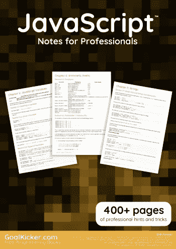
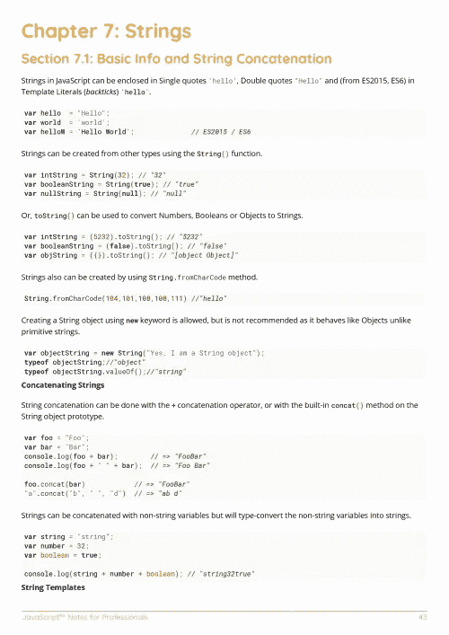
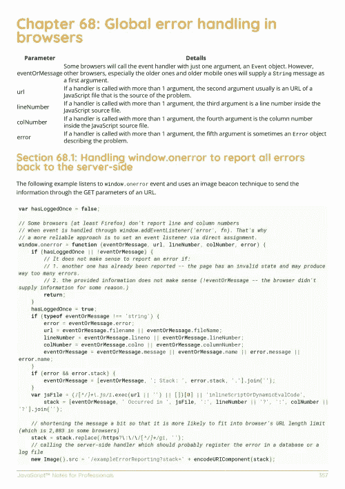

# 电子书:面向专业人士的 JavaScript 笔记

> 原文：<https://medium.easyread.co/e-book-javascript-notes-for-professionals-book-17747516b587?source=collection_archive---------4----------------------->

## 免费下载 GoalKicker.com 的 Javascript 电子书

**下载这里:**[**【http://goalkicker.com/JavaScriptBook/】**](http://goalkicker.com/JavaScriptBook/)

*JavaScript Notes for Professionals 一书由* [*栈溢出文档*](https://archive.org/details/documentation-dump.7z) *编译而成，内容由栈溢出达人撰写。文本内容由-SA 在知识共享协议下发布。见本书末尾的致谢，感谢对各章节做出贡献的人。除非另有说明，图像可能是其各自所有者的版权*

*本书以教育为目的，不隶属于 JavaScript 集团、公司或 Stack Overflow。所有商标属于其各自的公司所有者*

*480 页，2018 年 1 月出版*

# 章

1.  JavaScript 入门
2.  JavaScript 变量
3.  内置常数
4.  Javascript 中的数据类型
5.  按位运算符
6.  算术(数学)
7.  用线串
8.  日期
9.  日期比较
10.  比较操作
11.  构造函数
12.  情况
13.  评论
14.  数组
15.  目标
16.  声明和转让
17.  环
18.  功能
19.  函数 JavaScript
20.  原型、对象
21.  班级
22.  命名空间
23.  复试
24.  背景(这个)
25.  Setters 和 Getters
26.  事件
27.  遗产
28.  方法链接
29.  间隔和超时
30.  安慰
31.  正则表达式
32.  饼干
33.  数据属性
34.  JSON
35.  创建交互式、快速动态网页应用的网页开发技术
36.  列举
37.  地图
38.  时间戳
39.  一元运算符
40.  错误处理
41.  发电机
42.  承诺
43.  异步函数(异步/等待)
44.  一组
45.  模态-提示
46.  execCommand 和内容可编辑
47.  历史
48.  导航对象
49.  浏览器对象模型
50.  事件循环
51.  严格模式
52.  自定义元素
53.  数据操作
54.  二进制数据
55.  模板文字
56.  取得
57.  范围
58.  模块
59.  屏幕
60.  可变强制/转换
61.  解构分配
62.  网络存储
63.  WebSockets
64.  箭头功能
65.  工人
66.  创造性的设计模式
67.  requestAnimationFrame
68.  浏览器中的全局错误处理
69.  尾部调用优化
70.  检测浏览器
71.  标志
72.  运输文件
73.  单元测试 Javascript
74.  排除故障
75.  自动分号插入— ASI
76.  本地化
77.  地理定位
78.  索引 b
79.  模块化技术
80.  代理人
81.  。postMessage()和 MessageEvent
82.  WeakMap
83.  WeakSet
84.  转义序列
85.  行为设计模式
86.  服务器发送的事件
87.  异步迭代器
88.  如何在异步回调函数中使用迭代器
89.  波浪号~
90.  按位运算符-真实世界示例(片段)
91.  使用 javascript 获取/设置 CSS 自定义变量
92.  选择 API
93.  文件 API、Blobs 和文件读取器
94.  通知 API
95.  振动 API
96.  电池状态 API
97.  流畅的 API
98.  网络加密 API
99.  安全问题
100.  同源策略和跨源沟通
101.  评估 JavaScript
102.  Linters —确保代码质量
103.  反模式
104.  性能提示
105.  记忆效率
106.  附录 A:保留关键字