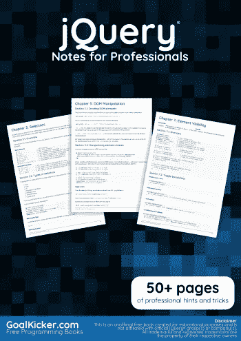
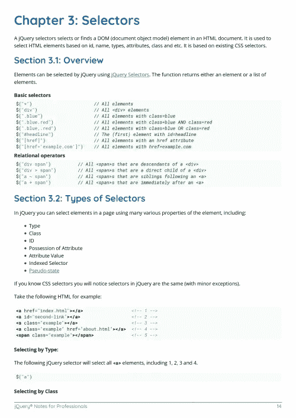
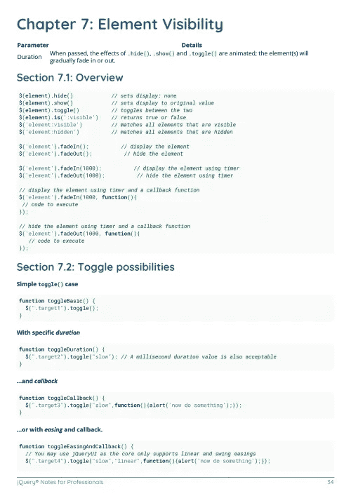

# 电子书:jQuery 专业人员笔记

> 原文：<https://medium.easyread.co/e-book-jquery-notes-for-professionals-book-af72fbc25e44?source=collection_archive---------14----------------------->

## GoalKicker.com 免费下载 jQuery 的电子书

**下载这里:**[**【http://goalkicker.com/jQueryBook/】**](http://goalkicker.com/jQueryBook/)

*《jQuery 专业人士须知》一书由* [*栈溢出文档*](https://archive.org/details/documentation-dump.7z) *编译而成，内容由栈溢出达人撰写。文本内容由-SA 在知识共享协议下发布。见本书末尾的致谢，感谢对各章节做出贡献的人。除非另有说明，图像可能是其各自所有者的版权*

*为教育目的创建的图书，不隶属于 jQuery group、公司或 Stack Overflow。所有商标属于其各自的公司所有者*

*66 页，2018 年 1 月出版*

# 章

1.  jQuery 入门
2.  埃阿斯
3.  选择器
4.  文档就绪事件
5.  DOM 操作
6.  DOM 遍历
7.  元素可见性
8.  事件
9.  插件
10.  预先考虑
11.  附加
12.  获取和设置元素的宽度和高度
13.  CSS 操作
14.  属性
15.  jQuery。animate()方法
16.  jQuery 延迟对象和承诺
17.  复选框全选，在其他复选框更改时自动选中/取消选中
18.  每个功能