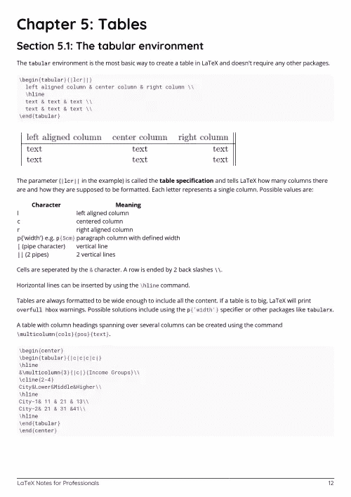

# 电子书:乳胶笔记专业书籍

> 原文：<https://medium.easyread.co/e-book-latex-notes-for-professionals-book-7d03cebbd862?source=collection_archive---------12----------------------->

## GoalKicker.com 免费下载 LaTex 的电子书

**下载这里:**[**【http://goalkicker.com/LaTeXBook/】**](http://goalkicker.com/LaTeXBook/)

*《专业人士乳胶笔记》一书由* [*栈溢出文档*](https://archive.org/details/documentation-dump.7z) *编译而成，内容由栈溢出的美人写。文本内容由-SA 在知识共享协议下发布。见本书末尾的致谢，感谢对各章节做出贡献的人。除非另有说明，图像可能是其各自所有者的版权*

*本书为教育目的而创作，不隶属于 LaTeX 集团、公司或 Stack Overflow。所有商标属于其各自的公司所有者*

*60 页，2018 年 1 月出版*

# 章

1.  乳胶入门
2.  标题页
3.  页眉和页脚
4.  文本格式
5.  桌子
6.  排字数学
7.  创建书目
8.  添加引文
9.  计数器、if 语句和 LaTeX 循环
10.  文档类别
11.  绘制图表
12.  使用 beamer 套装进行演示
13.  定义宏
14.  构建工具
15.  访问 LaTeX 包的文档
16.  使用 beamer 创建海报
17.  雕刻乐谱