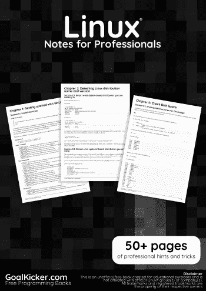
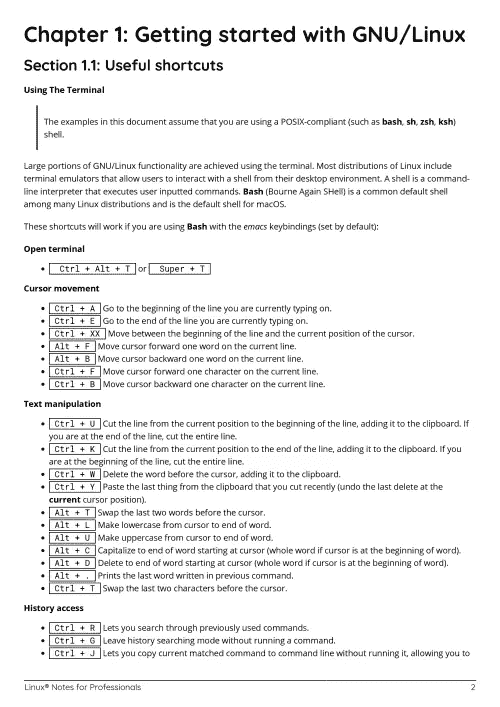
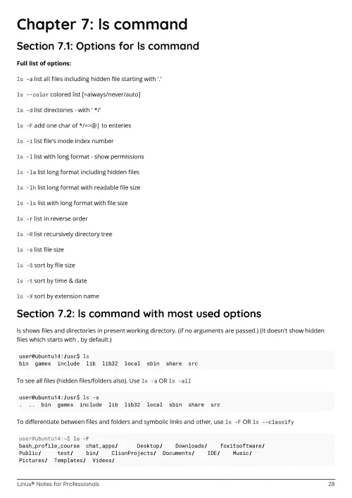

# 电子书:Linux 专业人士笔记

> 原文：<https://medium.easyread.co/e-book-linux-notes-for-professionals-book-127a30f1658a?source=collection_archive---------12----------------------->

## 免费下载 GoalKicker.com 的 Linux 电子书

**下载这里:**[**【http://goalkicker.com/LinuxBook/】**](http://goalkicker.com/LinuxBook/)

*Linux Notes for Professionals 本书由* [*栈溢出文档*](https://archive.org/details/documentation-dump.7z) *编译而成，内容由栈溢出的美文人士撰写。文本内容由-SA 在知识共享协议下发布。见本书末尾的致谢，感谢对各章节做出贡献的人。除非另有说明，图像可能是其各自所有者的版权*

*本书为教育目的而创作，不隶属于 Linux 集团、公司或 Stack Overflow。所有商标属于其各自的公司所有者*

*65 页，2018 年 1 月出版*

# 章

1.  GNU/Linux 入门
2.  检测 Linux 发行版名称和版本
3.  获取正在运行的 Linux 内核的信息
4.  壳
5.  检查磁盘空间
6.  获取系统信息
7.  ls 命令
8.  使用“tar”命令压缩文件
9.  服务
10.  管理服务
11.  修改用户
12.  灯组
13.  三通命令
14.  安全外壳(SSH)
15.  单细胞蛋白质
16.  GnuPG (GPG)
17.  网络结构
18.  午夜指挥官
19.  更改根目录(chroot)
20.  包管理器
21.  编译 Linux 内核