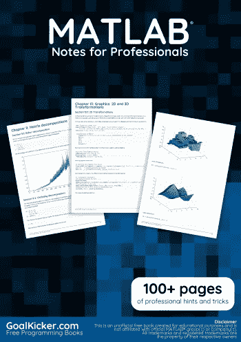
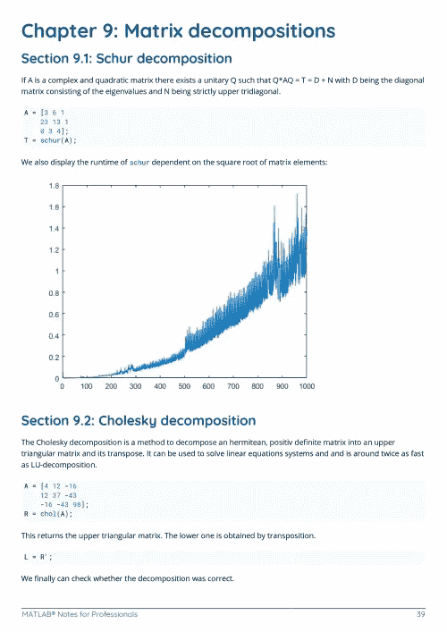
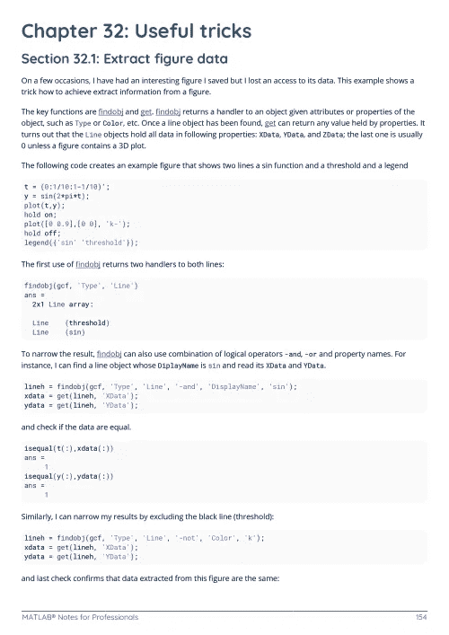

# 电子书:MATLAB 专业笔记

> 原文：<https://medium.easyread.co/e-book-matlab-notes-for-professionals-book-c32998e85282?source=collection_archive---------14----------------------->

## GoalKicker.com 免费下载 Matlab 的电子书

**下载这里:**[**【http://goalkicker.com/MATLABBook/】**](http://goalkicker.com/MATLABBook/)

*《MATLAB 专业人员笔记》一书由* [*栈溢出文档*](https://archive.org/details/documentation-dump.7z) *编译而成，内容由栈溢出的美人写。文本内容由-SA 在知识共享协议下发布。见本书末尾的致谢，感谢对各章节做出贡献的人。除非另有说明，图像可能是其各自所有者的版权*

*本书为教育目的而创作，不隶属于 MATLAB 集团、公司或 Stack Overflow。所有商标属于其各自的公司所有者*

*179 页，2018 年 1 月出版*

# 章

1.  MATLAB 语言入门
2.  功能
3.  记录功能
4.  使用带有逻辑输出的函数
5.  情况
6.  集合操作
7.  对于循环
8.  初始化矩阵或数组
9.  矩阵分解
10.  面向对象编程
11.  …向量化…
12.  图形:2D 线图
13.  图形:2D 和 3D 变换
14.  在 Matlab 中控制子图着色
15.  图像处理
16.  图画
17.  排除故障
18.  金融应用
19.  傅立叶变换和傅立叶逆变换
20.  常微分方程解算器
21.  MATLAB 插值
22.  综合
23.  读取大文件
24.  “accumarray()”函数的用法
25.  MEX API 简介
26.  绩效和基准
27.  多线程操作
28.  使用串行端口
29.  未记录的功能
30.  MATLAB 最佳实践
31.  MATLAB 用户界面
32.  有用的技巧
33.  常见错误和失误