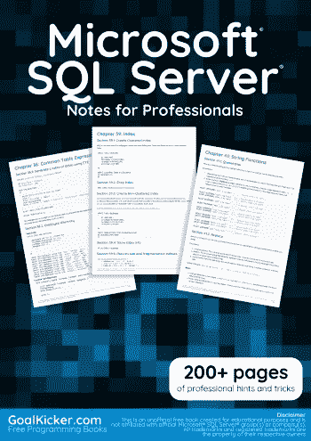
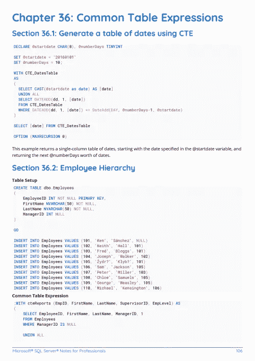
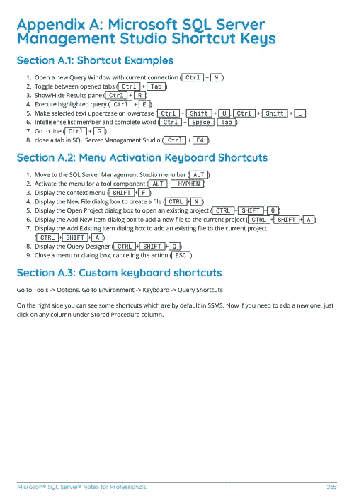

# 电子书:微软 SQL Server 专业人员笔记

> 原文：<https://medium.easyread.co/e-book-microsoft-sql-server-notes-for-professionals-book-49f1338517?source=collection_archive---------3----------------------->

## GoalKicker.com 免费下载 SQL 女士的电子书

**下载这里:**[**【http://goalkicker.com/MicrosoftSQLServerBook/】**](http://goalkicker.com/MicrosoftSQLServerBook/)

*《Microsoft SQL Server Notes for Professionals》一书由* [*栈溢出文档*](https://archive.org/details/documentation-dump.7z) *编译而成，内容由栈溢出的美人计撰写。文本内容由-SA 在知识共享协议下发布。见本书末尾的致谢，感谢对各章节做出贡献的人。除非另有说明，图像可能是其各自所有者的版权*

*本书为教育目的而创作，不隶属于 Microsoft SQL Server group、公司或 Stack Overflow。所有商标属于其各自的公司所有者*

*285 页，2018 年 1 月出版*

# 章

1.  Microsoft SQL Server 入门
2.  数据类型
3.  转换数据类型
4.  用户定义的表类型
5.  选择指令
6.  SQL Server 中的别名
7.  无效的
8.  变量
9.  日期
10.  生成日期范围
11.  数据库快照
12.  联合
13.  如果…否则
14.  选择语句
15.  插入
16.  合并
17.  创建视图
18.  视图
19.  联盟
20.  尝试/抓住
21.  WHILE 循环
22.  过度条款
23.  分组依据
24.  以...排序
25.  填充功能
26.  SQL Server 中的 JSON
27.  OPENJSON
28.  对于 JSON
29.  使用 JSON 数据的查询
30.  将 JSON 存储在 SQL 表中
31.  修改 JSON 文本
32.  FOR XML 路径
33.  加入
34.  交叉应用
35.  计算列
36.  常用表表达式
37.  在表之间移动和复制数据
38.  限制结果集
39.  检索有关实例的信息
40.  带领带选项
41.  字符串函数
42.  逻辑函数
43.  聚合函数
44.  SQL Server 中的字符串聚合函数
45.  排名功能
46.  窗口功能
47.  透视/取消透视
48.  动态 SQL 透视
49.  分割
50.  存储过程
51.  检索关于数据库的信息
52.  SQL Server 中的拆分字符串函数
53.  插入
54.  主键
55.  外键
56.  上次插入的身份
57.  作用域标识()
58.  顺序
59.  索引
60.  全文索引
61.  引发
62.  光标
63.  事务隔离级别
64.  高级选项
65.  移民
66.  表值参数
67.  数据库邮件
68.  内存中 OLTP (Hekaton)
69.  时态表
70.  临时表的使用
71.  计划的任务或作业
72.  隔离级别和锁定
73.  对行进行排序/排序
74.  特权或权限
75.  SQLCMD
76.  资源调控器
77.  文件组
78.  MS SQL Server 中的基本 DDL 操作
79.  子查询
80.  页码
81.  聚集列存储
82.  Parsename
83.  在 Windows 上安装 SQL Server
84.  分析查询
85.  查询提示
86.  查询存储
87.  按页面查询结果
88.  计划
89.  备份和恢复数据库
90.  事务处理
91.  本机编译的模块(Hekaton)
92.  空间坐标数据
93.  动态 SQL
94.  动态数据屏蔽
95.  使用 SQLCMD 导出 txt 文件中的数据
96.  公共语言运行时集成
97.  分隔特殊字符和保留字
98.  DBCC
99.  批量进口
100.  服务经纪人
101.  权限和安全性
102.  数据库权限
103.  行级安全性
104.  加密
105.  幻像读取
106.  文件流
107.  bcp(批量复制程序)实用程序
108.  SQL Server 在不同版本中的演变(2000–2016)
109.  SQL Server Management Studio (SSMS)
110.  管理 Azure SQL 数据库
111.  系统数据库—临时数据库
112.  Microsoft SQL Server Management Studio 快捷键