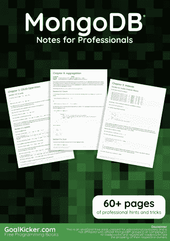
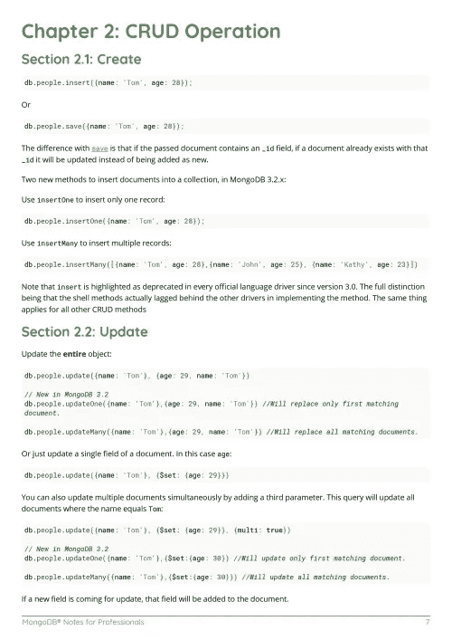
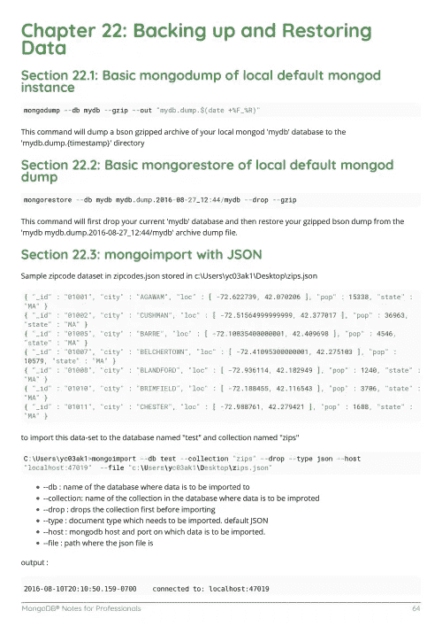

# 电子书:MongoDB 专业人士笔记

> 原文：<https://medium.easyread.co/e-book-mongodb-notes-for-professionals-book-9b66622dba54?source=collection_archive---------11----------------------->

## GoalKicker.com 免费下载 MongoDB 的电子书

**下载这里:**[**【http://goalkicker.com/MongoDBBook/】**](http://goalkicker.com/MongoDBBook/)

*MongoDB 专业人士笔记一书由* [*栈溢出文档*](https://archive.org/details/documentation-dump.7z) *编译而成，内容由栈溢出达人撰写。文本内容由-SA 在知识共享协议下发布。见本书末尾的致谢，感谢对各章节做出贡献的人。除非另有说明，图像可能是其各自所有者的版权*

*本书以教育为目的，不隶属于 MongoDB 集团、公司或 Stack Overflow。所有商标属于其各自的公司所有者*

*73 页，2018 年 1 月出版*

# 章

1.  MongoDB 入门
2.  CRUD 操作
3.  获取数据库信息
4.  查询数据(入门)
5.  更新运算符
6.  插页和插页
7.  收集
8.  聚合
9.  指数
10.  批量操作
11.  二维球面指数
12.  可插拔存储引擎
13.  Java 驱动程序
14.  Python 驱动程序
15.  作为碎片的蒙哥
16.  分身术
17.  作为副本集的 Mongo
18.  MongoDB —配置一个复制集以支持 TLS/SSL
19.  MongoDB 中的认证机制
20.  MongoDB 授权模型
21.  配置
22.  备份和恢复数据
23.  升级 MongoDB 版本