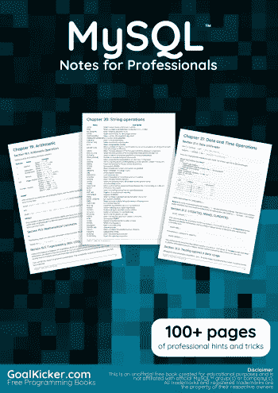
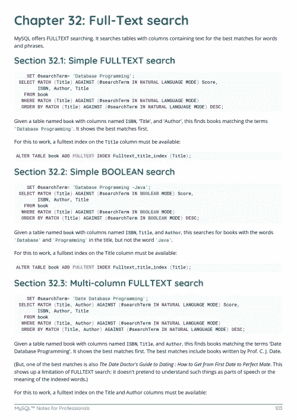
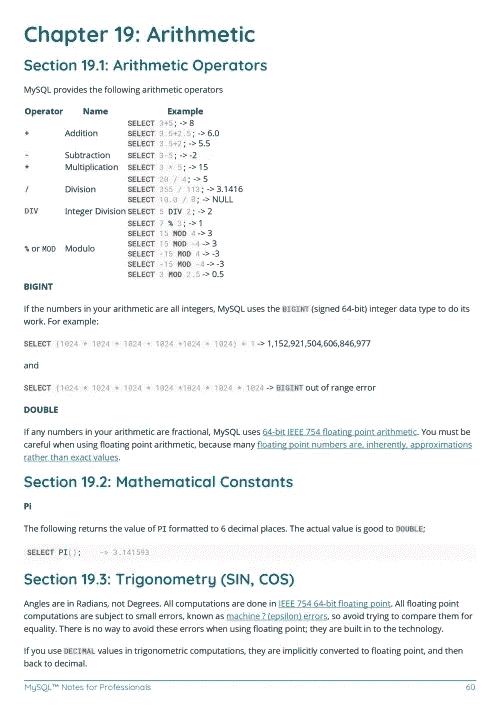

# 电子书:MySQL 专业人士笔记

> 原文：<https://medium.easyread.co/e-book-mysql-notes-for-professionals-book-c1a85858901a?source=collection_archive---------9----------------------->

## GoalKicker.com 免费下载 MySQL 的电子书

**下载这里:**[**【http://goalkicker.com/MySQLBook/】**](http://goalkicker.com/MySQLBook/)

*MySQL Notes for Professionals 一书由* [*栈溢出文档*](https://archive.org/details/documentation-dump.7z) *编译而成，内容由栈溢出的漂亮人撰写。文本内容由-SA 在知识共享协议下发布。见本书末尾的致谢，感谢对各章节做出贡献的人。除非另有说明，图像可能是其各自所有者的版权*

*本书以教育为目的，不隶属于 MySQL 集团、公司或 Stack Overflow。所有商标属于其各自的公司所有者*

*197 页，2018 年 1 月出版*

# 章

1.  MySQL 入门
2.  数据类型
3.  挑选
4.  反勾号
5.  空
6.  极限和偏移
7.  创建数据库
8.  使用变量
9.  评论 MySQL
10.  插入
11.  删除
12.  更新
13.  以...排序
14.  分组依据
15.  错误 1055:ONLY _ FULL _ GROUP _ BY:GROUP BY 子句中没有某些内容…
16.  连接
17.  联接:联接 3 个具有相同 id 名称的表。
18.  联盟
19.  算术
20.  字符串操作
21.  日期和时间操作
22.  处理时区
23.  正则表达式
24.  视角
25.  表格创建
26.  更改表格
27.  翻桌
28.  MySQL 锁表
29.  错误代码
30.  存储例程(过程和函数)
31.  索引和键
32.  全文搜索
33.  准备陈述
34.  JSON
35.  从 JSON 类型中提取值
36.  MySQL 管理
37.  扳机
38.  配置和调整
39.  事件
40.  枚举
41.  用 Docker-Compose 安装 Mysql 容器
42.  字符集和归类
43.  米萨姆发动机
44.  从 MyISAM 转换到 InnoDB
45.  交易
46.  日志文件
47.  使聚集
48.  分割
49.  分身术
50.  使用 mysqldump 备份
51.  mysqlimport
52.  将数据装入文件
53.  MySQL 联盟
54.  MySQL 客户端
55.  临时表
56.  定制 PS1
57.  处理稀疏或缺失的数据
58.  使用各种编程语言连接 UTF-8。
59.  亚秒精度的时间
60.  一对多
61.  服务器信息
62.  SSL 连接设置
63.  创建新用户
64.  通过授权获得安全性
65.  修改口令
66.  恢复并重置 MySQL 5.7+的默认根密码
67.  从丢失的根密码中恢复
68.  MySQL 性能提示
69.  性能调整
70.  保留字