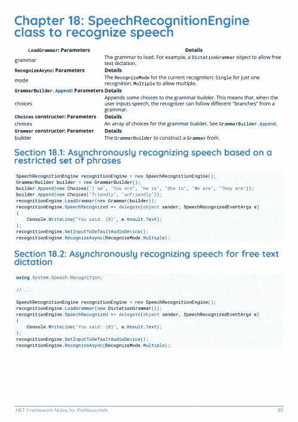

# 电子书:。NET Framework 专业人员手册

> 原文：<https://medium.easyread.co/e-book-net-framework-notes-for-professionals-book-5a29fac732e9?source=collection_archive---------7----------------------->

## 下载。NET 框架的电子书由 GoalKicker.com 免费提供

**下载这里:**[**【http://goalkicker.com/DotNETFrameworkBook/】**](http://goalkicker.com/DotNETFrameworkBook/)

*这个。NET Framework 专业人士须知本书是由* [*栈溢出文档*](https://archive.org/details/documentation-dump.7z) *编译而成，内容是由擅长栈溢出的漂亮人士编写的。文本内容由-SA 在知识共享协议下发布。见本书末尾的致谢，感谢对各章节做出贡献的人。除非另有说明，图像可能是其各自所有者的版权*

*为教育目的创作的图书，不隶属于。NET Framework 组、公司或堆栈溢出。所有商标属于其各自的公司所有者*

*191 页，2018 年 1 月出版*

# 章

1.  开始使用。NET 框架
2.  收集
3.  XmlSerializer
4.  HTTP 客户端
5.  例外
6.  LINQ
7.  建立工作关系网
8.  NuGet 包装系统
9.  反射
10.  字典
11.  HTTP 服务器
12.  设置
13.  任务并行库
14.  自定义类型
15.  日期时间解析
16.  内存管理
17.  托管扩展性框架
18.  SpeechRecognitionEngine 识别语音的引擎类
19.  系统。Reflection.Emit 命名空间
20.  系统。runtime . caching . memory cache(object cache)
21.  JSON 序列化
22.  第三方物流数据流
23.  文件输入/输出
24.  平台调用
25.  代码合同
26.  VB 窗体
27.  为每一个
28.  用线串
29.  表达式树
30.  穿线
31.  系统。诊断学
32.  阿多。网
33.  清除（clear 的缩写）
34.  进程和线程关联性设置
35.  依赖注入
36.  ASP.NET MVC 的全球化使用 ASP 的智能国际化。网
37.  任务并行库(TPL) API 概述
38.  系统。超正析象管(Image Orthicon)
39.  单元测试
40.  串行端口
41.  系统。IO.File 类
42.  同步上下文
43.  使用进度<t>和 IProgress</t>
44.  只读集合
45.  正则表达式(系统。Text .正则表达式)
46.  系统。网络邮件
47.  加密/密码术
48.  并行处理使用。Net 框架
49.  JSON 在。用 Newtonsoft。Json
50.  。网络核心
51.  JIT 编译器
52.  堆栈和堆
53.  在 C#中使用 SHA1
54.  碎片帐集
55.  读取和写入 Zip 文件
56.  写入和读取 StdErr 流
57.  上传文件并将数据发布到 web 服务器
58.  缩略词词汇表