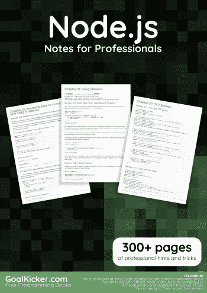
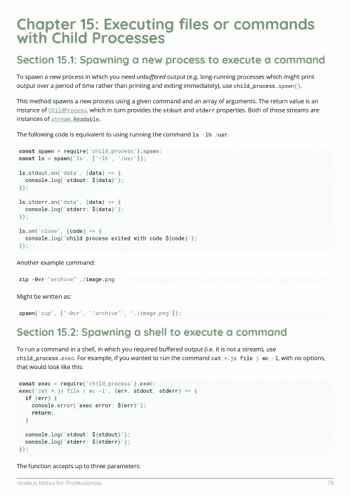
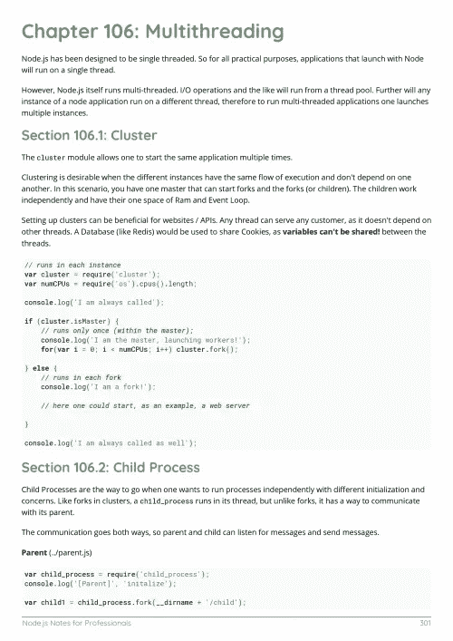

# 电子书:Node.js 专业人士笔记

> 原文：<https://medium.easyread.co/e-book-node-js-notes-for-professionals-book-e13db79d7b08?source=collection_archive---------0----------------------->

## GoalKicker.com 免费下载 Node Js 的电子书

**下载这里:**[**【http://goalkicker.com/NodeJSBook/】**](http://goalkicker.com/NodeJSBook/)

*node . js 专业人士须知本书由* [*栈溢出文档*](https://archive.org/details/documentation-dump.7z) *编译而成，内容由栈溢出的漂亮人士撰写。文本内容由-SA 在知识共享协议下发布。见本书末尾的致谢，感谢对各章节做出贡献的人。除非另有说明，图像可能是其各自所有者的版权*

*为教育目的创建的图书，不隶属于 Node.js 集团、公司或 Stack Overflow。所有商标属于其各自的公司所有者*

*332 页，2018 年 1 月出版*

# 章

1.  Node.js 入门
2.  npm
3.  带 Express 的 Web 应用程序
4.  文件系统输入/输出
5.  导出和使用模块
6.  在 node.js 中导出和导入模块
7.  模块是如何加载的
8.  集群模块
9.  阅读线
10.  package.json
11.  事件发射器
12.  更改时自动重新加载
13.  环境
14.  回拨至承诺
15.  用子进程执行文件或命令
16.  异常处理
17.  保持节点应用程序持续运行
18.  卸载 Node.js
19.  nvm —节点版本管理器
20.  超文本传送协议（Hyper Text Transport Protocol 的缩写）
21.  使用流
22.  在生产中部署 Node.js 应用程序
23.  保护 Node.js 应用程序
24.  猫鼬图书馆
25.  异步. js
26.  文件上传
27.  Socket.io 通信
28.  Mongodb 集成
29.  在 Node.js 中处理 POST 请求
30.  简单的基于 REST 的 CRUD API
31.  模板框架
32.  Node.js 架构和内部工作方式
33.  调试 Node.js 应用程序
34.  没有框架的节点服务器
35.  节点。带 ES6 的 JS
36.  与控制台交互
37.  卡珊德拉整合
38.  使用 Node.js 创建 API
39.  正常关机
40.  使用 IISNode 在 IIS 中托管 Node.js Web 应用程序
41.  硬币指示器 （coin-levelindicator 的缩写）命令行界面（Command Line Interface for batch scripting）
42.  NodeJS 框架
43.  咕哝
44.  对节点使用 WebSocket。射流研究…
45.  金属加工技工
46.  解析命令行参数
47.  客户端-服务器通信
48.  Node.js 设计基础
49.  连接到 Mongodb
50.  性能挑战
51.  发送 Web 通知
52.  节点中的远程调试。射流研究…
53.  数据库(MongoDB 和 Mongoose)
54.  良好的编码风格
55.  Restful API 设计:最佳实践
56.  交付 HTML 或任何其他类型的文件
57.  TCP 套接字
58.  砍
59.  蓝鸟承诺
60.  异步/等待
61.  Koa 框架 v2
62.  单元测试框架
63.  带有 Node.js 的 ECMAScript 2015 (ES6)
64.  用 Express 路由 ajax 请求。射流研究…
65.  向客户端发送文件流
66.  带有 Redis 的节点
67.  使用 Browserfiy 解决浏览器的“必需”错误
68.  节点。JS 和 MongoDB。
69.  护照整合
70.  依赖注入
71.  NodeJS 初学者指南
72.  Node.js 的使用案例
73.  Sequelize.js
74.  PostgreSQL 集成
75.  MySQL 集成
76.  MySQL 连接池
77.  MSSQL 集成
78.  Node.js 与 Oracle
79.  nodejs 中的同步与异步编程
80.  Node.js 错误管理
81.  Node.js v6 的新特性和改进
82.  事件循环
83.  节点历史
84.  passport.js
85.  异步编程
86.  不使用任何库的标准输入和标准输出的 Node.js 代码
87.  面向 Node.js/Express.js 的 MongoDB 集成
88.  洛达什
89.  节点 js 中的 csv 解析器
90.  回送—基于 REST 的连接器
91.  将 node.js 作为服务运行
92.  CORS 的 Node.js
93.  节点概要分析入门
94.  Node.js 性能
95.  纱线包装经理
96.  OAuth 2.0
97.  节点 JS 本地化
98.  不停机部署 Node.js 应用程序。
99.  带有 angular.js 示例代码的 Node.js (express.js)
100.  节点路由
101.  创建一个支持承诺和错误优先回调的 Node.js 库
102.  项目结构
103.  避免回调地狱
104.  Arduino 与 nodeJs 通信
105.  美国石油学会
106.  多线程操作
107.  node.js 下的 Windows 身份验证
108.  需要()
109.  ExpressJS 的路由控制器服务结构
110.  推送通知
111.  安装 Node.js