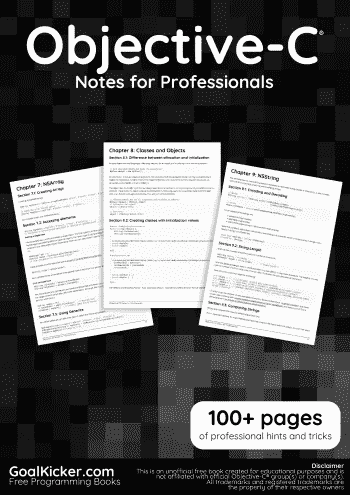
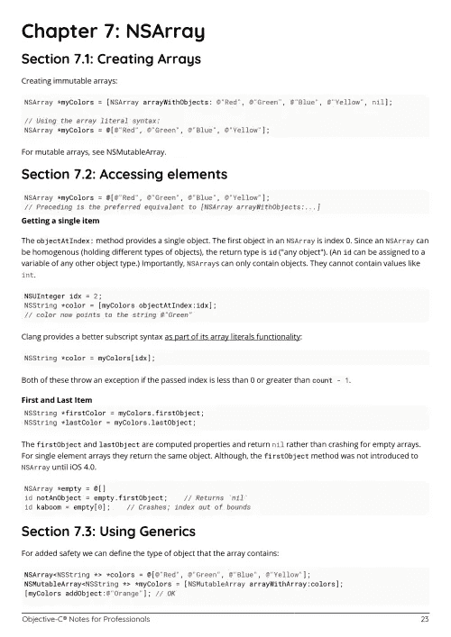
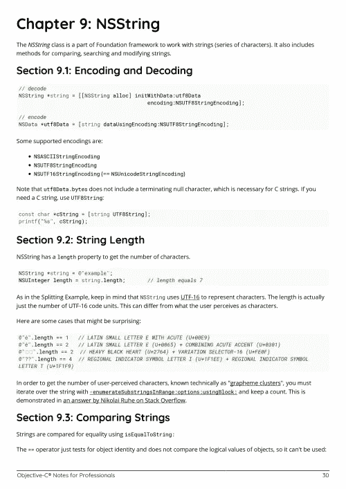

# 电子书:目标-专业人员笔记

> 原文：<https://medium.easyread.co/e-book-objective-c-notes-for-professionals-book-9b2e9df9b66b?source=collection_archive---------7----------------------->

## GoalKicker.com 免费下载目标 C 的电子书

**下载这里:**[**【http://goalkicker.com/ObjectiveCBook/】**](http://goalkicker.com/ObjectiveCBook/)

*《Objective-C 专业人员笔记》一书由* [*栈溢出文档*](https://archive.org/details/documentation-dump.7z) *编译而成，内容由栈溢出的漂亮人士编写。文本内容由-SA 在知识共享协议下发布。见本书末尾的致谢，感谢对各章节做出贡献的人。除非另有说明，图像可能是其各自所有者的版权*

*为教育目的创建的图书，不隶属于 Objective-C 集团、公司或 Stack Overflow。所有商标属于其各自的公司所有者*

*129 页，2018 年 1 月出版*

# 章

1.  Objective-C 语言入门
2.  协议
3.  阻碍
4.  种类
5.  键值编码/键值观察
6.  记录
7.  NSArray
8.  类别和对象
9.  NSString
10.  NSDictionary
11.  NSDictionary
12.  低级运行时环境
13.  NSArray
14.  NSURL
15.  方法
16.  错误处理
17.  枚举
18.  NSData
19.  随机整数
20.  性能
21.  NSDate
22.  n 预测
23.  NSMutableArray
24.  NSRegularExpression
25.  非标准化
26.  内存管理
27.  一个
28.  NSCalendar
29.  NSMutableDictionary
30.  多线程
31.  非属性字符串
32.  NSTimer
33.  结构
34.  订阅
35.  基本数据类型
36.  使用 Xcode 进行单元测试
37.  快速枚举
38.  NSSortDescriptor
39.  遗产
40.  NSTextAttachment
41.  NSUrl 发送发布请求
42.  布尔/布尔/布尔/ NSCFBoolean
43.  协议和代表
44.  XML 解析
45.  声明类方法和实例方法
46.  预定义宏
47.  NSCache
48.  中央调度中心
49.  继续和打破！
50.  格式规范
51.  n 对象
52.  现代目标-C
53.  NSUserDefaults