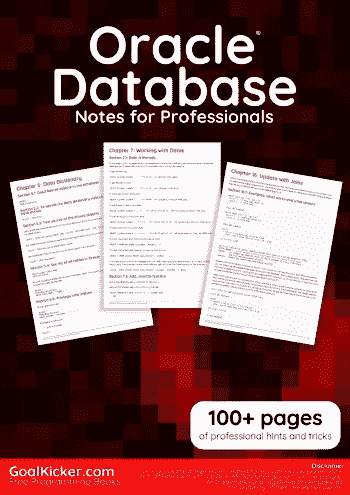
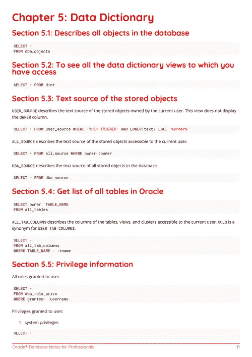
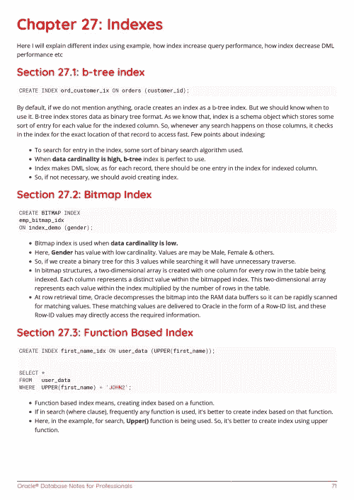

# 电子书:Oracle 数据库专业人员笔记

> 原文：<https://medium.easyread.co/e-book-oracle-database-notes-for-professionals-book-6481a5464e50?source=collection_archive---------4----------------------->

## GoalKicker.com 免费下载甲骨文电子书

**下载这里:**[**【http://goalkicker.com/OracleDatabaseBook/】**](http://goalkicker.com/OracleDatabaseBook/)

*《Oracle 数据库专业人员须知》一书由* [*栈溢出文档*](https://archive.org/details/documentation-dump.7z) *编译而成，内容由栈溢出方面的美文人士撰写。文本内容由-SA 在知识共享协议下发布。见本书末尾的致谢，感谢对各章节做出贡献的人。除非另有说明，图像可能是其各自所有者的版权*

*本书为教育目的而创作，不隶属于 Oracle 数据库集团、公司或 Stack Overflow。所有商标属于其各自的公司所有者*

*118 页，2018 年 1 月出版*

# 章

1.  Oracle 数据库入门
2.  PL/SQL 入门
3.  匿名 PL/SQL 块
4.  PL/SQL 过程
5.  数据字典
6.  日期
7.  使用日期
8.  对偶表
9.  连接
10.  处理空值
11.  字处理
12.  IF-THEN-ELSE 语句
13.  限制查询返回的行数(分页)
14.  使用 WITH 子句的递归子查询分解(也称为公用表表达式)
15.  更新记录的不同方式
16.  使用联接更新
17.  功能
18.  统计功能
19.  窗口功能
20.  创建上下文
21.  拆分分隔字符串
22.  收藏和记录
23.  对象类型
24.  环
25.  光标
26.  顺序
27.  指数
28.  暗示
29.  包装
30.  异常处理
31.  错误记录
32.  数据库链接
33.  表分区
34.  Oracle 高级排队(AQ)
35.  限制
36.  自主交易
37.  甲骨文 MAF 公司
38.  级别查询
39.  使用 Oracle Database 12C 进行分层检索
40.  数据泵
41.  批量收集
42.  真正的应用安全
43.  作业模型和语言
44.  扳机
45.  动态 SQL