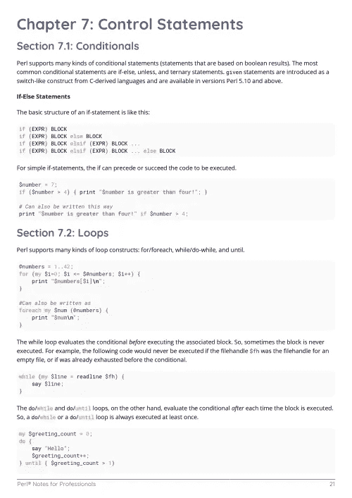

# 电子书:Perl 专业人员笔记

> 原文：<https://medium.easyread.co/e-book-perl-notes-for-professionals-book-440ffe62912c?source=collection_archive---------10----------------------->

## GoalKicker.com 免费下载 Perl 的电子书

**下载这里:**[**【http://goalkicker.com/PerlBook/】**](http://goalkicker.com/PerlBook/)

*Perl Notes for Professionals 本书由* [*栈溢出文档*](https://archive.org/details/documentation-dump.7z) *编译而成，内容由栈溢出达人撰写。文本内容由-SA 在知识共享协议下发布。见本书末尾的致谢，感谢对各章节做出贡献的人。除非另有说明，图像可能是其各自所有者的版权*

*本书为教育目的而创作，不隶属于 Perl 集团、公司或 Stack Overflow。所有商标属于其各自的公司所有者*

*109 页，2018 年 1 月出版*

# 章

1.  Perl 语言入门
2.  评论
3.  变量
4.  Perl 中的插值
5.  真假
6.  日期和时间
7.  控制语句
8.  子程序
9.  调试输出
10.  列表
11.  整理
12.  文件输入/输出(读写文件)
13.  将文件内容读入变量
14.  字符串和引用方法
15.  在不带引号的分隔符上拆分字符串
16.  面向对象的 Perl
17.  异常处理
18.  正则表达式
19.  XML 解析
20.  统一码
21.  Perl 一行程序
22.  随机性
23.  特殊变量
24.  包和模块
25.  通过 CPAN 安装 Perl 模块
26.  在 Mac 和 Ubuntu 上检查已安装模块的简单方法
27.  打包和拆包
28.  用于带有 Win32::OLE 模块的 Windows Excel 的 Perl 命令
29.  通过 DBI 模块与数据库进行简单的交互
30.  Perl 测试
31.  舞蹈演员
32.  属性文本
33.  Perl 中的 GUI 应用程序
34.  内存使用优化
35.  Perl 脚本调试
36.  佩尔布鲁
37.  Perl 的安装
38.  从源代码编译 Perl cpan 模块 sapnwrfc
39.  最佳实践