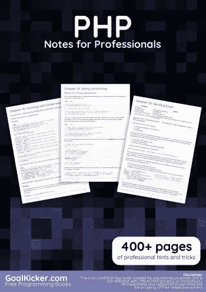
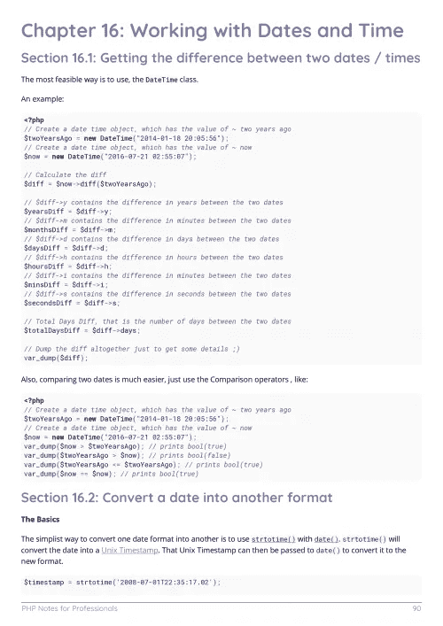
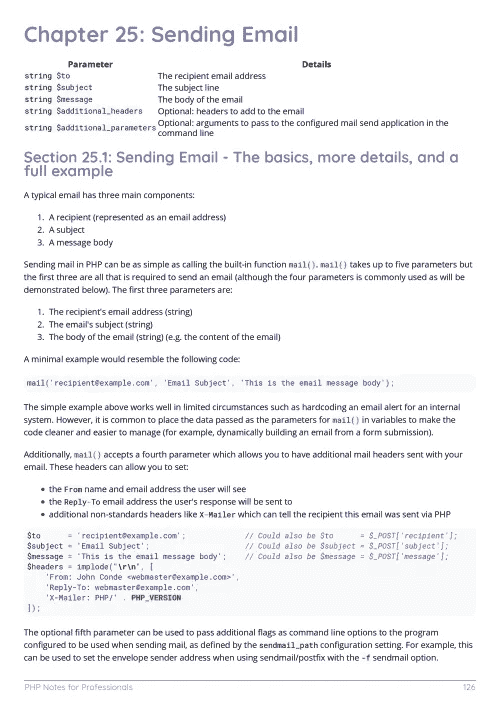

# 电子书:PHP 专业人员笔记

> 原文：<https://medium.easyread.co/e-book-php-notes-for-professionals-book-e1a24df5002b?source=collection_archive---------3----------------------->

## GoalKicker.com 免费下载 PHP 的电子书

**下载自:【**[**Google Drive**](https://drive.google.com/open?id=1fLf8Mpxtv--WN7SckEN6cmRmCTZiuej8)**】**

*《PHP 专业人士须知》一书由* [*栈溢出文档*](https://archive.org/details/documentation-dump.7z) *编译而成，内容由栈溢出达人撰写。文本内容由-SA 在知识共享协议下发布。见本书末尾的致谢，感谢对各章节做出贡献的人。除非另有说明，否则图像可能是其各自所有者的版权*

*本书为教育目的而创作，不隶属于 PHP 团队、公司或 Stack Overflow。所有商标属于其各自的公司所有者*

*478 页，发表于 201 年 1 月 8 日*

# 章

1.  PHP 入门
2.  变量
3.  变量作用域
4.  输出变量的值
5.  常数
6.  评论
7.  类型
8.  经营者
9.  参考
10.  数组
11.  数组迭代
12.  在数组上执行
13.  操纵数组
14.  一起处理多个数组
15.  日期时间类
16.  使用日期和时间
17.  环
18.  功能
19.  函数式编程
20.  控制结构
21.  控制结构的替代语法
22.  字符串解析
23.  字符串格式
24.  异常处理和错误报告
25.  发送电子邮件
26.  会议
27.  饼干
28.  类别和对象
29.  名称空间
30.  输出缓冲
31.  超全局变量 PHP
32.  JSON
33.  SOAP 客户端
34.  在 PHP 中使用 cURL
35.  反射
36.  依赖注入
37.  可扩展标记语言
38.  解析 HTML
39.  SimpleXML
40.  正则表达式(regexp/PCRE)
41.  特征
42.  编写器依赖关系管理器
43.  神奇的方法
44.  文件处理
45.  魔法常数
46.  类型提示
47.  自动装填底火
48.  多线程扩展
49.  过滤器和过滤功能
50.  发电机
51.  UTF-8
52.  资源定位符
53.  对象序列化
54.  PHPDoc
55.  序列化
56.  关闭
57.  读取请求数据
58.  类型杂耍和非严格比较问题
59.  套接字
60.  PDO
61.  PHP MySQLi
62.  SQLite3
63.  使用 SQLSRV
64.  命令行界面(CLI)
65.  本地化
66.  排除故障
67.  单元测试
68.  错误和警告的汇编
69.  标题操作
70.  为 PHP 核心做贡献
71.  编码约定
72.  使用 MongoDB
73.  蒙哥 php
74.  异步编程
75.  PHP 中的 Unicode 支持
76.  如何分解一个网址
77.  用 PHP 创建 PDF 文件
78.  如何检测客户端 IP 地址
79.  PHP 中的 YAML
80.  使用 GD 进行图像处理
81.  意象
82.  多重处理
83.  SOAP 服务器
84.  机器学习
85.  隐藏物
86.  流
87.  SPL 数据结构
88.  因特网邮件访问协议
89.  在 PHP 中使用 Redis
90.  HTTP 认证
91.  BC 数学(二进制计算器)
92.  Docker 部署
93.  WebSockets
94.  APCu
95.  设计模式
96.  PHP 内置服务器
97.  发射台安全报告(Pad Safty Report)
98.  编译 PHP 扩展
99.  常见错误
100.  表演
101.  请记住我
102.  安全性
103.  密码系统
104.  密码散列函数
105.  为 PHP 手册做贡献
106.  在 Windows 上安装 PHP 环境
107.  在 Linux/Unix 环境中安装