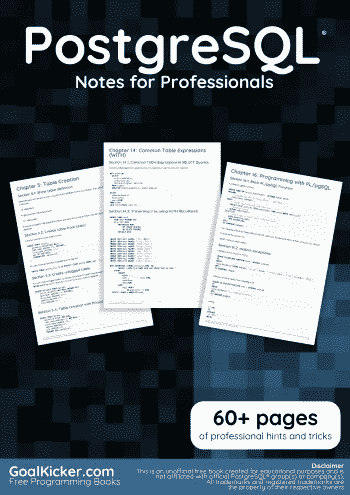
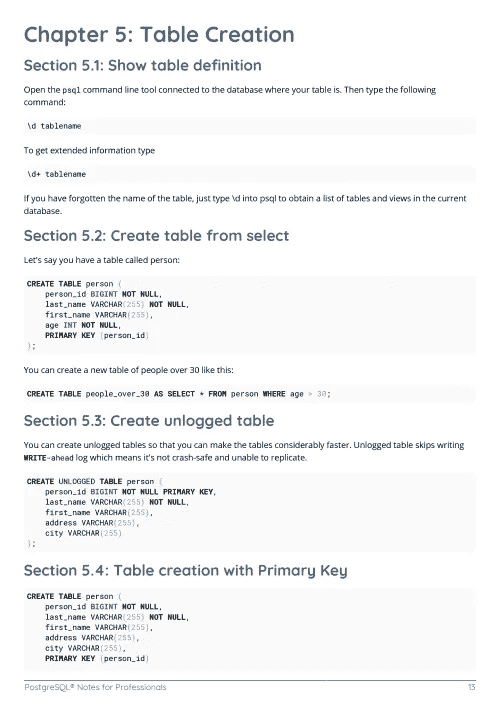
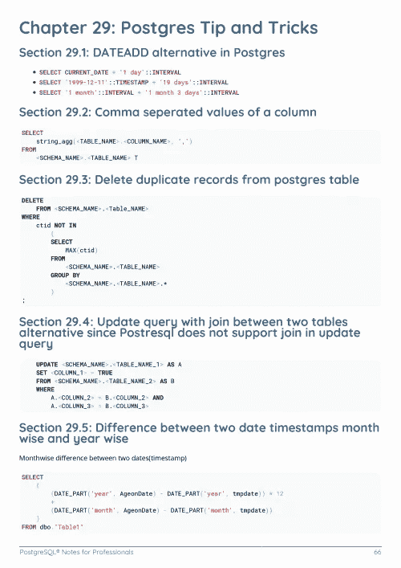

# 电子书:PostgreSQL 专业笔记

> 原文：<https://medium.easyread.co/e-book-postgresql-notes-for-professionals-book-212fa4015531?source=collection_archive---------8----------------------->

## GoalKicker.com 免费下载 PostgreSQL 的电子书

**下载自:【**[**Google Drive**](https://drive.google.com/open?id=1rhpLz7TUlQNHweuORiEpwiIT5Z-vpJOT)**】**

*PostgreSQL Notes for Professionals 这本书是由* [*栈溢出文档*](https://archive.org/details/documentation-dump.7z) *汇编而成，内容是美人们在栈溢出时写的。文本内容由-SA 在知识共享协议下发布。见本书末尾的致谢，感谢对各章节做出贡献的人。除非另有说明，否则图像可能是其各自所有者的版权*

*为教育目的创建的图书，不隶属于 PostgreSQL 集团、公司或 Stack Overflow。所有商标属于其各自的公司所有者*

*73 页，2018 年 1 月出版*

# 章

1.  PostgreSQL 入门
2.  数据类型
3.  PostgreSQL 中的注释
4.  日期、时间戳和时间间隔
5.  表格创建
6.  挑选
7.  查找字符串长度/字符长度
8.  联合
9.  插入
10.  更新
11.  JSON 支持
12.  聚合函数
13.  角色管理
14.  公用表表达式(WITH)
15.  以编程方式访问数据
16.  使用 PL/pgSQL 编程
17.  遗产
18.  PostgreSQL 高可用性
19.  扩展 dblink 和 postgres_fdw
20.  窗口功能
21.  生产数据库的备份脚本
22.  将 PostgreSQL 数据库表头和数据导出到 CSV 文件
23.  递归查询
24.  Postgres 加密函数
25.  触发器和触发函数
26.  事件触发器
27.  备份和恢复
28.  从 Java 连接到 PostgreSQL
29.  Postgres 提示和技巧