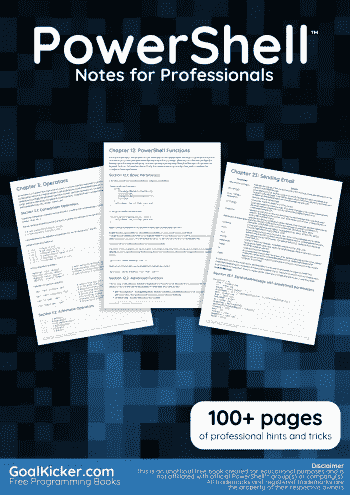
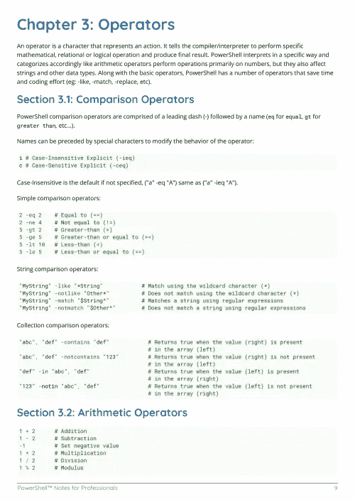
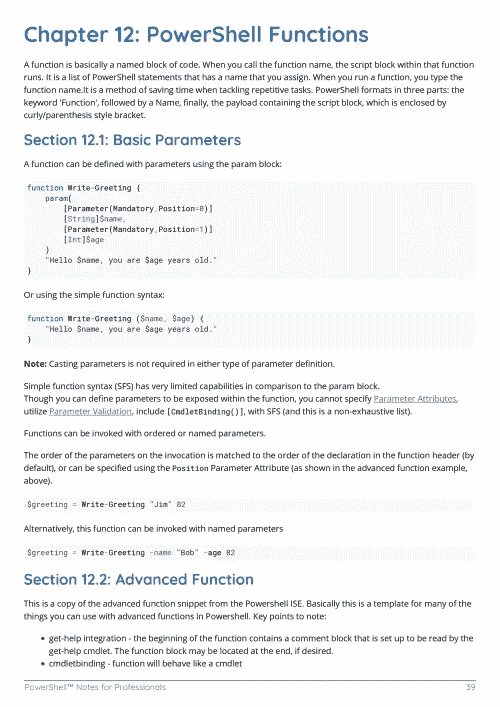

# 电子书:PowerShell 专业人员笔记

> 原文：<https://medium.easyread.co/e-book-powershell-notes-for-professionals-book-3592a94446de?source=collection_archive---------6----------------------->

## GoalKicker.com 免费下载 PowerShell 的电子书

**下载这里:**[**【http://goalkicker.com/PowerShellBook/】**](http://goalkicker.com/PowerShellBook/)

*PowerShell Notes for Professionals 本书由* [*栈溢出文档*](https://archive.org/details/documentation-dump.7z) *汇编而成，内容由栈溢出的漂亮人撰写。文本内容由-SA 在知识共享协议下发布。见本书末尾的致谢，感谢对各章节做出贡献的人。除非另有说明，图像可能是其各自所有者的版权*

*本书为教育目的而创作，不隶属于 PowerShell 集团、公司或 Stack Overflow。所有商标属于其各自的公司所有者*

*184 页，2018 年 1 月出版*

# 章

1.  PowerShell 入门
2.  PowerShell 中的变量
3.  经营者
4.  特殊操作员
5.  基本集合运算
6.  条件逻辑
7.  环
8.  交换语句
9.  用线串
10.  哈希表
11.  使用对象
12.  PowerShell 函数
13.  PowerShell 类
14.  PowerShell 模块
15.  PowerShell 配置文件
16.  计算属性
17.  使用现有的静态类
18.  内置变量
19.  自动变量
20.  环境变量
21.  劈啪声
22.  PowerShell“流”；调试、详细、警告、错误、输出和信息
23.  发送电子邮件
24.  PowerShell 远程处理
25.  使用 PowerShell 管道
26.  PowerShell 后台作业
27.  PowerShell 中的返回行为
28.  CSV 解析
29.  使用 XML 文件
30.  与 RESTful APIs 通信
31.  PowerShell SQL 查询
32.  正则表达式
33.  别名
34.  使用进度条
35.  PowerShell.exe 命令行
36.  Cmdlet 命名
37.  运行可执行文件
38.  强制脚本先决条件
39.  使用帮助系统
40.  模块、脚本和函数
41.  命名规格
42.  通用参数
43.  参数集
44.  PowerShell 动态参数
45.  PowerShell 中的 GUI
46.  URL 编码/解码
47.  错误处理
48.  包装管理
49.  与 PowerShell 的 TCP 通信
50.  PowerShell 工作流
51.  嵌入托管代码(C# | VB)
52.  如何使用 Powershell 脚本(v2.0 或更低版本)从 Artifactory 下载最新工件？
53.  基于注释的帮助
54.  存档模块
55.  基础设施自动化
56.  PSScriptAnalyzer — PowerShell 脚本分析器
57.  期望状态配置
58.  使用 ShouldProcess
59.  计划任务模块
60.  ISE 模块
61.  创建基于 DSC 类的资源
62.  WMI 和 CIM
63.  ActiveDirectory 模块
64.  SharePoint 模块
65.  Psake 简介
66.  《纠缠》简介
67.  处理机密和凭证
68.  安全和加密
69.  签名脚本
70.  使用 PowerShell 匿名化文本文件中的 IP (v4 和 v6)
71.  亚马逊网络服务(AWS)认知
72.  亚马逊网络服务(AWS)简单存储服务(S3)