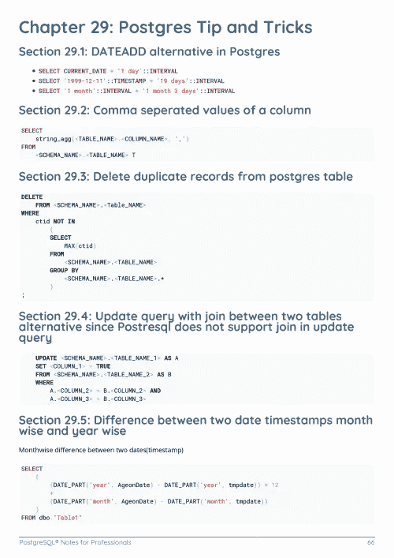

# 电子书:Python 专业人士笔记

> 原文：<https://medium.easyread.co/e-book-python-notes-for-professionals-book-de75eb8105d9?source=collection_archive---------1----------------------->

## GoalKicker.com 免费下载 Python 的电子书

**下载这里:**[**【http://goalkicker.com/PythonBook/】**](http://goalkicker.com/PythonBook/)

*Python Notes for Professionals 本书由* [*栈溢出文档*](https://archive.org/details/documentation-dump.7z) *编译而成，内容由栈溢出的美工们撰写。文本内容由-SA 在知识共享协议下发布。见本书末尾的致谢，感谢对各章节做出贡献的人。除非另有说明，图像可能是其各自所有者的版权*

*本书为教育目的而创作，不隶属于 Python 集团、公司或 Stack Overflow。所有商标属于其各自的公司所有者*

*814 页，2018 年 1 月出版*

# 章

1.  Python 语言入门
2.  Python 数据类型
3.  刻痕
4.  评论和文件
5.  日期和时间
6.  日期格式
7.  列举型别
8.  一组
9.  简单的数学运算符
10.  按位运算符
11.  布尔运算符
12.  运算符优先级
13.  过滤器
14.  数组
15.  词典
16.  目录
17.  列出理解
18.  列表切片(选择列表的一部分)
19.  链接列表
20.  链接列表节点
21.  元组
22.  功能
23.  用列表参数定义函数
24.  Python 中的函数式编程
25.  部分功能
26.  装修工
27.  班级
28.  元类
29.  字符串方法
30.  字符串格式
31.  条件式
32.  环
33.  在函数中使用循环
34.  导入模块
35.  模块和封装之间的差异
36.  数学模块
37.  复杂数学
38.  集合模块
39.  操作员模块
40.  JSON 模块
41.  Sqlite3 模块
42.  操作系统模块
43.  区域设置模块
44.  Itertools 模块
45.  Asyncio 模块
46.  随机模块
47.  Functools 模块
48.  dis 模块
49.  base64 模块
50.  队列模块
51.  德克模块
52.  “pip”模块的用法:PyPI 包管理器
53.  网络浏览器模块
54.  pyautogui 模块
55.  使用 Matplotlib 绘图
56.  比较
57.  排序，最小值和最大值
58.  可变范围和绑定
59.  基本输入输出
60.  文件和文件夹输入/输出
61.  索引和切片
62.  发电机
63.  减少
64.  地图功能
65.  指数运算
66.  搜索
67.  包括…在内
68.  操作 XML
69.  并行计算
70.  进程和线程
71.  多线程操作
72.  编写扩展
73.  单元测试
74.  正则表达式(Regex)
75.  从 Python 2 到 Python 3 的不兼容性
76.  虚拟环境
77.  复制数据
78.  上下文管理器(“with”语句)
79.  隐藏功能
80.  Unicode 和字节
81.  __name__ 特殊变量
82.  检查路径存在和权限
83.  Python 网络
84.  打印功能
85.  os.path
86.  创建 Python 包
87.  解析命令行参数
88.  HTML 解析
89.  子进程库
90.  setup.py
91.  套接字
92.  递归
93.  类型提示
94.  pip: PyPI 包管理器
95.  例外
96.  使用 Python 进行 Web 抓取
97.  分配
98.  属性对象
99.  过载
100.  排除故障
101.  读写 CSV
102.  使用“exec”和“eval”执行动态代码
103.  PyInstaller —分发 Python 代码
104.  迭代器和迭代器
105.  用 Python 实现数据可视化
106.  解释器(命令行控制台)
107.  *args 和**kwargs
108.  碎片帐集
109.  Pickle 数据序列化
110.  urllib
111.  二进制数据
112.  Python 和 Excel
113.  风格
114.  方法覆盖
115.  数据序列化
116.  Python 并发
117.  使用 AMQPStorm 介绍 RabbitMQ
118.  描述符
119.  多重处理
120.  名为 TemporaryFile 的临时文件
121.  使用 Pandas 输入、子集化和输出外部数据文件
122.  从字符串或列表写入 CSV
123.  解压缩文件
124.  使用 ZIP 存档
125.  堆
126.  压型
127.  用户定义的方法
128.  解决全局解释器锁(GIL)
129.  部署
130.  记录
131.  数据库访问
132.  Python HTTP 服务器
133.  Web 服务器网关接口(WSGI)
134.  Python 服务器发送的事件
135.  将 Python 连接到 SQL Server
136.  客户端和服务器之间的套接字和消息加密/解密
137.  从其他语言切换语句的替代方法
138.  列出理解
139.  列表析构(又名打包和解包)
140.  访问 Python 源代码和字节码
141.  混合蛋白
142.  属性访问
143.  阿尔派
144.  抽象基类(abc)
145.  插件和扩展类
146.  Websockets
147.  不可变数据类型(int、float、str、tuple 和 frozensets)
148.  类实例的字符串表示形式:__str__ 和 __repr__ 方法
149.  多态性
150.  非官方 Python 实现
151.  2to3 工具
152.  抽象语法树
153.  统一码
154.  Python 串行通信(pyserial)
155.  使用 Py2Neo 的 Neo4j 和 Cypher
156.  Python 的基本诅咒
157.  性能优化
158.  python 中的模板
159.  枕头
160.  pass 语句
161.  py .测试
162.  Heapq
163.  tkinter
164.  具有精确帮助输出的 CLI 子命令
165.  一种数据库系统
166.  Python 持久性
167.  海龟图案
168.  设计模式
169.  多维数组
170.  声音的
171.  皮格莱特
172.  瓶
173.  groupby()
174.  pygame
175.  哈希里布
176.  GZip 入门
177.  ctypes
178.  使用 Python 创建 Windows 服务
179.  Python 中的可变 vs 不可变(和可散列)
180.  Python 程序的速度
181.  configparser
182.  英联邦例外
183.  光学字符识别
184.  图形工具
185.  Python 虚拟环境— virtualenv
186.  [计]系统复制命令（system 的简写）
187.  使用 virtualenvwrapper 的虚拟环境
188.  在 windows 中用 virtualenvwrapper 创建虚拟环境
189.  Python 请求发布
190.  Python Lex-Yacc
191.  ChemPy — python 包
192.  pyaudio
193.  罢免
194.  用 Python 和 Raspberry PI 进行物联网编程
195.  kivy——用于 NUI 开发的跨平台 Python 框架
196.  从 C#调用 Python
197.  语法相似，意义不同:Python 与 JavaScript
198.  引发自定义错误/异常
199.  熊猫变换:对组执行操作并连接结果
200.  安全和加密
201.  Python 中的安全外壳连接
202.  Python 反模式
203.  常见陷阱