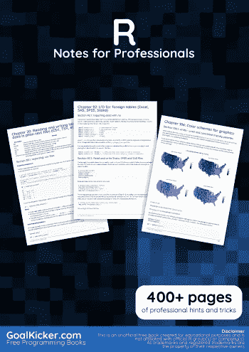

# 电子书:专业人士笔记

> 原文：<https://medium.easyread.co/e-book-r-notes-for-professionals-book-ebf6394acad7?source=collection_archive---------8----------------------->

## GoalKicker.com 免费下载 R 的电子书

**下载这里:**[**【http://goalkicker.com/RBook/】**](http://goalkicker.com/RBook/)

*《R 专业人士笔记》一书由* [*栈溢出文档*](https://archive.org/details/documentation-dump.7z) *编译而成，内容由栈溢出的漂亮人士撰写。文本内容由-SA 在知识共享协议下发布。见本书末尾的致谢，感谢对各章节做出贡献的人。除非另有说明，图像可能是其各自所有者的版权*

*为教育目的创建的图书，不隶属于 R 集团、公司或 Stack Overflow。所有商标属于其各自的公司所有者*

*472 页，2018 年 1 月出版*

# 章

1.  R 语言入门
2.  变量
3.  算术运算符
4.  矩阵
5.  公式
6.  读取和写入字符串
7.  用 stringi 包进行字符串操作
8.  班级
9.  列表
10.  散列表
11.  创建向量
12.  日期和时间
13.  日期类
14.  日期-时间类(POSIXct 和 POSIXlt)
15.  字符类
16.  数字类和存储模式
17.  逻辑类
18.  数据帧
19.  分裂函数
20.  在纯文本文件(CSV、TSV 等)中读写表格数据。)
21.  管道运算符(%>%和其他)
22.  线性模型(回归)
23.  数据表
24.  用 data.table 透视和取消透视
25.  条形图
26.  基本绘图
27.  箱线图
28.  ggplot2
29.  因素
30.  模式匹配和替换
31.  游程编码
32.  加速难以矢量化的代码
33.  地理地图介绍
34.  集合操作
35.  tidyverse
36.  Rcpp
37.  随机数生成器
38.  并行处理
39.  子集化
40.  排除故障
41.  安装软件包
42.  检查包裹
43.  用 devtools 创建包
44.  在自己的包中使用管道赋值% <> %:如何？
45.  Arima 模型
46.  分布函数
47.  发光的
48.  空间分析
49.  sqldf
50.  代码剖析
51.  控制流结构
52.  列式操作
53.  JSON
54.  RODBC
55.  润滑剂
56.  时间序列和预测
57.  strsplit 函数
58.  网页抓取和解析
59.  广义线性模型
60.  在长表单和宽表单之间重塑数据
61.  RMarkdown 和针织演示
62.  变量的范围
63.  执行排列测试
64.  xgboost
65.  r 代码矢量化最佳实践
66.  缺少值
67.  分层线性建模
68.  *应用函数族(泛函)
69.  文本挖掘
70.  方差分析
71.  光栅和图像分析
72.  生存分析
73.  容错/弹性代码
74.  可重复 R
75.  傅立叶级数和变换
76.  。Rprofile
77.  dplyr
78.  脱字号
79.  提取并列出压缩档案中的文件
80.  R 的概率分布
81.  用针织机在胶乳中静置
82.  R 中的网页抓取
83.  使用 RMarkdown 创建报告
84.  GPU 加速计算
85.  热图和热图。2
86.  用 igraph 软件包进行网络分析
87.  函数式编程
88.  获取用户输入
89.  火花 API (SparkR)
90.  Meta:文档指南
91.  输入和输出
92.  外部表(Excel、SAS、SPSS、Stata)的 I/O
93.  数据库表的 I/O
94.  地理数据(shapefiles 等)的 I/O。)
95.  光栅图像的 I/O
96.  R 的二进制格式的 I/O
97.  回收利用
98.  表达式:解析+求值
99.  R 中的正则表达式语法
100.  正则表达式(regex)
101.  组合学
102.  求解 R 中的常微分方程
103.  R 中的特征选择-移除无关特征
104.  RMD 的书目
105.  用 R 编写函数
106.  图形的配色方案
107.  使用 hclust 的层次聚类
108.  随机森林算法
109.  RESTful R 服务
110.  机器学习
111.  使用 texreg 以可直接打印的方式导出模型
112.  出版
113.  使用 S4 类实现状态机模式
114.  使用 tidyr 整形
115.  通过替换修改字符串
116.  非标准评价和标准评价
117.  随机选择
118.  R 语言中的面向对象编程
119.  强迫
120.  通过编写独立的 R 脚本来标准化分析
121.  用 R 分析推文
122.  自然语言处理
123.  R Markdown 笔记本(来自 RStudio)
124.  聚合数据帧
125.  数据采集
126.  r 举例纪念
127.  更新 R 版本