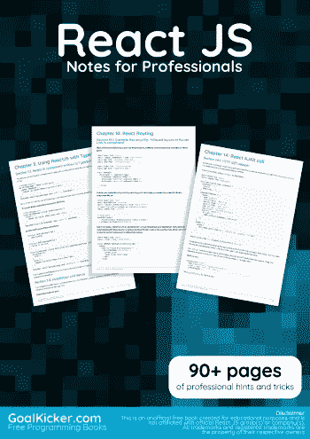
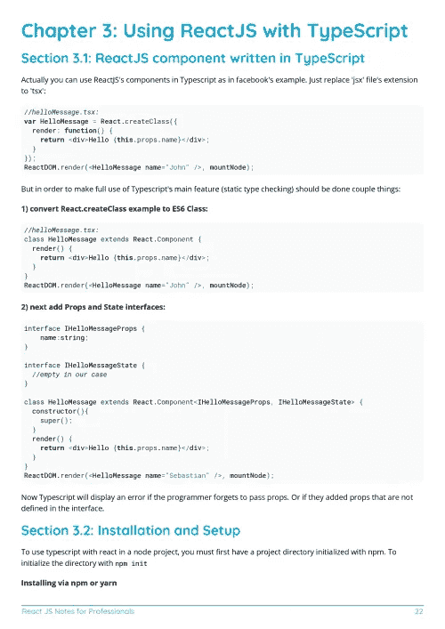
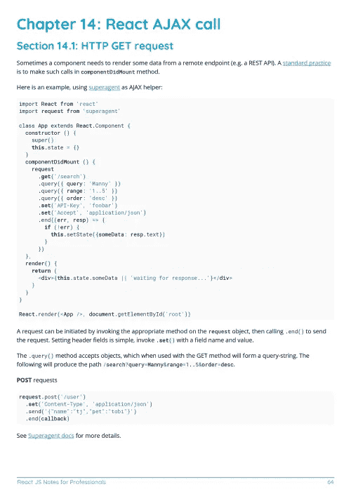

# 电子书:React JS 专业人士笔记

> 原文：<https://medium.easyread.co/e-book-react-js-notes-for-professionals-book-d164596cfb91?source=collection_archive---------0----------------------->

## GoalKicker.com 免费下载 ReactJS 的电子书

**下载这里:**[**【http://books.goalkicker.com/ReactJSBook/】**](http://books.goalkicker.com/ReactJSBook/)

*React JS Notes for Professionals 本书由* [*栈溢出文档*](https://archive.org/details/documentation-dump.7z) *编译而成，内容是美人们在栈溢出时写的。文本内容由-SA 在知识共享协议下发布。见本书末尾的致谢，感谢对各章节做出贡献的人。除非另有说明，图像可能是其各自所有者的版权*

*本书为教育目的而创作，不隶属于 React JS 集团、公司或 Stack Overflow。所有商标属于其各自的公司所有者*

*109 页，2018 年 1 月出版*

# 章

1.  React 入门
2.  成分
3.  将 ReactJS 与 TypeScript 一起使用
4.  反应中的状态
5.  React 中的道具
6.  反应组件生命周期
7.  表单和用户输入
8.  React 样板文件
9.  在 jQuery 中使用 ReactJS
10.  反应路由
11.  组件之间的通信
12.  如何设置一个基本的 webpack，react 和 babel 环境
13.  React . create class vs extends React。成分
14.  对 AJAX 调用做出反应
15.  组件之间的通信
16.  无状态功能组件
17.  表演
18.  服务器端呈现简介
19.  设置反应环境
20.  使用与流反应
21.  JSX
22.  反应形式
23.  用户界面解决方案
24.  以流动方式使用电抗器
25.  React、Webpack 和 TypeScript 安装
26.  如何以及为什么在 React 中使用键
27.  react 中的键
28.  高阶组件
29.  与 Redux 反应
30.  装置
31.  反应工具