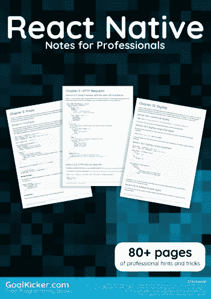
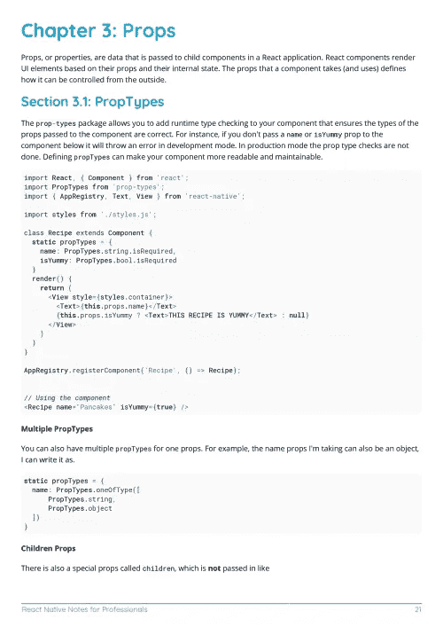
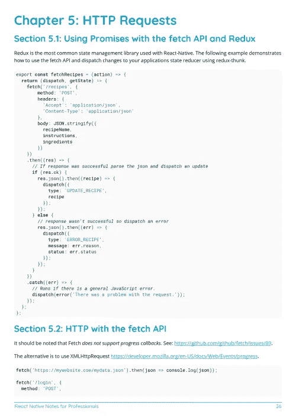

# 电子书:反应本地笔记专业书籍

> 原文：<https://medium.easyread.co/e-book-react-native-notes-for-professionals-book-97215bd52076?source=collection_archive---------2----------------------->

## GoalKicker.com 免费下载 React Native 的电子书

**下载这里:**[**【http://books.goalkicker.com/ReactNativeBook/】**](http://books.goalkicker.com/ReactNativeBook/)

*《React Native Notes for Professionals》一书由* [*栈溢出文档*](https://archive.org/details/documentation-dump.7z) *编译而成，内容由栈溢出美文人士撰写。文本内容由-SA 在知识共享协议下发布。见本书末尾的致谢，感谢对各章节做出贡献的人。除非另有说明，图像可能是其各自所有者的版权*

*为教育目的创建的图书，不隶属于 React 本地团体、公司或 Stack Overflow。所有商标属于其各自的公司所有者*

*91 页，2018 年 1 月出版*

# 章

1.  React Native 入门
2.  布局
3.  小道具
4.  命令行说明
5.  HTTP 请求
6.  导航器最佳实践
7.  列表视图
8.  平台模块
9.  状态
10.  你好世界
11.  形象
12.  自定义字体
13.  动画 API
14.  Android —硬件后退按钮
15.  排除故障
16.  在设备上运行应用程序(Android 版本)
17.  成分
18.  本机模块
19.  与 Firebase 集成进行身份验证
20.  从页面注入按钮的导航器
21.  用 ListView 刷新控件
22.  式样
23.  情态的
24.  按指定路线发送
25.  单元测试
26.  网络视图
27.  为 android 创建一个可共享的 APK
28.  推送通知
29.  链接本机 API
30.  呈现最佳实践
31.  React Native 中的 ESLint
32.  多道具渲染