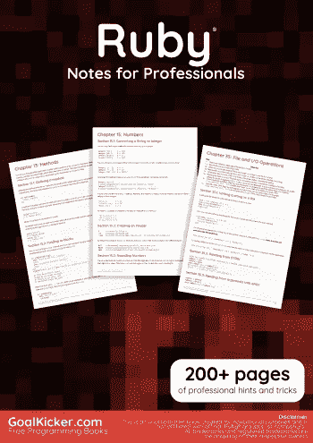
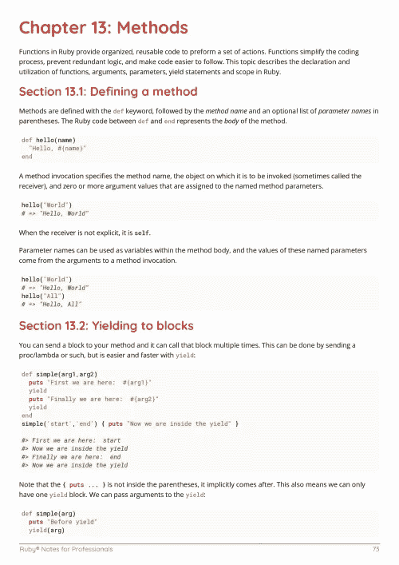
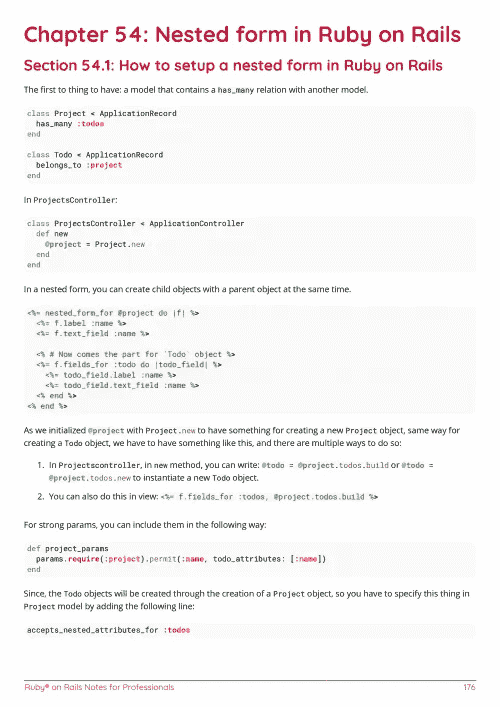

# 电子书:Ruby 专业笔记

> 原文：<https://medium.easyread.co/e-book-ruby-notes-for-professionals-book-83fe7a7bf3c1?source=collection_archive---------15----------------------->

## GoalKicker.com 免费下载 Ruby 的电子书

**下载这里:**[**【http://goalkicker.com/RubyBook/】**](http://goalkicker.com/RubyBook/)

*Ruby Notes for Professionals 本书由* [*栈溢出文档*](https://archive.org/details/documentation-dump.7z) *编译而成，内容由栈溢出的美人写。文本内容由-SA 在知识共享协议下发布。见本书末尾的致谢，感谢对各章节做出贡献的人。除非另有说明，图像可能是其各自所有者的版权*

*本书为教育目的而创作，不隶属于 Ruby 集团、公司或 Stack Overflow。所有商标属于其各自的公司所有者*

*236 页，2018 年 1 月出版*

# 章

1.  Ruby 语言入门
2.  铸造(类型转换)
3.  数组
4.  班级
5.  混杂
6.  积木和 Procs 和 Lambdas
7.  遗产
8.  控制流
9.  用线串
10.  标志
11.  例外
12.  线
13.  方法
14.  方法 _ 缺失
15.  数字
16.  循环
17.  正则表达式和基于正则表达式的操作
18.  可比较的
19.  宝石用途
20.  Ruby 中的设计模式和习惯用法
21.  加载源文件
22.  范围
23.  评论
24.  经营者
25.  经营者
26.  Ruby 中的特殊常量
27.  模块
28.  Ruby 版本管理器
29.  Gem 创建/管理
30.  常数
31.  可变范围和可见性
32.  rbenv
33.  环境变量
34.  单例类
35.  文件和输入输出操作
36.  时间
37.  长队
38.  解构
39.  工业基准黑(industrial reference black)
40.  计数器
41.  c 扩展
42.  结构体
43.  元编程
44.  动态评价
45.  实例 _ 评估
46.  信息传递
47.  关键字参数
48.  日期时间
49.  真实性
50.  带有 Ruby 的 JSON
51.  内隐接受者与理解自我
52.  Ruby 中的猴子补丁
53.  反省
54.  Ruby 中的猴子补丁
55.  风雅
56.  Ruby 中的猴子补丁
57.  用 Begin / Rescue 捕获异常
58.  命令行应用程序
59.  排除故障
60.  纯 RSpec JSON API 测试
61.  Ruby 中的递归
62.  装置
63.  雇员再培训局(Employees Retraining Board)
64.  Ruby 中的内省
65.  生成一个随机数
66.  开始使用 Hanami
67.  OptionParser
68.  Splat 运算符(*)
69.  多维数组
70.  可在 Ruby 中枚举
71.  Ruby 访问修饰符
72.  操作系统或外壳命令