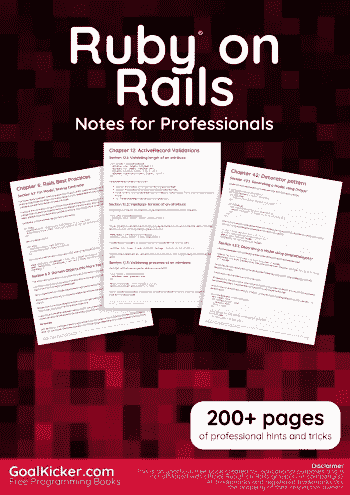
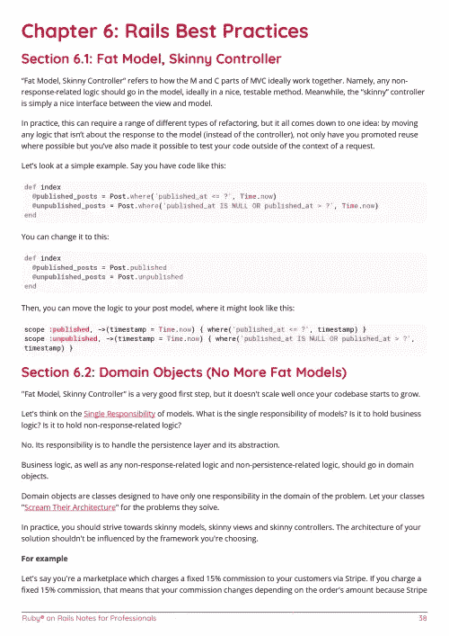

# 电子书:Ruby on Rails 专业人士笔记

> 原文：<https://medium.easyread.co/e-book-ruby-on-rails-notes-for-professionals-book-e4e0114145c6?source=collection_archive---------2----------------------->

## GoalKicker.com 免费下载 Rails 的电子书

**下载这里:**[**【http://goalkicker.com/RubyOnRailsBook/】**](http://goalkicker.com/RubyOnRailsBook/)

*Ruby on Rails Notes for Professionals 这本书是由* [*栈溢出文档*](https://archive.org/details/documentation-dump.7z) *汇编而成，内容是由漂亮的栈溢出人士编写的。文本内容由-SA 在知识共享协议下发布。见本书末尾的致谢，感谢对各章节做出贡献的人。除非另有说明，图像可能是其各自所有者的版权*

*本书为教育目的而创作，不隶属于 Ruby on Rails 集团、公司或 Stack Overflow。所有商标属于其各自的公司所有者*

*227 页，2018 年 1 月出版*

# 章

1.  Ruby on Rails 入门
2.  按指定路线发送
3.  ActiveRecord
4.  视图
5.  活动记录迁移
6.  Rails 最佳实践
7.  命名规格
8.  行动电缆
9.  活动模型
10.  Rails 中的用户认证
11.  活动记录关联
12.  活动记录验证
13.  ActiveRecord 查询接口
14.  动作邮件程序
15.  Rails 生成命令
16.  配置
17.  I18n —国际化
18.  通过 Rails 使用 GoogleMaps
19.  文件上传
20.  贮藏
21.  动作控制器
22.  配置
23.  安全常数
24.  轨道 5
25.  康康授权
26.  蒙古人
27.  宝石
28.  更改默认时区
29.  资产管道
30.  升级 Rails
31.  活动记录锁定
32.  排除故障
33.  用轨道配置角度
34.  铁路记录器
35.  对虾 PDF
36.  Rails API
37.  在 Heroku 上部署 Rails 应用程序
38.  主动支持
39.  表单助手
40.  ActiveRecord 交易
41.  RSpec 和 Ruby on Rails
42.  装饰图案
43.  弹性搜索
44.  使用 react-rails gem 与 Rails 进行交互
45.  Rails 食谱——高级 rails 食谱/学习和编码技术
46.  多用途 ActiveRecord 列
47.  班级组织
48.  浅层布线
49.  模范国家:AASM
50.  Rails 5 API 认证
51.  测试 Rails 应用程序
52.  活动工单
53.  多年来的 Rails 框架
54.  Ruby on Rails 中的嵌套表单
55.  工厂女孩
56.  从特定文件夹导入整个 CSV 文件
57.  Ruby on Rails 代码优化和清理工具
58.  活动工单
59.  主动模型序列化程序
60.  导轨引擎—模块化导轨
61.  单表继承
62.  ActiveRecord 交易
63.  涡轮链
64.  友好 ID
65.  安全存储认证密钥
66.  使用设备验证 Api
67.  使用 Hyperloop 将 React.js 与 Rails 集成
68.  更改默认的 Rails 应用程序环境
69.  铁路-发动机
70.  向 rails 应用程序添加 Amazon RDS
71.  rails 中的支付功能
72.  码头上的栏杆
73.  保留字