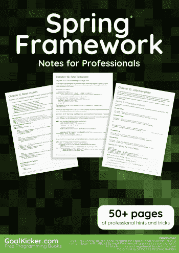
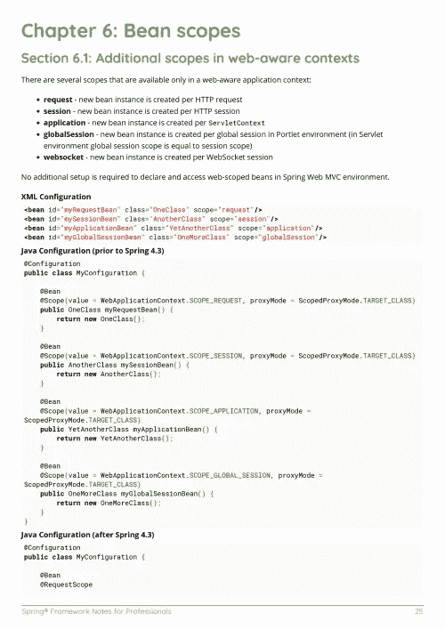
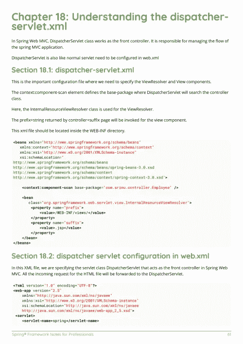

# 电子书:Spring 专业人员框架笔记

> 原文：<https://medium.easyread.co/e-book-spring-framework-notes-for-professionals-book-de3f2e5afe10?source=collection_archive---------4----------------------->

## GoalKicker.com 免费下载 Spring Framework 的电子书

**下载这里:**[**【http://books.goalkicker.com/SpringFrameworkBook/】**](http://books.goalkicker.com/SpringFrameworkBook/)

*Spring Framework Notes for Professionals 本书是由* [*栈溢出文档*](https://archive.org/details/documentation-dump.7z) *汇编而成，内容是由漂亮的栈溢出人士编写的。文本内容由-SA 在知识共享协议下发布。见本书末尾的致谢，感谢对各章节做出贡献的人。除非另有说明，图像可能是其各自所有者的版权*

*为教育目的而创建的图书，不隶属于 Spring Framework 组、公司或 Stack Overflow。所有商标属于其各自的公司所有者*

*67 页，2018 年 1 月出版*

# 章

1.  Spring Framework 入门
2.  弹簧芯
3.  Spring 表达式语言
4.  从 SimpleJdbcCall 获取 SqlRowSet
5.  创建和使用 beans
6.  Bean scopes
7.  春季条件 bean 注册
8.  春季 JSR 303 豆验证
9.  应用程序上下文配置
10.  RestTemplate
11.  任务执行和调度
12.  弹簧惰性初始化
13.  财产来源
14.  依赖注入(DI)和控制反转(IoC)
15.  JDBC 模板
16.  SOAP WS 消费
17.  弹簧轮廓
18.  了解 dispatcher-servlet.xml