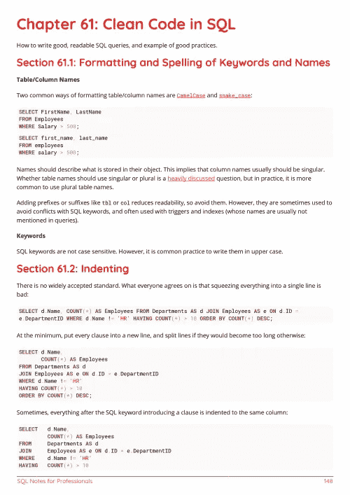

# 电子书:SQL 专业笔记

> 原文：<https://medium.easyread.co/e-book-sql-notes-for-professionals-book-ffcc0d651c07?source=collection_archive---------5----------------------->

## GoalKicker.com 免费下载 SQL 的电子书

**下载这里:**[**【http://goalkicker.com/SQLBook/】**](http://goalkicker.com/SQLBook/)

*SQL Notes for Professionals book 由* [*栈溢出文档*](https://archive.org/details/documentation-dump.7z) *编译而成，内容由栈溢出达人撰写。文本内容由-SA 在知识共享协议下发布。见本书末尾的致谢，感谢对各章节做出贡献的人。除非另有说明，图像可能是其各自所有者的版权*

*为教育目的创建的图书，不隶属于 SQL 组、公司或 Stack Overflow。所有商标属于其各自的公司所有者*

*164 页，2018 年 1 月出版*

# 章

1.  SQL 入门
2.  标识符
3.  数据类型
4.  空
5.  示例数据库和表格
6.  挑选
7.  分组依据
8.  以...排序
9.  与或运算符
10.  情况
11.  LIKE 运算符
12.  IN 子句
13.  使用 WHERE 和 HAVING 筛选结果
14.  跳过汇整(分页)
15.  除...之外
16.  解释和描述
17.  EXISTS 子句
18.  加入
19.  更新
20.  创建数据库
21.  创建表格
22.  创建功能
23.  尝试/抓住
24.  联合/联合所有
25.  更改表格
26.  插入
27.  合并
28.  交叉应用，外部应用
29.  删除
30.  缩短
31.  翻桌
32.  删除数据库
33.  级联删除
34.  授予和撤销
35.  可扩展标记语言
36.  主键
37.  指数
38.  行号
39.  SQL 分组依据与不同
40.  在包含详细信息的列子集上查找重复项
41.  字符串函数
42.  函数(聚合)
43.  函数(标量/单行)
44.  函数(分析)
45.  窗口功能
46.  常用表表达式
47.  视图
48.  物化视图
49.  评论
50.  外键
51.  顺序
52.  子查询
53.  执行块
54.  存储过程
55.  扳机
56.  处理
57.  表格设计
58.  同义词
59.  信息图式
60.  执行顺序
61.  清除 SQL 中的代码
62.  SQL 注入