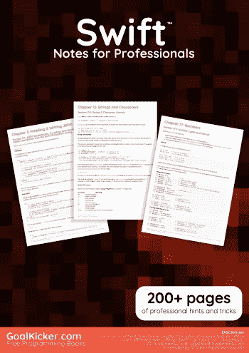
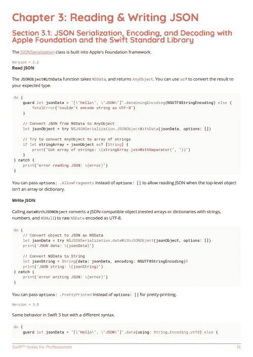
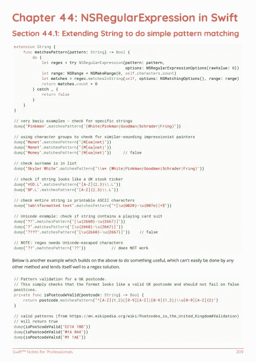

# 电子书:Swift 专业人员笔记手册

> 原文：<https://medium.easyread.co/e-book-swift-notes-for-professionals-book-de022fffa81f?source=collection_archive---------10----------------------->

## GoalKicker.com 免费下载 Swift 的电子书

**下载这里:**[**【http://goalkicker.com/SwiftBook/】**](http://goalkicker.com/SwiftBook/)

*Swift Notes for Professionals 这本书是由* [*栈溢出文档*](https://archive.org/details/documentation-dump.7z) *汇编而成，内容是栈溢出的漂亮人写的。文本内容由-SA 在知识共享协议下发布。见本书末尾的致谢，感谢对各章节做出贡献的人。除非另有说明，图像可能是其各自所有者的版权*

*为教育目的制作的图书，不隶属于 Swift 集团、公司或 Stack Overflow。所有商标属于其各自的公司所有者*

*289 页，2018 年 1 月出版*

# 章

1.  Swift 语言入门
2.  转换
3.  阅读和写作 JSON
4.  枚举
5.  协议
6.  选项
7.  结构
8.  关闭
9.  错误处理
10.  数组
11.  字典
12.  字符串和字符
13.  扩展ˌ扩张
14.  设置
15.  使用 C 和 Objective-C
16.  功能
17.  数字
18.  班级
19.  条件式
20.  变量和属性
21.  元组
22.  布尔运算
23.  内存管理
24.  无商标消费品
25.  高级运算符
26.  访问控制
27.  关联对象
28.  环
29.  反射
30.  选项集
31.  方法 Swizzling
32.  并发
33.  初始值设定项
34.  面向协议编程入门
35.  Swift 中的函数式编程
36.  风格惯例
37.  铅字铸造
38.  登录 Swift
39.  表演
40.  RxSwift
41.  延迟语句
42.  设计模式——创造
43.  Swift 软件包管理器
44.  Swift 中的 NSRegularExpression
45.  文档标记
46.  AES 加密
47.  PBKDF2 密钥派生
48.  Typealias
49.  密码散列法
50.  依赖注入
51.  作为 Swift 的一等公民
52.  阻碍
53.  磁盘空间上的缓存
54.  Swift 算法
55.  (不安全)缓冲区指针
56.  Swift 高级功能
57.  完成处理程序
58.  设计模式—结构
59.  Kitura 的 Swift HTTP 服务器
60.  从字符串生成首字母的 UIImage