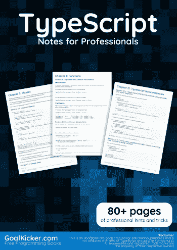
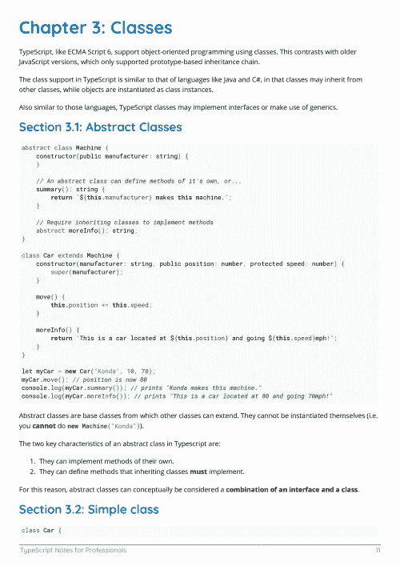
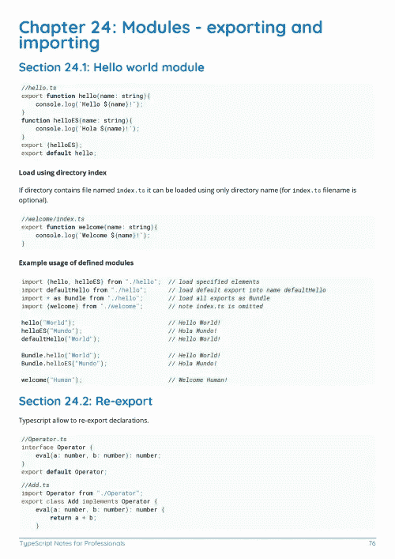

# 电子书:给专业人士的打字笔记

> 原文：<https://medium.easyread.co/e-book-typescript-notes-for-professionals-book-9ec1d77dd627?source=collection_archive---------1----------------------->

## GoalKicker.com 免费下载 TypeScript 的电子书

**下载自:【**[**Google Drive**](https://drive.google.com/open?id=1OUiR_9vEbxVl_akH-e-J4YVUsuoY1pyB)**】**

*《专业人员打字笔记》一书由* [*栈溢出文档*](https://archive.org/details/documentation-dump.7z) *汇编而成，内容由栈溢出美工撰写。文本内容由-SA 在知识共享协议下发布。见本书末尾的致谢，感谢对各章节做出贡献的人。除非另有说明，否则图像可能是其各自所有者的版权*

*为教育目的创建的图书，不隶属于 TypeScript group、公司或 Stack Overflow。所有商标属于其各自的公司所有者*

*97 页，2018 年 1 月出版*

# 章

1.  TypeScript 入门
2.  导入外部库
3.  班级
4.  严格的空检查
5.  将 Typescript 与 React 一起使用(JS 和 native)
6.  功能
7.  接口
8.  将 TypeScript 与 webpack 一起使用
9.  无商标消费品
10.  TypeScript 核心类型
11.  与构建工具集成
12.  发布类型脚本定义文件
13.  类装饰者
14.  tsconfig.json
15.  混合蛋白
16.  枚举
17.  使用 AngularJS 的类型脚本
18.  带有 SystemJS 的 TypeScript
19.  单元测试
20.  TSLint —确保代码质量和一致性
21.  TypeScript 基本示例
22.  用户定义的类型保护
23.  如何在没有类型定义文件的情况下使用 javascript 库
24.  模块—导出和导入
25.  为什么以及何时使用 TypeScript
26.  排除故障
27.  数组
28.  typescript-安装-typescript-运行-typescript-编译器-tsc
29.  配置 typescript 项目以编译 typescript 中的所有文件。
30.  将 Typescript 与 RequireJS 一起使用