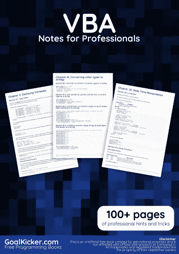
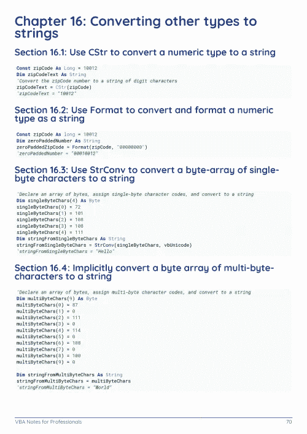
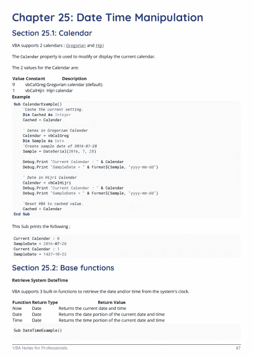

# 电子书:VBA 专业笔记

> 原文：<https://medium.easyread.co/e-book-vba-notes-for-professionals-book-190039c4459a?source=collection_archive---------9----------------------->

## GoalKicker.com 免费下载 VBA 的电子书

**下载这里:**[**【http://goalkicker.com/VBABook/】**](http://goalkicker.com/VBABook/)

*《VBA 笔记专业人士用书》是由* [*栈溢出文档*](https://archive.org/details/documentation-dump.7z) *汇编而成，内容是由栈溢出的漂亮人士所写。文本内容由-SA 在知识共享协议下发布。见本书末尾的致谢，感谢对各章节做出贡献的人。除非另有说明，图像可能是其各自所有者的版权*

*本书为教育目的而创作，不隶属于 VBA 集团、公司或 Stack Overflow。所有商标属于其各自的公司所有者*

*201 页，2018 年 1 月出版*

# 章

1.  VBA 入门
2.  声明变量
3.  脚本编写。文件系统对象
4.  过程调用
5.  命名规格
6.  创建过程
7.  流量控制结构
8.  评论
9.  数组
10.  错误处理
11.  递归
12.  条件编译
13.  数据类型和限制
14.  字符串文字—转义、不可打印的字符和行继续符
15.  声明和分配字符串
16.  将其他类型转换为字符串
17.  在字符串中搜索是否存在子字符串
18.  子字符串
19.  测量绳子的长度
20.  使用 ADO
21.  串联字符串
22.  分配带有重复字符的字符串
23.  脚本编写。字典对象
24.  VBA 选项关键字
25.  日期时间操作
26.  创建自定义类
27.  事件
28.  属性
29.  用户表单
30.  面向对象的 VBA
31.  不使用 FileSystemObject 处理文件和目录
32.  经营者
33.  收集
34.  传递参数 ByRef 或 ByVal
35.  CreateObject 与 GetObject
36.  宏安全性和 VBA-项目/-模块的签名
37.  数据结构
38.  接口
39.  在 VBA 读取 2GB 以上的二进制文件和文件哈希
40.  整理
41.  经常使用的字符串操作
42.  自动化或使用其他应用程序库
43.  VBA 运行时错误
44.  复制、返回和传递数组
45.  非拉丁字符
46.  API 调用