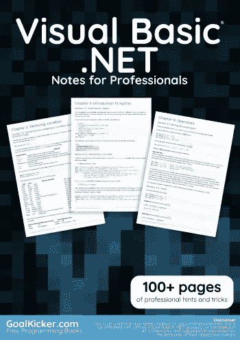
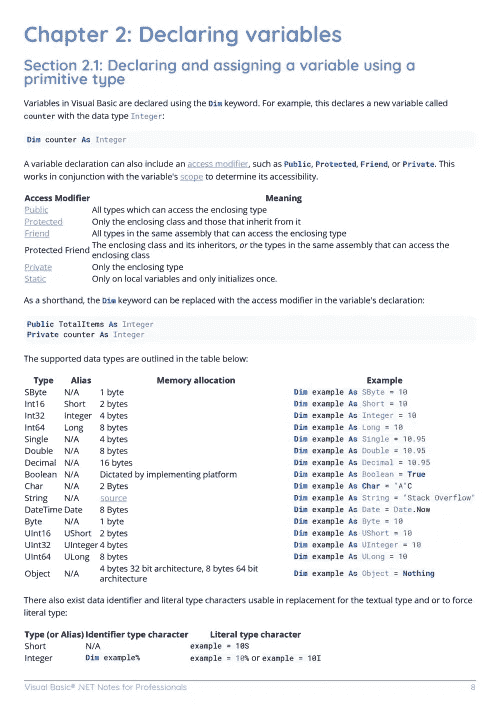
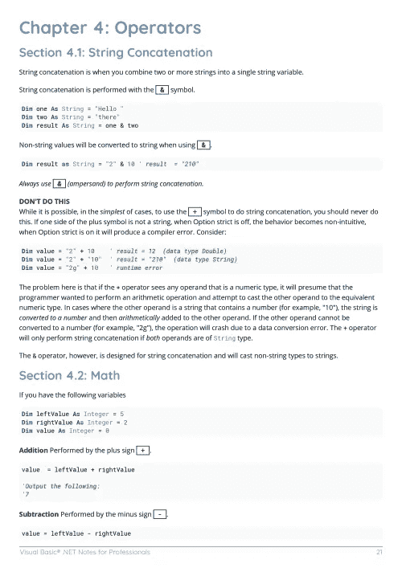

# 电子书:Visual Basic。专业人士网上笔记手册

> 原文：<https://medium.easyread.co/e-book-visual-basic-net-notes-for-professionals-book-f5f593992d4d?source=collection_archive---------1----------------------->

## 下载 Visual Basic。GoalKicker.com 的免费网络电子书

**下载这里:**[**【http://goalkicker.com/VisualBasic_NETBook/】**](http://goalkicker.com/VisualBasic_NETBook/)

*Visual Basic。NET Notes for Professionals book 是由* [*栈溢出文档*](https://archive.org/details/documentation-dump.7z) *汇编而成，内容是由漂亮的栈溢出人士编写的。文本内容由-SA 在知识共享协议下发布。见本书末尾的致谢，感谢对各章节做出贡献的人。除非另有说明，图像可能是其各自所有者的版权*

*为教育目的创建的书籍，与 Visual Basic 无关。NET 组、公司或堆栈溢出。所有商标属于其各自的公司所有者*

*149 页，2018 年 1 月出版*

# 章

1.  Visual Basic 入门。网络语言
2.  声明变量
3.  语法介绍
4.  经营者
5.  情况
6.  短路运算符(and also-or else)
7.  日期
8.  排列
9.  列表
10.  列举型别
11.  字典
12.  环
13.  文件处理
14.  文件/文件夹压缩
15.  连接处理
16.  类型转换
17.  ByVal 和 ByRef 关键字
18.  安慰
19.  功能
20.  递归
21.  班级
22.  无商标消费品
23.  一次性物品
24.  NullReferenceException
25.  Using 语句
26.  选项严格
27.  选项显式
28.  选项推断
29.  错误处理
30.  OOP 关键字
31.  扩展方法
32.  Visual Basic 14.0 的功能
33.  反射
34.  穿线
35.  多线程操作
36.  背景工作者
37.  使用 BackgroundWorker
38.  基于任务的异步模式
39.  LINQ
40.  数据存取
41.  ftp 服务器
42.  使用 Windows 窗体
43.  Windows 窗体中的谷歌地图
44.  WinForms 拼写复选框
45.  GDI+
46.  动态读取压缩文本文件
47.  WPF XAML 数据绑定
48.  调试应用程序
49.  随意
50.  在 VB 中使用 axWindowsMediaPlayer。网
51.  VB.NET 的单元测试