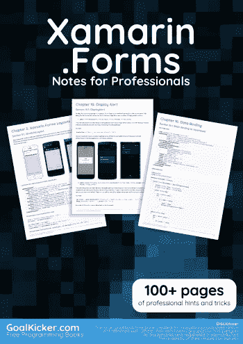
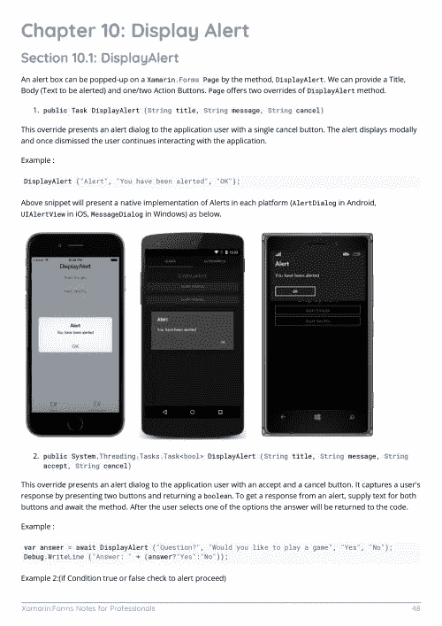
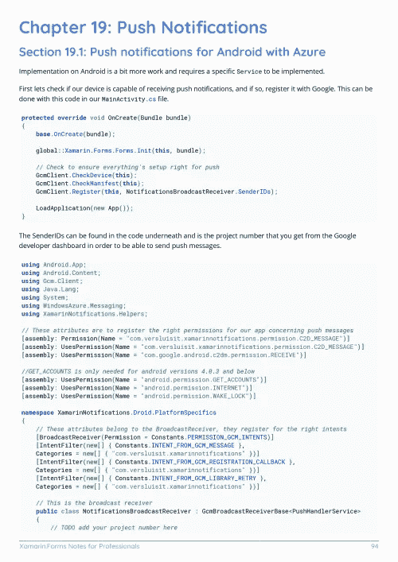

# 电子书:Xamarin。专业人员用表格说明手册

> 原文：<https://medium.easyread.co/e-book-xamarin-forms-notes-for-professionals-book-267a3f71310c?source=collection_archive---------1----------------------->

## 下载 Xamarin。形式的电子书免费由 GoalKicker.com

**下载这里:**[**【http://books.goalkicker.com/XamarinFormsBook/】**](http://books.goalkicker.com/XamarinFormsBook/)

*本品。本书是由* [*栈溢出文档*](https://archive.org/details/documentation-dump.7z) *汇编而成，内容是由漂亮的栈溢出人士编写的。文本内容由-SA 在知识共享协议下发布。见本书末尾的致谢，感谢对各章节做出贡献的人。除非另有说明，图像可能是其各自所有者的版权*

*为教育目的创作的书籍，与 Xamarin 无关。表单组、公司或堆栈溢出。所有商标属于其各自的公司所有者*

*181 页，2018 年 1 月出版*

# 章

1.  Xamarin 入门。形式
2.  为什么使用 Xamarin 表单以及何时使用 Xamarin 表单
3.  Xamarin 表单布局
4.  Xamarin 相对布局
5.  Xamarin 导航。形式
6.  Xamarin。表单页面
7.  Xamarin。表单单元格
8.  Xamarin。表单视图
9.  使用列表视图
10.  显示警报
11.  使用 DependencyService 访问本机功能
12.  DependencyService
13.  自定义渲染器
14.  贮藏
15.  手势
16.  数据绑定
17.  使用地图
18.  样式中的自定义字体
19.  推送通知
20.  效果
21.  触发因素和行为
22.  Xamarin 中的 AppSettings Reader。形式
23.  创建自定义控件
24.  使用本地数据库
25.  CarouselView —预发布版本
26.  异常处理
27.  Xamarin 格式的 SQL 数据库和 API。
28.  联系人选择器— Xamarin 表单(Android 和 iOS)
29.  Xamarin 插件
30.  OAuth2
31.  信息中心
32.  通用 Xamarin。表单应用程序生命周期？依赖平台！
33.  特定于平台的行为
34.  平台特定的视觉调整
35.  依赖服务
36.  单元测试
37.  Xamarin 中的 BDD 单元测试。形式