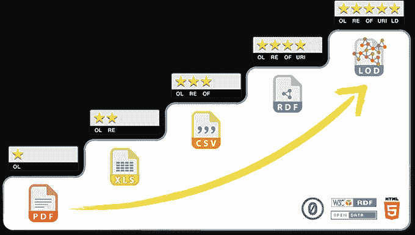
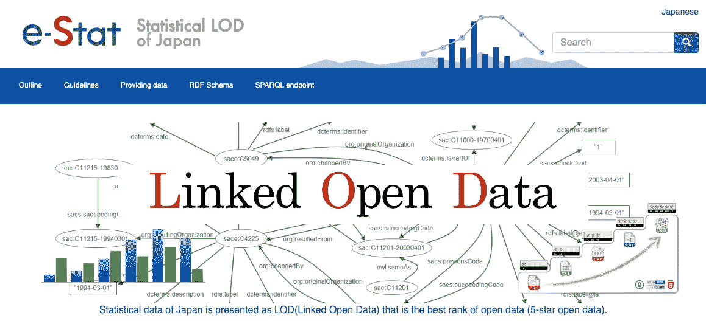
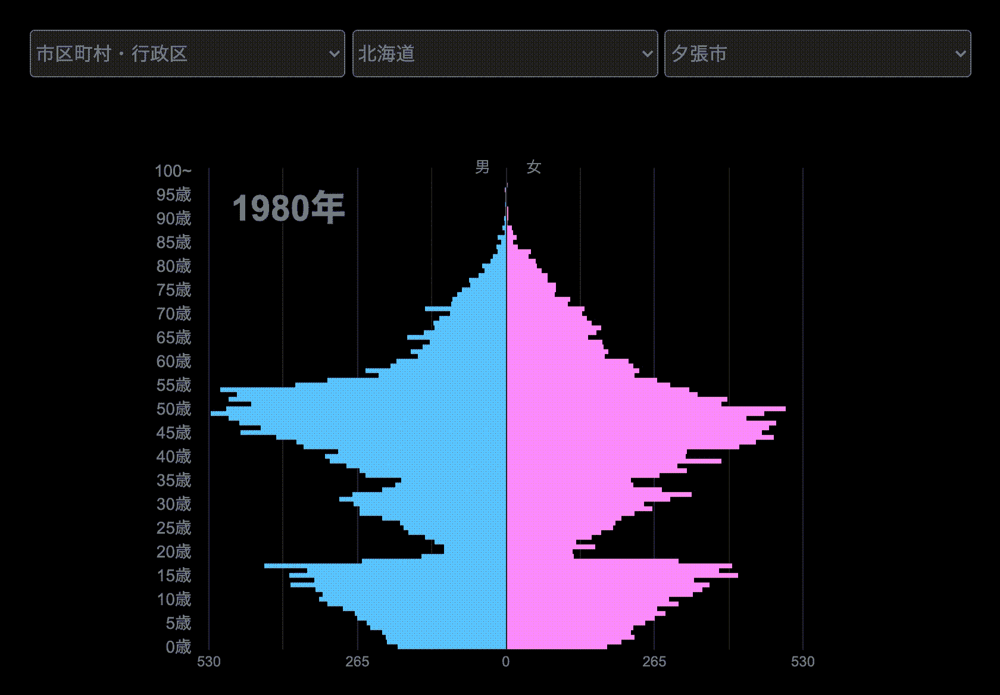

# 链接开放数据加速了公民数据科学

> 原文：<https://medium.com/oracledevs/e2625b3630a8?source=collection_archive---------0----------------------->

[https://2021.lodc.jp/](https://2021.lodc.jp/) (in Japanese)

自 2022 年 3 月举行 LOD Challenge 2021 awards 座谈会以来，已经有一段时间了，但我想分享一些关于这次活动、我们的活动以及日本 LOD 使用现状的亮点。

LOD 代表链接开放数据，这是公共机构和公司发布开放数据并促进其更广泛使用的最有效方法。自 2011 年以来，当地语义网社区每年都举办 LOD 挑战赛，旨在促进该技术的传播。

[https://2021.lodc.jp/awardSymposium2021Report.html](https://2021.lodc.jp/awardSymposium2021Report.html) (in Japanese)

在此期间，开放数据的重要性得到了广泛的认可，网络上的开放数据量显著增加。现在开放数据不仅仅是少数研究机构共享科学期刊和生命科学数据。开放数据倡议对许多国家的政府组织来说已经变得至关重要，公民实际上已经在访问这些数据来解决社会问题。

与此同时，我们一直在改进在网上共享数据的技术方法。机器可读格式使分析数据和构建应用程序变得更加容易，而不仅仅是将数据作为文档文件放在网站上。面向开放数据的[五星级部署方案](http://www.w3.org/DesignIssues/LinkedData.html)作为一项指导方针已经广为人知，尽管它可能并不总是数据发布者的强制性要求。

[https://5stardata.info/en/](https://5stardata.info/en/)

如今，许多公共机构，如统计中心和文化机构，都在积极提供 LOD。以这些可信的数据源为核心，其他开放数据，如地图、媒体公司的内容以及博物馆和图书馆的资产信息，都被链接起来。

国家统计中心提供了“统计 LOD”的 API，因此用户可以编写程序来分析数据和创建应用程序。这样的开发者被称为“公民数据科学家”，他们将在计算机素养更高的未来社会中，为解决社会问题发挥重要作用。

[https://data.e-stat.go.jp/lodw/en](https://data.e-stat.go.jp/lodw/en)

在 LOD Challenge 2021 中，我们发现了许多利用现有公开数据的提交内容。例如,“人口金字塔”,使用统计 LOD，可以立即可视化城市、城镇或村庄的人口变化。一旦数据被广泛使用，就会有更多的数据被公布和维护，从而创造一个数据共享的生态系统，培养一种开放的数据文化。

[https://www.mirko.jp/pyramid/](https://www.mirko.jp/pyramid/)

甲骨文很高兴作为赞助商参加 LOD 挑战赛。此外，作为技术合作伙伴，我们举办了一场研讨会，讨论如何使用 Oracle Cloud 的永远免费层构建 SPARQL 端点(=发布 LOD 的服务器)。我们为与会者提供了一个不需要信用卡的云帐户，这样即使是学生也可以免费拥有自己的服务器，没有时间限制。

甲骨文奖授予了提交的“[课程 LOD](https://jp-cos.github.io/en/) ”这个数据集的价值和质量得到了很高的评价，这个作品也获得了本次活动的大奖。

以下是评委评价的摘录:

> “该项目有助于建立国家研究课程模型，该模型将有广泛的用途。它还展示了创建 LOD 的谨慎和创造性方法，包括每个资源 URI 的 HTML 页面、英文摘要页面、问题管理和使用 GitHub 的网站发布等组件。我们希望该项目将继续得到增强，例如，通过与外部数据链接和发布 SPARQL 端点，并希望它将成为未来 LOD 构建的最佳实践。”

获奖项目名单见[这里](https://2021.lodc.jp/awardPressRelease2021.html)(日文)。

LOD Challenge 2022 目前正在接受提交材料，今年的研讨会上再次提供了 Oracle 云帐户。如果您对使用 Oracle Cloud 的永远免费层创建自己的 SPARQL 端点感兴趣，请查看[我关于如何做的文章](/oracledevs/build-always-free-sparql-endpoint-part-1-2-6749daa974bd)。

请从以下网址了解有关 **Oracle Graph** 的更多信息:

*   [中](/tag/oracle-graph) (=所有带有 Oracle Graph 标签的文章)
*   [堆栈溢出](https://stackoverflow.com/questions/tagged/oracle-graph) (=带有 oracle-graph 标记的问题)
*   [Slack AnDOUC](https://join.slack.com/t/andouc/shared_invite/zt-1a2hmiz6f-vLlblcQyv0t9FMraMMP5uQ) (=邀请链接，请访问#graph)
*   [Slack OracleDevRel](https://join.slack.com/t/oracledevrel/shared_invite/zt-uffjmwh3-ksmv2ii9YxSkc6IpbokL1g) (=邀请链接，请访问#oracle-db-graph)