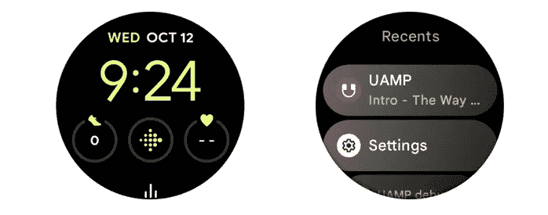

# 使用媒体工具包简化 Wear OS 媒体应用的开发

> 原文：<https://medium.com/androiddevelopers/ease-the-development-of-media-apps-for-wear-os-with-the-media-toolkit-1b7ea06e07e5?source=collection_archive---------6----------------------->

过去两年，随着新设备的发布，Wear OS 的使用量有所增长。播放音乐、听播客或跟踪指导锻炼的媒体应用程序现在非常受用户欢迎。

在这篇博客文章中，你将了解如何借助最新发布的 [Wear media toolkit](https://google.github.io/horologist/#media) 将你的媒体应用程序戴到 OS 智能手表上，并了解更多关于:

*   该工具包如何帮助在 Wear OS 上实现媒体用例。
*   手表上的媒体特定行为和独特的用户界面挑战。
*   新的 Wear OS 3 功能可以使媒体应用程序受益。
*   如何定制您的内容以在 Wear OS 上获得更好的性能。

# 佩戴媒体工具包

[Wear media toolkit](https://google.github.io/horologist/#media) 是一套加速 Wear OS 高质量媒体应用开发的库。该工具包是[钟表师](https://github.com/google/horologist)项目的一部分，它提供了一个全功能的[示例应用](https://github.com/google/horologist/blob/main/media-sample)，你可以运行它来探索你可以构建什么。

该工具包使用同类最佳的媒体用例库，从使用 [Compose for Wear OS](https://developer.android.com/training/wearables/compose) 实现的高效且令人愉快的 UI，到实现播放的 Media3。您的应用程序可能有特定的需求，比如使用专有的媒体播放器——在这种情况下，您可以采用工具包中的 UI 实现，同时仍然依赖您现有的播放器。

# 媒体使用案例

设计媒体应用时，首先考虑两个最重要的用例:

1.  **播放下载的内容:**下载音乐或播客，这样用户就可以在健身时收听，无需网络连接
2.  **流媒体**:使用任何可用的网络收听音乐、播客或广播电台

一些用户还希望使用 Wear OS 媒体应用程序来启动和控制手机上的媒体内容:这已经可以通过在手表和 Wear 的内置媒体控件上使用新推出的[助手](https://support.google.com/wearos/answer/7314149?hl=en-GB&co=GENIE.Platform%3DAndroid)体验来实现。

# 解决特定磨损挑战

你可能已经意识到了在开发 Android 手机应用程序时媒体所面临的挑战。手表还有其他考虑因素，如:

*   内置扬声器不是为音乐播放而设计的
*   更小的电池，因此功率有限
*   有限的或变化的网络连接
*   电池对不良 LTE 信号的敏感度

因此，为手表开发意味着考虑其他因素，为用户提供最佳体验:

*   避免在手表扬声器上播放媒体，使用蓝牙扬声器/耳机
*   启用音频卸载
*   除非绝对必要，否则避免 pinging 网络连接

让我们深入这些问题，看看媒体工具包如何帮助您解决这些挑战。

# 避免在手表扬声器上播放媒体

大多数 Wear OS 设备都有扬声器。虽然手表扬声器可以用于通话和指导活动，但它们不能提供最佳的媒体内容收听体验，因为它们不是为此目的而设计的。

为了提供最佳的用户体验，您的应用程序应该确保在蓝牙耳机或扬声器连接到手表时播放音频。

媒体工具包使这变得很容易。它提供了一个特定的 [Media3 扩展](https://github.com/google/horologist/tree/main/media3-backend)来修饰 [ExoPlayer](https://exoplayer.dev/) 实例，并在发出声音之前主动停止意外播放。这是通过检查当前音频输出是否是蓝牙设备来实现的。如果没有，工具包启动[蓝牙设置](https://developer.android.com/training/wearables/apps/audio#prompt-the-user-to-connect-a-headset)流程，允许用户连接到他们的耳机。

查看[尝试播放](https://github.com/google/horologist/blob/0ba50ca1de056d4aca16740d5f9c8bde33215982/media3-backend/src/main/java/com/google/android/horologist/media3/WearConfiguredPlayer.kt#L83)函数，看看这是如何实现的。

您可以看到，在 Media3 Player 之上，这个可重用的库代码是多么简单和合理。

# 启用音频卸载

[音频卸载](https://exoplayer.dev/battery-consumption.html#audio-playback)允许音频处理从 CPU 卸载到专用信号处理器。这带来了更好的性能和节能，这对 Wear OS 上的应用程序尤为重要。

媒体工具包通过配置和控制音频卸载的 [AudioOffloadManager](https://github.com/google/horologist/blob/main/media3-backend/src/main/java/com/google/android/) 为音频卸载提供支持，使您的应用程序在后台休眠，在前台禁用。

看一看[示例应用](https://github.com/google/horologist/blob/10fb61ff97458dbbe004039eca2f94a320ac69da/media-sample/src/main/java/com/google/android/horologist/mediasample/di/PlaybackServiceModule.kt#L221)来看看 [AudioOffloadManager](https://github.com/google/horologist/blob/main/media3-backend/src/main/java/com/google/android/horologist/media3/offload/AudioOffloadManager.kt) 是如何启用的。

请注意，音频卸载目前不支持以下功能:

*   改变播客的[播放速度](/google-exoplayer/exoplayer-2-12-whats-new-e43ef8ff72e7)
*   无间隙的
*   音量标准化

如果您不确定给定的音频格式是否支持音频卸载，请使用[audio manager . isofloadplaybacksupported()](https://developer.android.com/reference/android/media/AudioManager#isOffloadedPlaybackSupported(android.media.AudioFormat,%20android.media.AudioAttributes))方法。

有关更多信息，请参见 [Exoplayer 文档](https://exoplayer.dev/battery-consumption.html#audio-playback)。

# 使用 Macrobenchmark 验证音频卸载性能

Media Toolkit 提供了一些基准测试，您可以运行这些测试来生成性能跟踪。要比较启用或禁用音频卸载时的 CPU 性能，请运行 [PlaybackBenchmark](https://github.com/google/horologist/blob/main/media-sample-benchmark/src/main/java/com/google/android/horologist/mediasample/benchmark/PlaybackBenchmark.kt) 。这将持续 30 秒。首先，它提取 10 秒，缓冲后，播放 25 秒的音频。

请参见从 [ui.perfetto.dev](https://ui.perfetto.dev/) 获取的以下快照，以便在禁用和启用音频卸载的情况下进行回放。这些截图是在连接到 Pixel Buds 的 Pixel Watch 上运行 [PlaybackBenchmark](https://github.com/google/horologist/blob/main/media-sample-benchmark/src/main/java/com/google/android/horologist/mediasample/benchmark/PlaybackBenchmark.kt) 时拍摄的。

Audio offload disabled

Audio offload enabled

比较这两幅图像，很容易看出:

1.  启用音频卸载时，CPU 不会持续工作。
2.  当启用音频卸载时，CPU 频率会下降(约 449 MHz)较长时间，而当禁用音频卸载时，CPU 频率会更频繁地向更高的值振荡。

通过在 Android Studio 上运行 [PlaybackBenchmark](https://github.com/google/horologist/blob/main/media-sample-benchmark/src/main/java/com/google/android/horologist/mediasample/benchmark/PlaybackBenchmark.kt) 并在 [ui.perfetto.dev](https://ui.perfetto.dev/) 上导入结果，可以更深入地了解正在运行的进程。

如果你想了解更多关于宏基准的信息，请阅读更多关于[宏基准概述](https://developer.android.com/topic/performance/benchmarking/macrobenchmark-overview)的内容。

# 除非绝对必要，否则避免网络连接

当你为 Wear 开发时，你应该预料到用户的网络连接是有限的。许多用户在播放媒体时会忘记带手机。此外，即使用户有可用的网络连接，收听下载的内容也会为用户节省大量电池。

该工具包使优化媒体下载变得简单。它提供了一个 [MediaDownloadService](https://github.com/google/horologist/blob/main/media-data/src/main/java/com/google/android/horologist/media/data/service/download/MediaDownloadService.kt) ，使用 Media3 的 DownloadManager 和 Androidx 工作管理器来安排下载。Media3 启动所有正确的通知和前台服务，示例应用程序代码配置[工作管理器](https://github.com/google/horologist/blob/main/media-sample/src/main/java/com/google/android/horologist/mediasample/di/DownloadModule.kt)在 Wi-Fi 连接可用时运行下载，以确保更好的性能。这是通过使用[网络感知](https://github.com/google/horologist/tree/main/network-awareness)模块实现的，该模块允许开发人员将网络操作与网络类型对应起来。

总之，通过使用 MediaDownloadService，您可以确保用户获得可靠、高性能的下载，以便他们可以随时随地播放媒体。

# UI 设计

Wear media toolkit 提供了一个 [UI 模块](https://github.com/google/horologist/tree/main/media-ui)来帮助你的应用构建 UI 屏幕。

用户界面模块使用 [Compose for Wear OS](https://developer.android.com/training/wearables/compose) ，它为手表带来了许多定制的组件，并确保您的应用程序符合材料设计。它还提供了令人愉快的 Android Studio 集成开发体验，如预览和动画工具。Compose for Wear OS 和工具包带有内置的可访问性和跨所有屏幕的翻译。

您可以轻松使用 Wear media toolkit 屏幕，并根据应用程序的特定风格进行调整。屏幕遵循核心设计原则，媒体示例应用程序展示了这些原则:

*   应用程序应该使用 2 个可滑动的屏幕来组织:播放器和图书馆
*   **播放器**屏幕可以快速访问重要的播放动作。播放器屏幕应该有一个 5 按钮布局。这确保了我们的最小点击目标得以实现，用户可以在旅途中轻松控制媒体。
*   **库**屏幕允许用户找到要播放的媒体。在库屏幕中尽可能保持内容层次结构的扁平化，以降低复杂性。

Player and Library screens

*   在点击库中的内容时，应该向用户呈现实体页面，比如播放列表。实体页面为用户提供了关于媒体项目内容的更多信息。它还包含重要的用户操作，如手动下载和播放/随机播放。

Entity page

*   根据内容类型调整操作:如果你有一个播客，你可能想让用户快进 30 秒，而不是跳到下一个。
*   您可以在媒体应用程序中自定义图标和字体，但最小字体大小为 12dp。对于主要内容，如歌曲名称和艺术家姓名，字体大小至少应为 14dp。
*   对于具有 RSB(旋转侧按钮)或边框的设备，通过使用这种交互来改变音量或滚动内容，增强用户体验。

Volume screen

通过运行示例应用程序，您可以立即看到工具包如何帮助您在遵循上面列出的原则的同时构建应用程序屏幕。

# 正在进行的活动

一个[正在进行的活动](https://developer.android.com/training/wearables/notifications/ongoing-activity#:~:text=In%20Wear%20OS%2C%20pairing%20an,engaged%20with%20long%2Drunning%20activities.)是 Wear OS 3 中的一个新功能，允许正在进行的通知出现在 Wear OS 用户界面的其他表面上。

这使得用户能够更多地参与长时间运行的活动。健身和媒体应用程序受益于这一功能。正在进行的活动会显示在 watchface 和 recents 应用程序上。

Ongoing Activity

将您的应用程序设计为当正在进行的活动通知被点击时打开播放器屏幕。这允许用户快速执行动作，例如在播放歌曲时暂停歌曲。

如果您使用 Media 3，Wear OS 会自动为媒体应用程序创建正在进行的活动；你只需要提供一个打开应用的意图。这就是为什么示例应用程序简单地提供了一个到播放器屏幕的[深度链接，以获取打开播放器屏幕的正在进行的活动。](https://github.com/google/horologist/blob/main/media-sample/src/main/java/com/google/android/horologist/mediasample/di/PlaybackServiceModule.kt#L264)

# 性能考虑因素

确保您的应用程序具有良好性能的很大一部分可归结为优化流媒体和下载音乐的播放以及下载操作。

Wear media toolkit 有助于构建高性能应用的基础，例如提供[网络感知](https://github.com/google/horologist/tree/main/network-awareness)模块来为特定操作选择更好的连接，但要让应用在手表上表现良好，您需要考虑特定的应用选择。

流式传输的注意事项:

*   通过选择低比特率(如 48kbps)和编解码器(如 [AAC 和 MP3](https://developer.android.com/guide/topics/media/media-formats#audio-formats) )来优化内容。
*   优化图像和曲目的[预取策略](https://developer.android.com/training/connectivity/network-access-optimization#prefetch-data)，确保在暂时失去连接时继续播放。避免用户进入信号弱且无信号的区域，收听流媒体内容，以及音乐因网络连接中断而突然停止。
*   在所有网络配置中测试您的应用程序:Wi-Fi、LTE、通过蓝牙连接到手机的手表。还要测试手表在网络间切换时会发生什么。

下载内容的注意事项:

*   使用 WiFi [比使用蓝牙连接下载媒体到手表上要好得多](https://developer.android.com/training/connectivity/network-access-optimization#additional-considerations)。如果用户使用 LTE 计划，最好检查用户是否知道下载操作将使用 LTE 数据，这可能会成为一项昂贵的操作。

播放注意事项(流式和下载的音乐):

*   在手表上听媒体内容的用户不应该经历过度的电池消耗:即使网络可用，[也可以通过向服务器发送不太频繁的 pings 来限制流量](https://developer.android.com/training/connectivity/network-access-optimization#bundle-transfers)，并选择较低的插图图像分辨率。

# 总结

使用 Wear media toolkit 在 Wear OS 上构建您的媒体应用程序。该工具包旨在使开发更容易，同时确保实现媒体特定行为并采用磨损媒体设计原则。

查看我们的 Android 开发者峰会 2022 演讲，[在 Wear OS 上构建媒体应用](https://www.youtube.com/watch?v=Gc_q_SKjRIE)，获得关于该主题的精彩概述。

[d.android.com/wear](http://d.android.com/wear)是查看 Wear OS 开发相关最新指南的最佳地点。别忘了向主持 Wear media toolkit 的[钟表师项目](https://github.com/google/horologist)提供反馈。