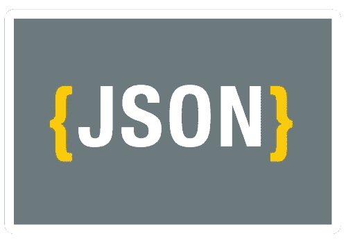

# 更简单、更好、更快 JSON:开发人员会喜欢的关于 Oracle Database 12c 第 2 版第 1 部分的 12 件事

> 原文：<https://medium.com/oracledevs/easier-better-faster-json-12-things-developers-will-love-about-oracle-database-12c-release-2-b478ebbd149f?source=collection_archive---------1----------------------->

12.1.0.2 为 Oracle 数据库带来了 JSON 支持。这有助于您处理存储在 clobs 或 varchar2s 中的 JSON 文档。

这些太棒了。但是存储原始 JSON 应该是例外，而不是常规。大多数时候，您应该将 JSON 文档分解到关系表中。

这给你留下了一个问题。以 JSON 格式获取数据！

尝试编写自己的 JSON 生成器很难。因此，在 12.2 中，我们提供了一整套选项来帮助您完成工作。

# 来自 SQL 的 JSON

12.2 提供了四个关键函数来帮助您编写以 JSON 格式返回数据的 SQL:

*   JSON _ 对象
*   JSON_objectagg
*   JSON _ 数组
*   JSON_arrayagg

使用 JSON_object*函数创建一系列键值对文档。即输出有花括号{}。JSON_array*函数接受一个值列表，并将其作为一个数组返回，即放在方括号[]中。

对于输入中的每一行，这些函数的非 agg 版本都输出一行。agg 版本将多行合并到一个文档或数组中。

好的。那么这些是如何工作的呢？

让我们看一个例子。

假设您正在使用经典的雇员和部门表。对于每个部门，您需要一个包含以下内容的 JSON 文档:

*   部门名称
*   一批员工
*   这个数组的每个元素都应该是自己的文档，列出雇员的姓名和职务。

例如:

```
{ 
  "department": "Accounting", 
  "employees": [ { 
    "name": "Shelley,Higgins", 
    "job": "Accounting Manager" 
  }, { 
    "name": "William,Gietz", 
    "job": "Public Accountant" 
  } ] 
}
```

如何使用新函数来创建它呢？

让我们从内向外努力:

*   首先，您需要为每个员工准备一份文档。这有两个属性，name 和 job。将这些传递给 JSON_object 调用。
*   然后你需要把这些变成一个数组。所以将 JSON_object 包装在一个 JSON_arrayagg 中。按部门分组，将每个部门的雇员划分到单独的数组中。
*   最后，每个部门都有一个文档。因此，您需要另一个带有部门和雇员属性的 JSON_object。这些值是部门名称和上一步中 JSON_arrayagg 调用的结果。

将所有这些放在一起，您会得到:

```
select json_object (
  'department' value d.department_name, 
  'employees' value json_arrayagg ( 
    json_object ( 
      'name' value first_name || ',' || last_name, 
      'job' value job_title 
    )
  )
) 
from  hr.departments d, hr.employees e, hr.jobs j 
where d.department_id = e.department_id 
and   e.job_id = j.job_id 
group by d.department_name;
```

瞧啊。你有你的 JSON！



# PL/SQL 中的 JSON

现在您有了 JSON 文档。但是如果要编辑呢？

假设您想将名称改为大写。并添加一个标题元素。所以前面的文档变成了:

```
{ 
  "department": "Accounting", 
  "employees": [ { 
    "name": "SHELLEY,HIGGINS", 
    "job": "Accounting Manager", "title": "" 
  }, {
    "name": "WILLIAM,GIETZ", 
    "job": "Public Accountant", 
    "title": "" 
  } ] 
}
```

如果您正在生成文档，最简单的方法就是将它们添加到 SQL 中！因此，这假设您想要从外部来源更改 JSON 文档。

为了帮助解决这个问题，有了新的 PL/SQL 对象。这些使您能够通过 get/put 调用访问、修改 JSON 文档并向其中添加元素。

关键对象类型包括:

*   json_element_t —文档和数组的超类型
*   json_object_t —用于处理 json 文档
*   json_array_t —用于使用 json 数组

您需要做的第一件事是创建 JSON 对象。通过解析文档来实现:

```
doc := json_object_t.parse(' {
  "department": "Accounting", 
  "employees": [ { 
    "name": "Shelley,Higgins", 
    "job": "Accounting Manager" 
  }, { 
    "name": "William,Gietz", 
    "job": "Public Accountant" } ] 
  } '
);
```

然后，您可以使用 get 来访问 employees 数组:

```
emps := treat(doc.get('employees') as json_array_t) ;
```

treat 函数将元素转换为适当的类型(这里是 JSON_array_t)。

一旦有了数组，就可以遍历雇员。如果不存在，Put 会添加一个新键。否则，它会覆盖现有值。

```
for i in 0 .. emps.get_size - 1 loop 
  emp := treat(emps.get(i) as json_object_t); 
  emp.put('title', ''); 
  emp.put('name', upper(emp.get_String('name'))); 
end loop;
```

get 函数返回对原始对象的引用。所以如果你得到一些 JSON 并修改它，原始文档也会改变！

如果不希望这样，那么在得到元素时克隆它。例如:

```
emps := treat(doc.get('employees') as json_array_t).clone
```

因此，转换 JSON 的完整 PL/SQL 块是:

```
declare 
  doc json_object_t; 
  emps json_array_t; 
  emp json_object_t; 
begin 
  doc := json_object_t.parse('{ 
      "department": "Accounting", 
      "employees": [ { 
        "name": "Shelley,Higgins", 
        "job": "Accounting Manager" 
      }, { 
        "name": "William,Gietz", 
        "job": "Public Accountant" 
      } ] 
    }'
  );   emps := treat(doc.get('employees') as json_array_t) ;   for i in 0 .. emps.get_size - 1 loop 
    emp := treat(emps.get(i) as json_object_t); 
    emp.put('title', ''); 
    emp.put('name', upper(emp.get_String('name'))); 
  end loop;     dbms_output.put_line(doc.to_String); 
end; 
/
{ 
  "department": "Accounting", 
  "employees": [ { 
    "name": "SHELLEY,HIGGINS", 
    "job": "Accounting Manager", 
    "title": "" 
  }, { 
    "name": "WILLIAM,GIETZ", 
    "job": "Public Accountant", 
    "title": "" 
  } ] 
}
```

现在，您可以从 SQL 生成 JSON，并在 PL/SQL 中对其进行更改，您有强大的选项来处理它。

在 12.2 版本中，JSON 的功能还有很多其他的改进。其他增强功能包括:

*   JSON_exists 函数
*   支持内存、分区和物化视图
*   搜索索引
*   杰奥森
*   JSON 数据指南

如果你非常想使用 JSON，我推荐[看看这些](https://docs.oracle.com/database/122/ADJSN/changes.htm#ADXDB6162)。

【blogs.oracle.com】全文原载于 2016 年 11 月 10 日[](https://blogs.oracle.com/sql/12-things-developers-will-love-about-oracle-database-12c-release-2)**。**