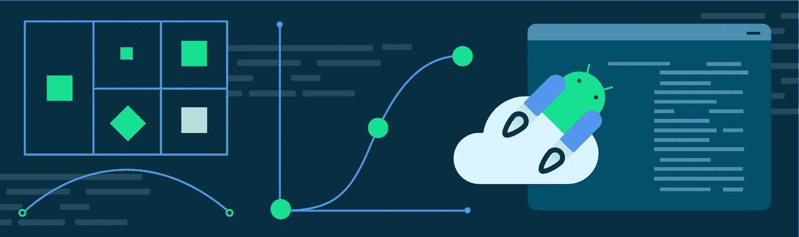
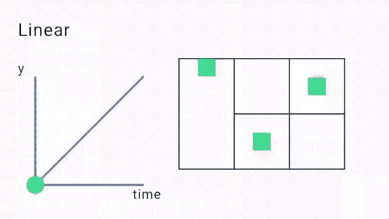
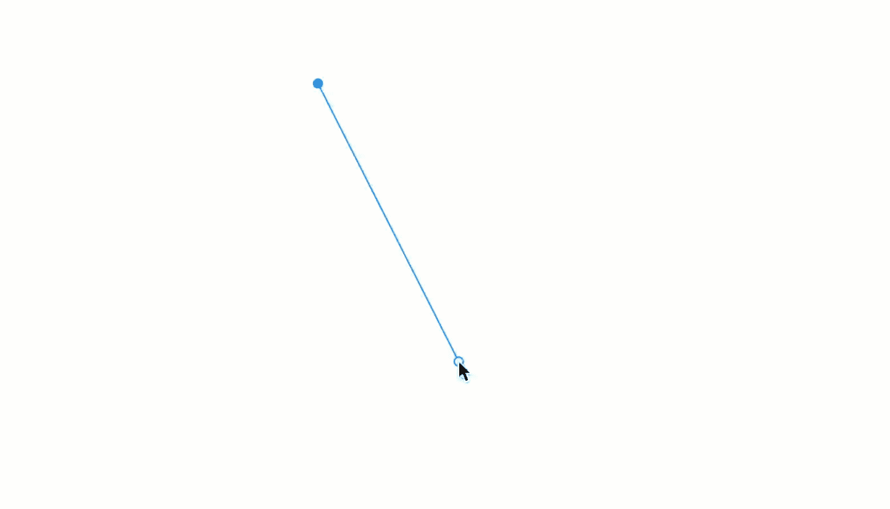
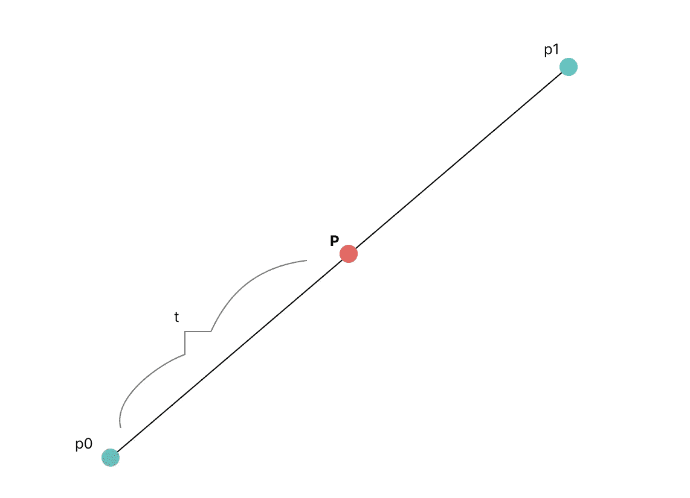
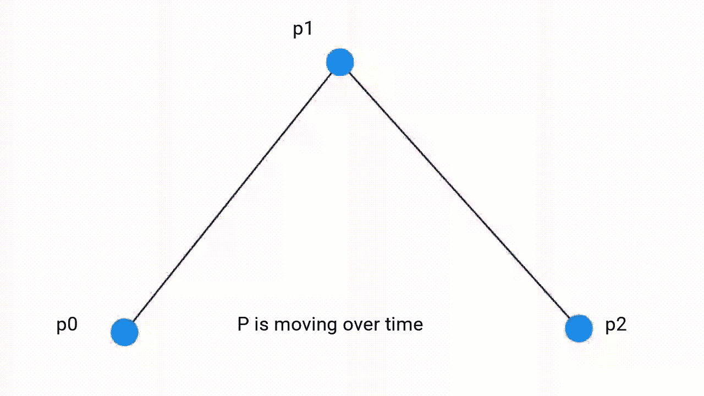
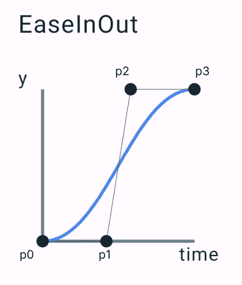
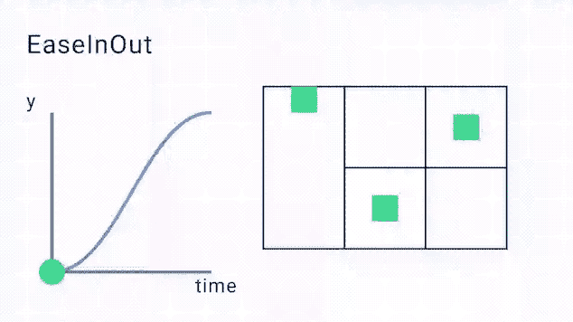
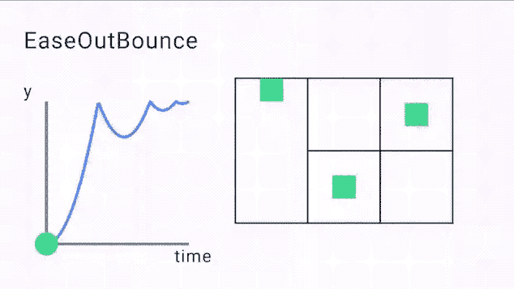
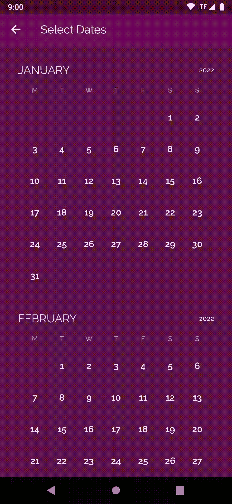

# 在 Jetpack 合成中缓入缓出曲线🎢

> 原文：<https://medium.com/androiddevelopers/easing-in-to-easing-curves-in-jetpack-compose-d72893eeeb4d?source=collection_archive---------4----------------------->



*了解如何在 Compose 中创建和使用自定缓动功能*

一切运动、加速或减速的东西——没有什么是瞬间开始或停止运动的。你在地板上弹起的球碰到地面，然后再次弹起，经过几次较小的弹起后，最终回到静止位置。列车到达目的地时，车门会慢慢关闭。缓和函数定义了这种加速或减速。一旦你了解了缓解功能，你会开始注意到你周围的缓解功能，有时你将无法再正常地看待这个世界(好吧，也许这只是我)。

当考虑 UI 动画时，使用不同的缓动功能可以帮助传达不同类型的动画。例如，如果你想要一个更有趣的用户界面，你可以考虑使用反弹或超调的缓动功能。对于更流畅的动画，您可以考虑使用“缓入”或“缓出”功能。

# 什么是缓和函数？

类似于视图系统中的[插值器](https://developer.android.com/reference/android/view/animation/Interpolator)，Compose 中的缓动函数是描述**变化率**的一种方式，假设 y 在**时间**内(通常在图上用 x 表示)。该函数将输入(动画持续时间的一部分)从 0 映射到 1。

在 Compose 中实现缓动功能的界面如下:

它传入一个介于 0 和 1 之间的`fraction`，并将其映射到一个新值，作为应用转换的结果。最简单的例子是实现一个线性缓动函数:

在下面的例子中，输入分数代表随时间的进展(时间是 x 轴)。线性映射将返回相同的进度值，因此变化率随时间是恒定的:



*Graph showing how Linear Easing works over time, and applying the animation to different animations such as translation, rotation, scaling, alpha and color.*

然而，线性缓动函数很少看起来最适合动画——因为生活中的大多数事物都不是线性移动的，重力几乎总是会影响对象的移动方式。当然，线性缓动比没有任何动画要好得多，但它看起来远不如随着时间推移而缓动的曲线那样流畅。

# **实现自己的缓动功能**

如果您已经查看了 Compose 的缓动函数的[源代码，您可能会注意到有一些已定义的缓动函数可供您使用，但是如果您想要更定制的东西，您也可以实现自己的缓动函数。你可能已经看到一些提供的标准缓动函数正在使用`CubicBezierEasing`函数并为其提供一些值:](https://android.googlesource.com/platform/frameworks/support/+/refs/heads/androidx-main/compose/animation/animation-core/src/commonMain/kotlin/androidx/compose/animation/core/Easing.kt#46)

这看起来很简单！但是什么是`CubicBezierEasing`？在我们开始之前，让我们学习一点关于贝塞尔曲线的一般理论。

# **什么是贝塞尔曲线？🤔**

[贝塞尔曲线](https://en.wikipedia.org/wiki/B%C3%A9zier_curve)是由一组控制点控制的参数曲线。这些控制点决定了曲线的形状。你可能已经见过贝塞尔曲线而没有意识到它——如果你试图通过创建点和它们之间的线来绘制矢量艺术——这是贝塞尔曲线的一种用法。它们提供了一种在点之间获得平滑过渡的方法——通过数学公式。



# 贝塞尔曲线是如何工作的？

我们可以用两点开始一条贝塞尔曲线，这两点是由一条线连接的`p0`和`p1`。如果我们在这两点之间引入第三个点`P`，那么`P`的位置由所谓的`t`值来描述——一个介于 0 和 1 之间的值(或者一个分数)。



当`t`在`0`和`1`之间移动时，`P`沿着`p0`和 p1 形成的直线移动，`P`的值是这两点的组合。例如:当`t`移近`p1`时，它向`1`移动，当`t`移近`p0`时，它向`0`移动，两者之间的任何值都是这两个值的混合。这称为 **lerp** 或**线性插补**。

```
P = (1-t)p0 + t * p1
```

向我们的样本添加另一点，我们有 **p0** 、 **p1** 和 **p2** 。我们现在有两个插值点，基于相同的 **t** 值在它们的线上移动。在用另一条线连接这两个点之后，如果我们在那条线上添加另一个点，它也基于相同的`t`-值移动。这遵循一个非常特殊的路径，被称为**二次贝塞尔曲线路径**。你可以不断增加点来得到更复杂的曲线，但同样的公式仍然适用。



关于贝塞尔曲线的更详细的视觉描述，这个关于[贝塞尔曲线之美](https://www.youtube.com/watch?v=aVwxzDHniEw)的视频值得一看，并阅读这本关于贝塞尔曲线的入门书。

# 什么是三次贝塞尔曲线？

三次贝塞尔曲线遵循与上面相同的模式，但是它采用 4 个(p0，p1，p2，p3)点来产生曲线(因此称为三次曲线)。曲线的形状由控制点`p1`和`p2`决定。

`CubicBezierEasing`功能接收两个控制点`p1`和`p2`。`p1`的 **x** 和 **y** 是函数的前两个参数，`p2`的 **x** 和 **y** 是函数的后两个参数。p0 和`p3`在(0，0)和(1，1)处是静态的，因此它们不作为函数的输入。

# 实现自定义缓动函数

为了定义我们自己的自定义缓和函数，我们可以自己实现`Easing`函数接口——或者使用已经定义的现有`CubicBezierEasing`函数。幸运的是，我们不需要自己想出漂亮的曲线！查看[easings.net](http://easings.net)函数集，我们可以从站点中提取三次贝塞尔曲线点，并实现大部分的缓和函数。

例如，`EaseInOut`功能可以通过以下方式轻松定义:

构成缓动曲线的映射点如下所示:



EaseInOut with its 4 points mapped

在上图中，你会看到点`p1`的`x,y`值为`(0.42, 0.0f)`，点`p2`的`x,y`值为`(0.58f, 1.0f)`。这将产生以下类型的缓和曲线。正如你所看到的，动画开始时很慢，逐渐变成线性，然后在接近尾声时变慢:



Ease In Out Curve Graph showing easing over time with multiple examples

一些缓动函数不需要使用三次贝塞尔曲线，而是使用指定的公式来转换值，如“缓出反弹”函数。

这是实现`EaseOutBounce`缓动功能的一个例子(取自[easings.net](http://easings.net)):

这将产生以下缓动曲线:



Ease out bounce curve with examples of how it would apply to basic animations

我们也可以使用[cubic-bezier.com](https://cubic-bezier.com)构建我们自己的定制缓动曲线——根据我们的意愿调整它。

# 如何在我的合成动画中使用自定义缓动功能？

几乎所有的动画 API 都接受一个`animationSpec`参数。我们可以通过使用`tween()` `animationSpec`并将`easing`参数设置为您的自定义缓动函数来指定要使用的缓动曲线:

不同的`animationSpecs`还有更多选择——比如`spring()`动画，一种基于物理的动画。值得注意的是，`spring()`是默认的`AnimationSpec`，因为它可以比基于持续时间的`AnimationSpec`类型(如`tween`)更平稳地处理中断。`Spring`当目标值在动画中变化时，保证速度的连续性。另一个`animationSpec`选项是`keyframes()`，用于在动画的不同时间进行更精细的控制。在 [AnimationSpec 文档](https://developer.android.com/jetpack/compose/animation#animationspec)中阅读更多关于不同`animationSpecs`的信息。

# 给我看看区别！

考虑[起重机日历选择](https://github.com/android/compose-samples/tree/main/Crane)动画，我们可以将整个动画的缓和曲线设置为一个`EaseOutQuart`:

这里是使用不同缓动曲线的动画的并排比较，你可以看到使用`Linear`与自定义的`EaseOutQuart`缓动函数产生了两个看起来非常不同的动画。渐出动画更平滑，感觉更流畅，而线性动画感觉很有结构，看起来不太自然。

`Linear`缓和——在整个动画中保持一致的速度，结尾很突然，与`EaseOutQuart`相比——在接近结尾时慢下来，一个平滑得多的结尾:



Linear Easing vs EaseOutQuart

# 摘要

如果你想使用其他的缓动功能，[的`1.2.0-beta03`合成动画](https://developer.android.com/jetpack/androidx/releases/compose-animation)推出了一堆新的缓动功能供你使用。点击查看[缓动文档，获取新缓动函数的更新列表。](https://developer.android.com/reference/kotlin/androidx/compose/animation/core/package-summary#Ease())

这就是现在的全部内容——我希望你能看看日常物品，试着找出它们使用的是什么缓解功能。

如果您有任何问题，请随时在 Twitter [@riggaroo](https://twitter.com/riggaroo) 上联系我。

再见了。👋

*感谢刘朵朵、尼克·布彻和本·特伦格罗夫对本文的反馈和评论。*