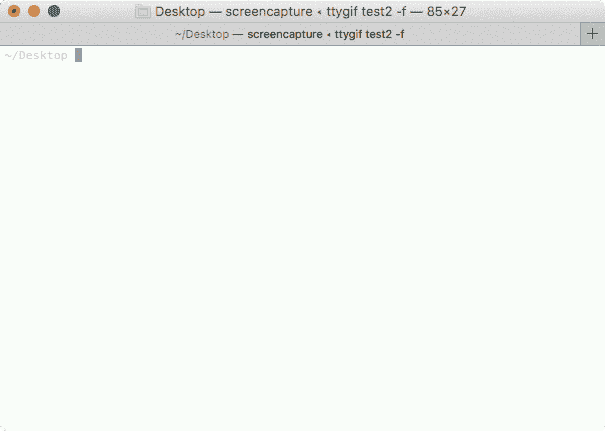
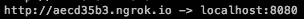
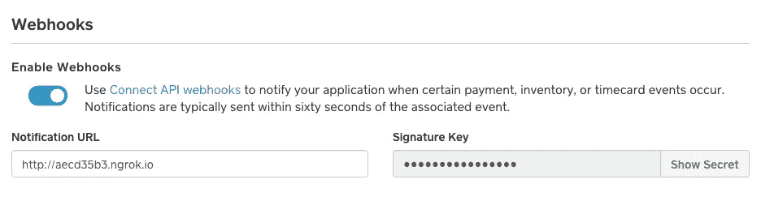
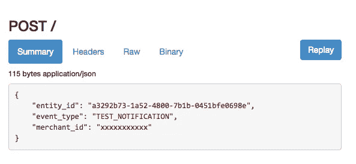

# 使用 ngrok 简化您的开发

> 原文：<https://medium.com/square-corner-blog/easing-your-development-with-ngrok-5389d6bbbc68?source=collection_archive---------0----------------------->

ngrok 让你用一个简单的命令就能轻松测试你的本地代码、webhooks 等等。

> 注意，我们已经行动了！如果您想继续了解 Square 的最新技术内容，请访问我们的新家[https://developer.squareup.com/blog](https://developer.squareup.com/blog)

> 上周，我在为 PDX PHP 做一个演示，讲述如何使用基于 PHP 的销售点和 Square 的 API 接受当面付款。大多数 PHP 开发工作流都涉及到使用本地开发服务器，然后在您确定一切都准备好了的情况下推进到您的生产服务器。当您试图在开发设备之外的设备上进行测试时，这可能有点麻烦。你如何与互联网上的其他人分享你的`localhost`？输入 **ngrok。**

ngrok 是一个允许你创建一个从本地主机到互联网的“隧道”的工具。最好用一个例子来解释，所以如果您想在多个设备上测试一个 web 应用程序，或者如果您正在为 webhooks 进行开发，我将演示如何启动和运行。

## 装置

在你的电脑上安装 ngrok 再简单不过了。`[ngrok.com/download](https://ngrok.com/download)`可能会有适合您平台的可执行文件。下载和解压会得到一个可执行文件，你可以用类似`$ ./ngrok`的命令运行它，但是不要跟踪你把下载文件放在哪里了，把它移到你的`$PATH`中就可以在任何地方访问`$ ngrok`。

## 使用

假设您正在开发一个应用程序，可能非常简单:

你正在运行一个类似于
`php -S localhost:8080`的本地开发服务器。这对您所有的本地测试来说都是很好的，但是为了测试代码如何在不同的设备上工作(特别是如果您正在使用[销售点 API](https://docs.connect.squareup.com/articles/point-of-sale-api-overview)来构建跨平台的基于 web 的 POS ),您将需要在 web 上公开一些东西。

ngrok 最简单的调用是`ngrok http 8080`。这将获取您在`localhost:8080`上公开的服务，并为其提供一个外部可访问的 URL。它生成的 URL 是随机的，但你可以注册一个帐户来获得你指定的自定义域名，以及其他高级功能。

localhost →xxx.ngrok.io

现在，您所要做的就是在不同的设备上导航到您的新 URL，继续您的测试和开发！

## Webhooks

Webhooks 是 ngrok 真正大放异彩的领域。您可以在本地机器上开发您的页面，然后使用您的 ngrok url 来接收针对它的 webhooks。这里有一个例子:

我在`[http://aecd35b3.ngrok.io](http://aecd35b3.ngrok.io)`上公开了我的本地站点，所以我将把它作为我的 webhook url 添加到 [Square 开发者门户](https://connect.squareup.com/apps/)中。

当我收到一个 webhook 请求时，我不仅可以在 ngrok 终端窗口中看到它，还可以使用 web 界面来查看我收到的请求是什么，以及我的应用程序的响应是什么。在测试像 webhooks 这样不能直接看到请求的东西时，知道应用程序如何响应是非常有用的。

如果您的响应不太正确，并且想要调整代码，您还可以从这个仪表板上重放请求。

ngrok 是一个开发 web 销售点 API 集成(或任何类型的多设备网站测试)的伟大工具，对于开发与 webhooks 的集成尤其有用。我希望你和我一样觉得它很有用！