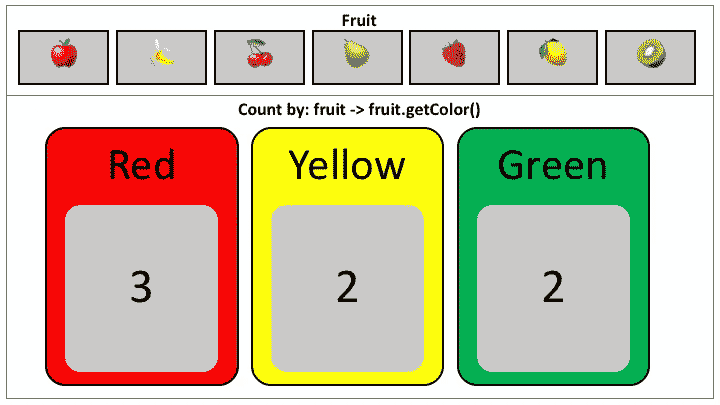

# EC 示例:CountBy

> 原文：<https://medium.com/oracledevs/ec-by-example-countby-a2d6411e95e1?source=collection_archive---------1----------------------->

学习如何在 [Eclipse 集合](https://github.com/eclipse/eclipse-collections)中使用`countBy`方法。



Count the fruit by color

# CountBy

方法`countBy`返回 Eclipse 集合中的一个`[Bag](/oracledevs/bag-the-counter-2689e901aadb)`。一个`Bag`是一个无序的`Collection`，它允许重复。Eclipse 集合中的`[HashBag](https://www.eclipse.org/collections/javadoc/9.2.0/org/eclipse/collections/impl/bag/mutable/HashBag.html)`实现的内部结构是一个`[ObjectIntHashMap](https://www.eclipse.org/collections/javadoc/9.2.0/org/eclipse/collections/impl/map/mutable/primitive/ObjectIntHashMap.html)`。内部映射的关键字是项目，值是存储为 int 的计数。方法`[countBy](https://www.eclipse.org/collections/javadoc/9.2.0/org/eclipse/collections/api/RichIterable.html#countBy-org.eclipse.collections.api.block.function.Function-)`将一个`Function`作为参数。

下面的代码将说明如何使用一个方法引用，根据颜色对一组`Fruit`进行计数。我们将结果存储在一个名为`**COUNTS_BY_COLOR**` **的变量中。**

```
public enum Fruit
{
    APPLE(Color.RED),
    BANANA(Color.YELLOW),
    CHERRY(Color.RED),
    PEAR(Color.GREEN),
    STRAWBERRY(Color.RED),
    LEMON(Color.YELLOW),
    KIWI(Color.GREEN);

    private final Color color;

    private static final ImmutableBag<Color> COUNTS_BY_COLOR =
            Bags.immutable.with(Fruit.values())
               .countBy(Fruit::getColor);

    Fruit(Color color)
    {
        this.color = color;
    }

    public Color getColor()
    {
        return this.color;
    }

    public static int getColorCount(Color color)
    {
        return COUNTS_BY_COLOR.occurrencesOf(color);
    }

    public static boolean isTopColor(Color color)
    {
        return COUNTS_BY_COLOR.topOccurrences(1)
                .anySatisfy(each -> each.getOne() == color);
    }

    public enum Color
    {
        RED, YELLOW, GREEN
    }
}
```

我们有两个方法来查询创建的`ImmutableBag`。它们用于以下测试。

```
public class FruitTest
{
    @Test
    public void redFruit()
    {
        Assertions.assertEquals(3, 
                Fruit.getColorCount(Fruit.Color.RED));
        Assertions.assertTrue(
                Fruit.isTopColor(Fruit.Color.RED));
    }

    @Test
    public void yellowFruit()
    {
        Assertions.assertEquals(2, 
                Fruit.getColorCount(Fruit.Color.YELLOW));
        Assertions.assertFalse(
                Fruit.isTopColor(Fruit.Color.YELLOW));
    }

    @Test
    public void greenFruit()
    {
        Assertions.assertEquals(2, 
                Fruit.getColorCount(Fruit.Color.GREEN));
        Assertions.assertFalse(
                Fruit.isTopColor(Fruit.Color.GREEN));
    }
}
```

更新日期:2023 年 1 月

时隔四年，我重访了这个博客。我看到了下面的代码，并意识到这个例子是在实现`containsBy`模式之前编写的。每当我看到`anySatisfy`与`equals`或身份检查一起使用时，我本能地知道可以使用名为`contains`的更高级模式。在这种情况下，`contains`不起作用的地方在于需要应用`Function`来检查特定属性的包含性。在这种情况下，被测试的属性是`ObjectIntPair.getOne()`。

```
public static boolean isTopColor(Color color)
{
    return COUNTS_BY_COLOR.topOccurrences(1)
            .anySatisfy(each -> each.getOne() == color);
}
```

使用`containsBy`可将代码重写如下。

```
public static boolean isTopColor(Color color)
{
    return COUNTS_BY_COLOR.topOccurrences(1)
            .containsBy(ObjectIntPair::getOne, color);
}
```

我在下面的博客中描述了`containsBy`方法是如何发展而来的。

[](/javarevisited/fusing-methods-for-productivity-c15c9eb2d666) [## 提高生产率的融合方法

### 当一个迭代模式如此普遍时，你给它一个名字。

medium.com](/javarevisited/fusing-methods-for-productivity-c15c9eb2d666) 

# 示例中涉及的 API

1.  `[countBy](https://www.eclipse.org/collections/javadoc/9.2.0/org/eclipse/collections/api/bag/ImmutableBag.html#countBy-org.eclipse.collections.api.block.function.Function-)` —按指定的`Function`对`Collection`元素进行计数，并返回一个[包](https://www.eclipse.org/collections/javadoc/9.2.0/org/eclipse/collections/api/bag/Bag.html)。
2.  `[Bags](https://www.eclipse.org/collections/javadoc/9.2.0/org/eclipse/collections/impl/factory/Bags.html).immutable.with` —用指定的可变参数元素创建一个`ImmutableBag`。Eclipse 集合中有[可变](/@donraab/as-a-matter-of-factory-part-1-mutable-75cc2c5d72d9)和[不可变](/@donraab/as-a-matter-of-factory-part-2-immutable-8cb72ff897ee) `Collection`工厂。
3.  `[occurrencesOf](https://www.eclipse.org/collections/javadoc/9.2.0/org/eclipse/collections/api/bag/Bag.html#occurrencesOf-java.lang.Object-)` —从`Bag`返回特定项目的计数。
4.  `[topOccurrences](https://www.eclipse.org/collections/javadoc/9.2.0/org/eclipse/collections/api/bag/Bag.html#topOccurrences-int-)` —返回一个`List`项目及其按出现次数降序排列的计数。

查看这个[演示](http://eclipse.github.io/eclipse-collections-kata/api-design)以了解关于 Eclipse 集合 API 的起源、设计和发展的更多信息。

[*月食收藏*](https://github.com/eclipse/eclipse-collections) *开作* [*投稿*](https://github.com/eclipse/eclipse-collections/blob/master/CONTRIBUTING.md) *。如果你喜欢这个库，你可以在 GitHub 上让我们知道。*