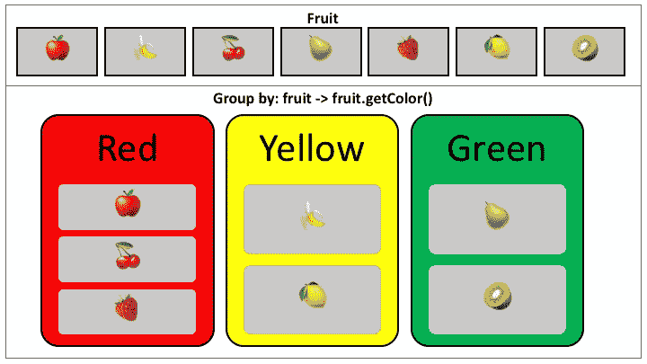

# EC by 示例:GroupBy

> 原文：<https://medium.com/oracledevs/ec-by-example-groupby-7ca219358c3b?source=collection_archive---------0----------------------->

了解如何使用 [Eclipse 集合](https://github.com/eclipse/eclipse-collections)对集合的元素进行分组。



# 新年快乐

这是我 2019 年的第一篇博客。我会长话短说。是时候写点代码了。

# 分组依据

方法`groupBy`在 [Eclipse 集合](https://github.com/eclipse/eclipse-collections)中返回一个`[**Multimap**](/oracledevs/multimap-how-it-works-a3430f549d35)`。一个`Multimap`看起来像一个`Map`，因为它有像`get`和`put`这样的方法，但是一个`Multimap`中的值总是一些`Collection`类型，像一个`List`、`Set`或`Bag`。

下面的代码将说明如何根据颜色对一组`Fruit`进行分组。我们将分组结果存储在一个名为`**FRUIT_BY_COLOR**`的变量中。注意，该类型是一种特殊的`[Multimap](https://www.eclipse.org/collections/javadoc/9.2.0/org/eclipse/collections/api/multimap/Multimap.html)`，因为我们在`[ImmutableBag](https://www.eclipse.org/collections/javadoc/9.2.0/org/eclipse/collections/api/bag/ImmutableBag.html)`上调用了`groupBy`。

```
public enum Fruit
{
    APPLE(Color.RED),
    BANANA(Color.YELLOW),
    CHERRY(Color.RED),
    PEAR(Color.GREEN),
    STRAWBERRY(Color.RED),
    LEMON(Color.YELLOW),
    KIWI(Color.GREEN);

    private final Color color;

    private static final ImmutableBagMultimap<Color, Fruit> FRUIT_BY_COLOR =
            Bags.immutable.with(Fruit.values())
                .groupBy(Fruit::getColor);

    Fruit(Color color)
    {
        this.color = color;
    }

    public Color getColor()
    {
        return this.color;
    }

    public static ImmutableBag<Fruit> getFruitByColor(Color color)
    {
        return FRUIT_BY_COLOR.get(color);
    }

    public enum Color
    {
        RED, YELLOW, GREEN
    }
}
```

我们可以使用`Fruit`枚举上的`getFruitByColor`方法查询每种颜色的`**FRUIT_BY_COLOR**` `Multimap`。

```
public class FruitTest
{
    @Test
    public void redFruit()
    {
        Assert.assertEquals(
                Bags.immutable.with(
                        Fruit.APPLE,
                        Fruit.CHERRY,
                        Fruit.STRAWBERRY),
                Fruit.getFruitByColor(Fruit.Color.RED));
    }

    @Test
    public void yellowFruit()
    {
        Assert.assertEquals(
                Bags.immutable.with(
                        Fruit.BANANA,
                        Fruit.LEMON),
                Fruit.getFruitByColor(Fruit.Color.YELLOW));
    }

    @Test
    public void greenFruit()
    {
        Assert.assertEquals(
                Bags.immutable.with(
                        Fruit.PEAR,
                        Fruit.KIWI),
                Fruit.getFruitByColor(Fruit.Color.GREEN));
    }
}
```

# 示例中涉及的 API

1.  `[groupBy](https://www.eclipse.org/collections/javadoc/9.2.0/org/eclipse/collections/api/bag/ImmutableBag.html#groupBy-org.eclipse.collections.api.block.function.Function-)` —使用指定的函数将一个`Collection`分组到一个`Multimap`中，为每个对象计算一个键。`Collection`的类型决定了返回的`Multimap`的类型。
2.  `[Bags](https://www.eclipse.org/collections/javadoc/9.2.0/org/eclipse/collections/impl/factory/Bags.html).immutable.with` —使用指定的可变参数元素创建一个`ImmutableBag`。Eclipse 集合中有[可变](/@donraab/as-a-matter-of-factory-part-1-mutable-75cc2c5d72d9)和[不可变](/@donraab/as-a-matter-of-factory-part-2-immutable-8cb72ff897ee) `Collection`工厂。
3.  `[get](https://www.eclipse.org/collections/javadoc/9.2.0/org/eclipse/collections/api/multimap/bag/ImmutableBagMultimap.html#get-K-)` —从`Multimap`返回一个`Collection`。在`ImmutableBagMultimap`的情况下返回一个`ImmutableBag`。

查看这个[演示](http://eclipse.github.io/eclipse-collections-kata/api-design)以了解关于 Eclipse 集合 API 的起源、设计和发展的更多信息。

[*月食收藏*](https://github.com/eclipse/eclipse-collections) *是开作* [*投稿*](https://github.com/eclipse/eclipse-collections/blob/master/CONTRIBUTING.md) *。如果你喜欢这个库，你可以在 GitHub 上让我们知道。*