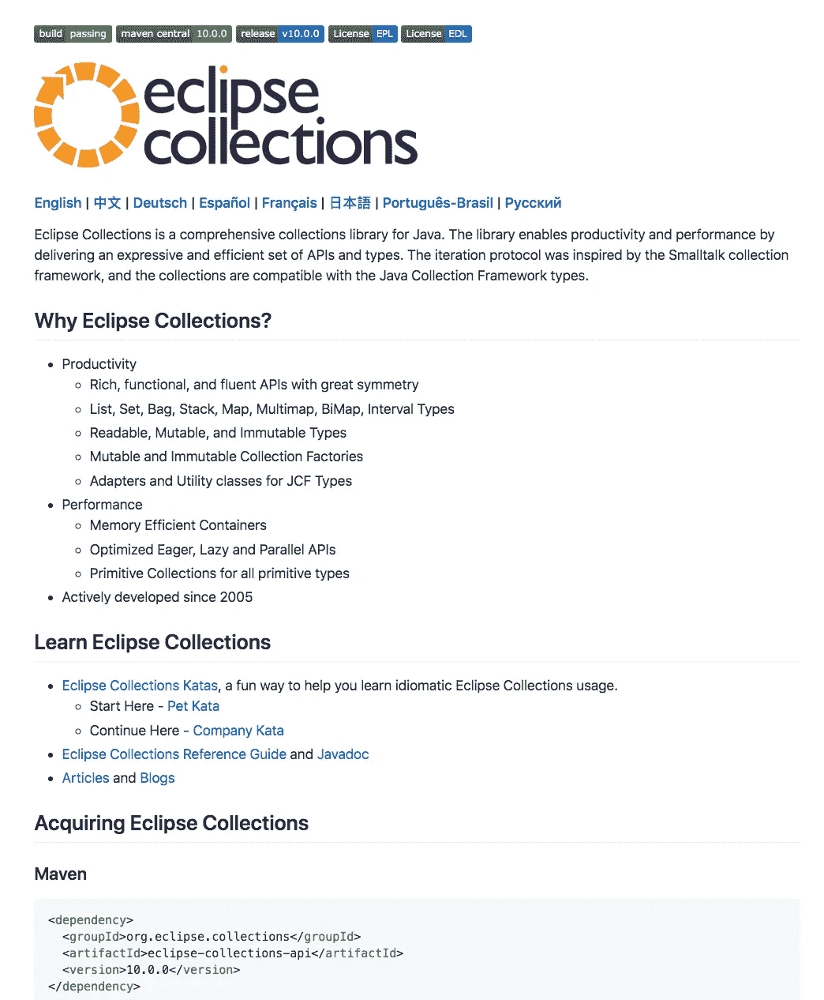

# 发布了 Eclipse 集合 10.0

> 原文：<https://medium.com/oracledevs/eclipse-collections-10-0-released-49bae6a4b4c6?source=collection_archive---------7----------------------->

[README](https://github.com/eclipse/eclipse-collections/blob/master/README.md): The features you want with the collections you need

# 感谢贡献者

[Eclipse Collections](https://github.com/eclipse/eclipse-collections) 9.2 于 2018 年 5 月发布。9.x 版本的特性非常丰富，并且有很多来自社区的贡献。10.0 版本更是如此。在 [10.0 版本](https://github.com/eclipse/eclipse-collections/releases/tag/10.0.0)中有 18 个贡献者。这是杰出的！非常感谢所有贡献者，他们贡献了宝贵的时间，让 Eclipse 集合的功能更加丰富，质量更高。非常感谢你的努力。

# 一个博客的功能太多

在 [Eclipse 集合](https://github.com/eclipse/eclipse-collections) 10.0 中包含了如此多的特性，以至于我要花更多的时间来编写利用所有这些特性的好例子。所以我决定把这篇博客分成几个部分。这部分将纯粹是一个总结。

# 更新:详细功能博客

*   [第 1 部分](/@donraab/new-features-of-eclipse-collections-10-0-part-1-3307ce997d21?source=friends_link&sk=6e99f4dc0ef15ec28a4ba2410ef6eaaf) —涵盖特性 1–10
*   [第 2 部分](/@donraab/new-features-of-eclipse-collections-10-0-part-2-cc215aadc907?source=friends_link&sk=76f3543e88c8f06062d34f094c67db71) —涵盖特性 11–20
*   [第 3 部分](/@donraab/new-features-of-eclipse-collections-10-0-part-3-ff801223f821?source=friends_link&sk=4f2c6d12f1dd3f65aac4f609f717a144) —涵盖特征 21–26
*   [我的十大功能列表](/@donraab/10-features-in-eclipse-collections-10-0-b5529f41d448?source=friends_link&sk=00774aab62995bea1fd5f9955b46987e)
*   [网站现已翻译成西班牙语](https://www.eclipse.org/collections/es/index.html)

# 功能概述

1.  用于`MultiReaderList` / `Bag` / `Set`的专用接口
2.  为原始列表实现`Stream`
3.  用目标地图实现`toMap`
4.  执行`MutableMapIterable.removeAllKeys`
5.  执行`RichIterable.toBiMap`
6.  实施`Multimap.collectKeyMultiValues`
7.  在集合工厂上实现`fromStream(Stream)`
8.  实施`LazyIterate.cartesianProduct`
9.  将`updateValues`添加到原始地图
10.  实施`MutableMultimap.getIfAbsentPutAll`
11.  实施`Bag.collectWithOccurrences`
12.  为原始可迭代增加`reduce`和`reduceIfEmpty`
13.  为新特性添加< 【 >< 【 > 【 < 【 > 【 for primitives
14.  Add 【 to primitive maps
15.  Implement 【 on 【
16.  Implement 【
17.  Implement 【
18.  Implement 【 on mutable primitive maps.
19.  Add ability to create 【 / 【 / 【 from 【
20.  Implement 【 and 【 in 【
21.  Implement 【 on 【
22.  Revamp and standardize resize/rehash for all primitive hash structures
23.  Implement factory methods to convert 【 < 【 > to 【 / 【 / 【 / 【
24.  Implement 【 in 【
25.  Implement a 【 factory method that takes a 【 parameter.
26.  Wildcard type in 【 & add methods

Check out the latest [JavaDoc](https://www.eclipse.org/collections/javadoc/10.0.0/overview-summary.html) 。

# 其他改进

1.  提高测试覆盖率
2.  许多构建改进
3.  删除重复代码
4.  删除了一些不赞成使用的类
5.  改进的泛型
6.  一些新的基准测试
7.  还有更多！

# 谢谢你

来自所有的贡献者和提交者…感谢您使用 Eclipse 集合。我们希望您喜欢 10.0 版本中的所有新功能和改进。

我将在几篇博客中发布 10.0 版本中新特性的详细示例。敬请期待！

*我是*[*Eclipse Collections*](https://github.com/eclipse/eclipse-collections)*OSS 项目在*[*Eclipse Foundation*](https://projects.eclipse.org/projects/technology.collections)*的项目负责人。* [*月食收藏*](https://github.com/eclipse/eclipse-collections) *是开投* [*投稿*](https://github.com/eclipse/eclipse-collections/blob/master/CONTRIBUTING.md) *。如果你喜欢这个库，你可以在 GitHub 上让我们知道。*