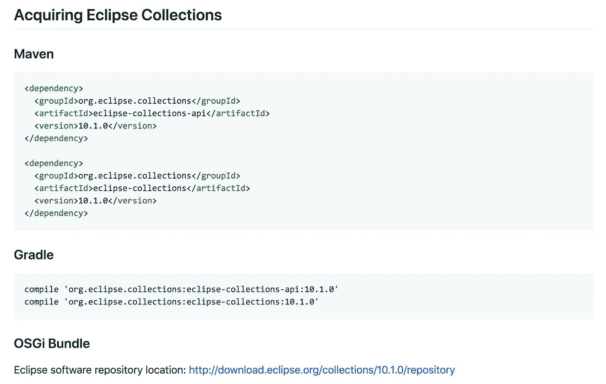

# 发布了 Eclipse 集合 10.1

> 原文：<https://medium.com/oracledevs/eclipse-collections-10-1-released-edfdc50ec0f4?source=collection_archive---------3----------------------->

这是第十次[发布评审](https://projects.eclipse.org/projects/technology.collections/governance)，也是 [Eclipse 集合](https://github.com/eclipse/eclipse-collections)作为 [Eclipse Foundation](https://www.eclipse.org/) 的一个项目的第四年。


Eclipse Collections t-shirts made by my wife with her [Cricut Maker](https://cricut.com/) for EC Contributors and Advocates

# 感谢贡献者

首先，我想大声喊出来，感谢所有花时间为这个[版本](https://github.com/eclipse/eclipse-collections/releases/tag/10.1.0)做出贡献的人。这是一个较小的特性发布，但是对库和 Eclipse 集合社区有一些值得注意的增加。我们也有一些新的首次为 Eclipse 集合和 OSS 做出贡献的人，我想说恭喜，欢迎，谢谢！

# 新功能

1.  已实施`RichIterable.groupByAndCollect`。

```
@Test
public void groupByAndCollect()
{
    MutableList<String> list =
            Lists.***mutable***.with(**"One"**, **"Two"**, **"Three"**); MutableMultimap<Character, String> multimap =
            list.groupByAndCollect(
                    each -> each.charAt(0),
                    String::toUpperCase,
                    Multimaps.***mutable***.list.empty()); MutableListMultimap<Character, String> expected =
            Multimaps.***mutable***.list.with(**'O'**, **"ONE"**, **'T'**, **"TWO"**, **'T'**, **"THREE"**); Assert.*assertEquals*(expected, multimap);
}
```

2.已实施`NoopProcedure`。

```
@Test
public void noopProcedure()
{
    MutableList<Integer> list = Lists.***mutable***.with(1, 2, 3);
    list.forEach(Procedures.*noop*());

    Assert.*assertEquals*(Lists.***mutable***.with(1, 2, 3), list);
}
```

# 其他改进

1.  Eclipse Collections 网站的西班牙语翻译。
2.  更新了创建/修改不可变集合的文档。
3.  ImmutableSortedBagFactory 的 Multimaps 类中的固定变量名。
4.  修复了为 p2 存储库生成的 Eclipse 功能，以确保下载正确的 EPLv1 许可证。
5.  修复了为 p2 存储库生成的 Eclipse 特性，以确保工件上的正确签名。

# 错误修复

1.  修正了`IntInterval.fromToBy()`从和到的相同值的负步长。
2.  修正了`IntInterval.injectInto()`从和到的相同值的负步长。

# 在 Eclipse 基金会工作了四年

这个月，我们将庆祝 Eclipse 基金会的 Eclipse Collections 项目成立四周年。我很高兴地向大家报告，Eclipse Collections 仍然很强大！我们继续扩大我们的贡献者、用户和倡导者社区。我认识的每个在项目中使用 Eclipse 集合的人都非常欣赏 API 的丰富性和对称性，以及库的生产力和性能。感谢 Eclipse 集合社区中所有人的支持！

Eclipse 集合 10.1 也将包含在即将发布的 Eclipse IDE 版本中。

 [## eclipse IDE 2019–12

### 上映日期:2019 年 12 月 18 日星期三

projects.eclipse.org](https://projects.eclipse.org/releases/2019-12) 

**注意:** Eclipse 集合可以在任何 Java 项目和任何 Java IDE 中使用。Eclipse 集合不依赖于任何其他库，也不依赖于 Eclipse IDE。该库在 Maven Central 中可用，并作为 OSGi 包提供。



# 谢谢你

来自所有的贡献者和提交者…感谢您使用 Eclipse 集合。我们希望你喜欢 [10.0](/oracledevs/eclipse-collections-10-0-released-49bae6a4b4c6?source=friends_link&sk=a94837d5317ce2863be2c259fee8db41) 和 [10.1](https://github.com/eclipse/eclipse-collections/releases/tag/10.1.0) 版本中的所有新特性和改进。

祝你有一个安全、健康、快乐的假期！如果你喜欢月食收藏，加入其他[观星者](https://github.com/eclipse/eclipse-collections/stargazers)的行列，在 [GitHub](https://github.com/eclipse/eclipse-collections) 上给回购者一颗星。

[*月食收藏*](https://github.com/eclipse/eclipse-collections) *为* [*投稿*](https://github.com/eclipse/eclipse-collections/blob/master/CONTRIBUTING.md) *开放。如果你喜欢这个库，你可以在 GitHub 上让我们知道。*