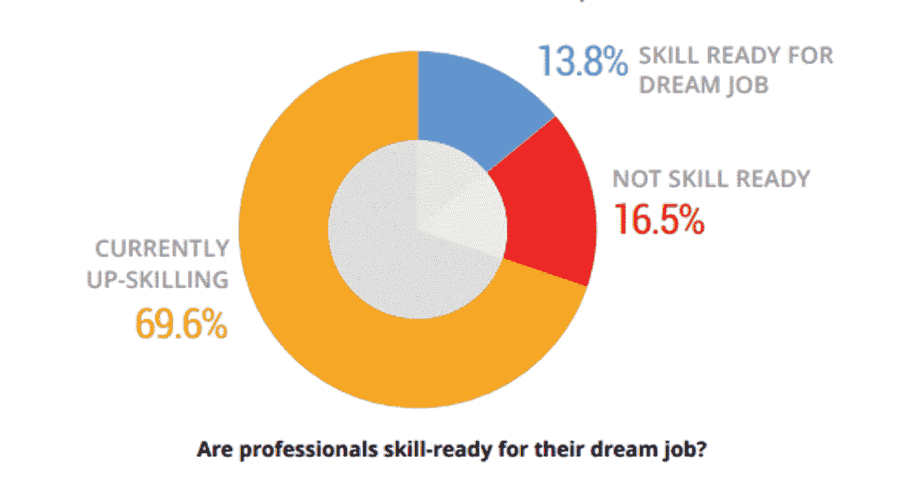

# Edureka 职业指南——顶级技术工作路线图

> 原文：<https://medium.com/edureka/edureka-career-guide-7cd4b20be54?source=collection_archive---------5----------------------->

2019 年无疑是技术革命之年。随着多个行业采用新的当代技术，毫无疑问，技术的进步将会以很快的速度发生。此外，随着 2019 年第二季度的临近，是时候让技术专业人员完全掌控自己的职业道路，实现他们的梦想职业生涯了。

但是，尽管这听起来很乐观，但一个公认的事实是，行业需求和专业人士获得的技能之间存在差距。

毕竟，对每一个提升技能的专业人士来说，这都是一个重要的问题！

> 我是什么？……到……我想成为什么？

为了帮助你找到这个问题的答案，我们进行了一项调查，以了解技术专业人士寻求一些高薪职位的动机。

我们的调查结果显示，**寻找未来技术领域工作的主要动机是提高他们工作和项目的质量**。

获得更好的工作职位和更高的薪水是影响他们升级到热门技术职业的另一个重要原因。

此外，正如您从下图中看到的，技术专业人员也将他们当前角色的自然发展、对冗余的恐惧、同行的影响列为转向需求技术的原因。

除此之外，我想到的另一个问题是

> 有多少人真正知道如何获得他们梦想中的工作？

当我们问我们的调查参与者同样的问题时，超过 51%的人说他们不知道如何获得他们梦想的工作，48.6%的人说他们知道如何获得他们渴望的工作。

这让我们意识到，每个技术专业人员都希望在趋势技术领域获得一份利润丰厚、回报丰厚的工作，但超过一半的人不知道如何实现这一目标。

我们调查的第三部分包括专业人士为他们的理想工作做好准备的技能。

正如你可以从上面的图表中看到的，我们所有人都清楚地看到，几乎 69%的人目前正在提升自己的技能。因此，可以明确地说，it 员工对未来工作技能的需求非常高，但他们缺乏实现梦想工作角色的清晰路线图和学习途径。

因此，Edureka 推出了 2019 年 Edureka 技术职业指南，旨在通过为技术专业人士**提供定制的按需技术**学习路径来缩小这一技能差距，即:

*   机器学习
*   大数据
*   云计算
*   DevOps
*   区块链
*   网络安全

本技术职业指南还试图回答关于技术职业道路的**个最常问的问题，尤其是那些新兴技术的问题，同时根据 Edureka 在这些技术方面的深厚专业知识提供可信的信息。**

***这份 Edureka 2019 年科技职业指南，是科技专业人士了解的一站式资源:***

1.  哪些技术技能值得学习？
2.  哪些职位最有价值&它们的行业前景？
3.  准确的**职业道路**热门技术工作角色**学习时间&资源**

提升未来技能不再是一种选择，事实上，Edureka 之前的一份技能报告指出**一名技术专业人员需要在其职业生涯中提升 15-20 次技能，才能在当今竞争激烈的 IT 行业中保持相关性**。我们相信，像这份职业指南这样由专家策划的信息，将会以一种结构化的方式帮助你提高技能。

我们花了几个月的时间来创建这个职业指南，我们希望它能帮助数百万 IT 专业人士实现他们的梦想工作。要创建本指南，

*   我们利用了我们的主题专家的专业知识，
*   询问了我们的职业顾问
*   汇集了我们内部的知识和研究。

为了更好地了解技术专业人员的职业和学习需求，我们甚至采访了全球数百名 IT 专业人员，询问他们希望在未来获得哪些职位，他们寻求这些理想工作的动机以及他们实现这些目标的技能准备情况。大约 500 名处于职业生涯不同阶段的技术专业人士回答了我们的调查，根据结果，这些是技术专业人士选择的 2019 年最受欢迎的技术工作。

1.  人工智能/机器学习工程师
2.  数据科学家
3.  云架构师
4.  大数据架构师
5.  DevOps 工程师
6.  区块链工程师
7.  网络安全工程师

因此，来自所有行业和经验水平的专业人士，如果觉得需要提升技能，以及需要掌握哪些技术、要学习的工具和要遵循的正确学习路径的专家策划的信息，可以通过 Edureka 技术职业指南，以结构化的方式帮助自己并提升技能，以获得理想的工作。

《2019 年 Edureka 技术职业指南》旨在为那些不知道通往梦想职业的学习道路的技术专业人士提供这一信息。它还旨在为那些已经开始学习之旅的人提供推荐的学习路径，并在需要时提供课程纠正。

## **查看** [**Edureka 2019 Tech 职业指南点击**](http://bit.ly/2IB2Udi) **。**