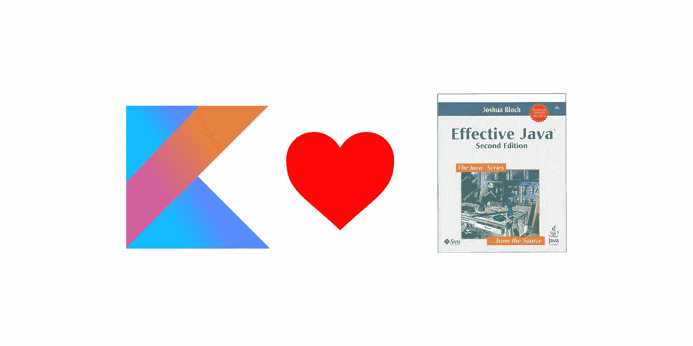

# Kotlin 中的有效 Java，第 1 项:考虑静态工厂方法而不是构造函数

> 原文：<https://blog.kotlin-academy.com/effective-java-in-kotlin-item-1-consider-static-factory-methods-instead-of-constructors-8d0d7b5814b2?source=collection_archive---------0----------------------->



**更新:** [**这里的**](https://kt.academy/article/ek-factory-functions) **是本文的最新版本。**

[*有效的 Java*](https://www.amazon.com/Effective-Java-3rd-Joshua-Bloch/dp/0134685997)Joshua Bloch 的书是关于 Java 开发的最重要的书籍之一。我经常引用它，可能这就是为什么我经常被要求说或写更多关于它的东西。我还注意到人们对它们与科特林的关系很感兴趣。这就是为什么我决定在 Kot 上用 Kotlin 来逐一描述它们。学院博客。只要看到读者有兴趣，我就继续；)

这是来自*有效 Java* 的第一条规则:

> *考虑静态工厂方法，而不是构造函数*。

让我们来探索一下。

# 图书提醒

高效 Java 的第一条规则声称，开发人员应该更多地考虑使用静态工厂方法，而不是构造函数。静态工厂方法是用于产生对象实例的静态方法。下面是一些静态工厂方法用法的 Java 示例:

```
Boolean trueBoolean = Boolean.valueOf(true);
String number = String.*valueOf*(12);
List<Integer> list = Arrays.*asList*(1, 2, 4);
```

静态工厂方法是构造函数的一个非常强大的替代方法。以下是它们的一些优势:

*   与构造函数不同，它们有名字。名字解释了一个对象是如何被创建的，有哪些自变量。比如说你看到下面这段代码:`new ArrayList(3)`。你能猜出`3`是什么意思吗？它应该是数组的第一个元素还是列表的第一个元素？肯定不是不言自明的。在这种情况下，一个名字，比如`ArrayList.withSize(3)`，就能消除所有的困惑。这是一个名字非常有用的例子:它解释了对象创建的参数或特征。命名的另一个原因是它解决了具有相同参数类型的构造函数之间的冲突。
*   与构造函数不同，它们不需要在每次被调用时创建一个新的对象。当我们使用静态工厂方法时，我们可以包含缓存机制来优化对象创建。这样我们可以提高对象创建的性能。我们还可以定义静态工厂方法，如果对象不能被创建，它将返回`null`，就像当`Connection`由于某种原因不能被创建时，它将返回`null`。
*   **与构造函数不同，它们可以返回其返回类型的任何子类型的对象。**这可以用来为不同的情况提供更好的对象。当我们想在一个接口后面隐藏一个实际的对象时，这一点尤其重要。例如，在 Kotlin 中，所有集合都隐藏在接口后面。这很重要，因为不同的平台有不同的类。当我们使用`listOf(1,2,3)`时，那么我们在 Kotlin/JVM 上运行时就有了`ArrayList`。同一个调用将返回 Kotlin/JS 上的 JavaScript 数组。这是一种优化，但不是问题，因为两种类型都实现了科特林`List`接口。`listOf`返回类型为`List`，这是我们正在操作的界面。对于我们来说，引擎盖下的实际类型通常并不重要。类似地，在任何静态工厂方法中，我们可以返回不同的类型，甚至改变类型的实际实现，只要它们隐藏在某个被指定为静态工厂方法返回类型的超类型或接口之后，一切都没问题。
*   **它们减少了创建参数化类型实例的冗长。与 Kotlin 相比，这更像是 Java 问题，因为 Kotlin 有更好的类型推理。关键是当我们调用一个构造函数时，我们必须指定参数类型，即使它们非常明显。当调用静态工厂方法时，可以避免使用参数类型。**

这些都是支持静态工厂方法使用的有力论据，但是 Joshua Bloch 也指出了一些缺点:

*   **它们不能在子类构造中使用。**在子类构造中，我们需要使用超类构造函数。我们不能使用静态工厂方法。
*   **它们不容易与其他静态方法区分开来。**例外有:`valueOf`、`of`、`getInstance`、`newInstance`、`getType`和`newType`。这些是不同类型的静态工厂方法的通用名称。

在这个论证之后，直观的结论是，用于构造一个对象的函数与对象结构或构造有很强的联系，应该被指定为一个构造函数。另一方面，当构造与对象结构没有直接联系时，那么它很可能应该使用静态方法来定义。

我们去科特林吧。当我在学习 Kotlin 的时候，我有一种感觉，有人正在设计它，而他的眼前有一本*有效的 Java* 书。它回答了书中描述的大多数 Java 问题。科特林还改变了工厂方法的实现方式。我们来分析一下。

# 伙伴工厂法

Kotlin 不允许静态方法。Java 静态工厂方法的类似物通常被称为*伴生工厂方法*。它是放在伴随对象中的工厂方法:

```
class MyList {
    //... companion object {
        fun of(vararg i: Int) { /*...*/ }
    }
}
```

用法与静态工厂方法的用法相同:

```
MyList.of(1,2,3,4)
```

隐藏的伙伴对象实际上是单例类。这个事实有一个很大的好处:伴随对象可以扩展其他类。这样我们可以实现多个通用工厂方法，并为它们提供不同的类。我最常见的例子是`Provider` class，我用它来代替 DI。我有以下课程:

```
abstract class Provider<T> { var original: T? = null
     var mocked: T? = null abstract fun create(): T fun get(): T = mocked ?: original ?: create()
           .apply { original = this } fun lazyGet(): Lazy<T> = lazy { get() }
}
```

对于不同的元素，我只需要指定创建函数:

```
interface UserRepository {
    fun getUser(): User companion object: Provider<UserRepository> {
        override fun create() = UserRepositoryImpl()
    }
}
```

有了这样的定义，我可以通过`UserReposiroty.get()`或`val user by UserRepository.lazyGet()`在所有代码中得到这个库。我还可以通过`UserRepository.mocked = object: UserRepository { /*...*/ }`指定不同的测试或模拟实现。

这是 Java 的一大优势，在 Java 中，所有的 SFM(静态工厂方法)都必须在每个对象中手工实现。另一个仍然被低估的重用工厂方法的方法是使用接口委托。我们可以这样使用上面的例子:

```
interface Dependency<T> {
    var mocked: T?
    fun get(): T
    fun lazyGet(): Lazy<T> = lazy { get() }
}abstract class Provider<T>(val init: ()->T): Dependency<T> {
    var original: T? = null
    override var mocked: T? = null

    override fun get(): T = mocked ?: original ?: init()
          .apply { original = this }
}interface UserRepository {
    fun getUser(): User companion object: Dependency<UserRepository> by Provider({
        UserRepositoryImpl() 
    }) 
}
```

用法是相同的，但是请注意，使用接口委托，我们可以在单个伴随对象中从不同的类获得工厂方法，并且我们只获得接口中指定的功能(根据*接口分离原则*，什么是好的)。关于接口委托[的更多信息，请点击](https://www.youtube.com/watch?v=8QgWSIaa_QU)。

[](https://kt.academy/)

# 扩展工厂方法

注意工厂方法被放在伴随对象中而不是被定义为静态方法的另一个优点:我们可以为伴随对象定义扩展函数。因此，如果我们想将*伴生工厂方法*添加到外部库中定义的 Kotlin 类，我们仍然可以这样做(只要它定义了任何伴生对象):

```
interface Tool {
   companion object { … }
}fun Tool.Companion.createBigTool(…) : BigTool { … }
```

或者，当伴随对象被命名为:

```
interface Tool {
   companion object Factory { … }
}fun Tool.Factory.createBigTool(…) : BigTool { … }
```

这是让我们从代码内部共享外部库的强大可能性。AFAIK Kotlin 是目前唯一给出这种可能性的语言。

# 顶级功能

在 Kotlin 中常见的是，我们定义一个顶级函数，而不是 CFM ( *伴随对象工厂方法*)。一些常见的例子有`listOf`、`setOf`和`mapOf`。类似地，库设计者正在指定用于创建对象的顶级函数。它们被广泛使用。例如，在 Android 中，我们传统上定义一个函数来创建`Activity` `Intent`作为静态方法:

```
// Java
class MainActivity extends Activity {
    static Intent getIntent(Context context) {
        return new Intent(context, MainActivity.class);
    }
}
```

在 Kotlin Anko 库中，我们可以使用具体化类型的顶级函数`intentFor`:

```
intentFor<MainActivity>()
```

这种解决方案的问题是，虽然公共顶级函数随处可见，但很容易丢弃用户 IDE 提示。更大的问题开始于当某人创建顶级函数时，这些函数的名字没有直接指出它不是一个方法。

使用顶级函数创建对象对于小而常用的对象来说是一个完美的选择，比如`List`或`Map`，因为`listOf(1,2,3)`比`List.of(1,2,3)`更简单，可读性更好(尽管看起来很相似)。虽然公共顶级函数需要小心谨慎地使用。

# 假构造函数

Kotlin 中的构造函数的工作方式类似于顶级函数:

```
class A()val a = A()
```

它们的引用也与顶级函数相同:

```
val aReference = ::A
```

类构造函数和函数在使用上的唯一区别是函数不是从大写字母开始的。虽然技术上他们可以。这个事实被用在不同的地方，包括科特林标准图书馆。`List`和`MutableList`是接口，它们不能有构造函数，但是 Kotlin 开发者希望允许下面的`List`构造:

```
List(3) { "$it" } // same as listOf("0", "1", "2")
```

这就是为什么以下函数包含在 *Collections.kt* 中(从 Kotlin 1.1 开始):

```
**public inline fun** <T> List(size: Int, init: (index: Int) -> T): List<T> = *MutableList*(size, init)
**public inline fun** <T> MutableList(size: Int, init: (index: Int) -> T): MutableList<T> {
    **val** list = ArrayList<T>(size)
    *repeat*(size) **{** index **->** list.add(init(index)) **}
    return** list
}
```

它们的外观和行为都像构造函数。许多开发人员没有意识到他们是幕后的顶级功能。同时，它们具有 SFM 的一些优点:它们可以返回类型的子类型，并且不需要每次都创建对象。他们也没有构造函数的要求。例如，二级构造函数需要立即调用主构造函数或超类的构造函数。当我们使用伪构造函数时，我们可以推迟构造函数的使用:

```
fun ListView(config: Config) : ListView {
    val items = … // Here we read items from config
    return ListView(items) // We call actual constructor
}
```

[](https://leanpub.com/effectivekotlin/c/3YYtCtqCC6a4)

# 顶级功能和范围

我们可能希望在类外创建工厂方法的另一个原因是，我们希望在某个特定的范围内使用它。比如当我们只在某个特定的类或文件中需要工厂方法时。

有些人可能会认为这种用法可能会引起误解，因为对象创建范围通常与这个类可见性范围相关联。所有这些可能性都是表达意图的有力工具，需要明智地使用。虽然对象创建的具体方式包含了关于它的信息，并且在某些上下文中使用这种可能性是非常有益的。

# 主要构造函数

Kotlin 引入了名为*主构造函数*的伟大特性。Kotlin 类中只能有一个主构造函数，但它们比 Java 中已知的构造函数强大得多(在 Kotlin 中这些构造函数被称为*二级*)。主构造函数[参数](https://medium.com/kotlin-academy/programmer-dictionary-parameter-vs-argument-type-parameter-vs-type-argument-b965d2cc6929)可以在类创建时使用:

```
class Student(name: String, surname: String) {
    val fullName = "$name $surname"
}
```

此外，这些参数可以直接定义为属性:

```
class Student(val name: String, val surname: String) {
    val fullName 
        get() = "$name $surname"
}
```

应该清楚的是，主构造函数与类的创建有着紧密的联系。注意，当我们使用带有默认参数的主构造函数时，我们不需要[伸缩构造函数](http://codethataint.com/blog/telescoping-constructor-pattern-java/)。由于所有这些，主构造函数被经常使用(在我的项目中创建的数百个类中，我发现只有少数没有主构造函数)，而次构造函数很少使用。这太棒了。我认为这是应该的。主构造函数与类结构和初始化有很强的联系，因此当我们应该定义构造函数而不是工厂方法时，它非常适合。对于其他情况，我们很可能应该使用伙伴对象工厂方法或顶级函数，而不是二级构造函数。

# 创建对象的其他方法

Kotlin 出色的工厂方法并不是 Kotlin 改进对象创建的唯一例子。在下一篇文章中，我们将描述 Kotlin 如何改进 builder 模式。例如，包含了多种优化，允许使用 DSL 创建对象:

```
val dialog = alertDialog {
    title = "Hey, you!"
    message = "You want to read more about Kotlin?"
    setPositiveButton { makeMoreArticlesForReader() }
    setNegativeButton { startBeingSad() }
}
```

我记住了。在本文中，我最初只描述了静态工厂方法的直接替代方法，因为这是高效 Java 的第一项内容。与这本书相关的其他令人敬畏的 Kotlin 特性将在下一篇文章中描述。如果你想得到通知，[订阅简讯](https://kotlin-academy.us17.list-manage.com/subscribe?u=5d3a48e1893758cb5be5c2919&id=d2ba84960a)。

# 结论

虽然 Kotlin 在对象创建方面做了很多改变，但是静态工厂方法的有效 Java 参数仍然是当前的。发生变化的是 Kotlin 排除了静态成员方法，取而代之的是我们可以使用具有 SFM 优势的替代方法:

*   伙伴工厂法
*   顶级功能
*   假构造者
*   扩展工厂方法

它们中的每一种都在不同的情况下使用，并且它们相对于 Java SFM 都有不同的优势。

一般规则是，在大多数情况下，我们创建对象所需要的只是一个主构造函数，默认情况下，它与类结构和创建相关联。当我们需要其他的类构造方法时，我们最有可能使用一些 SFM 的替代方法。

下一部分:

[](/effective-java-in-kotlin-item-2-consider-a-builder-when-faced-with-many-constructor-parameters-1927e69608e1) [## Kotlin 中的有效 Java，第 2 项:考虑一个面临许多构造函数参数的构建器

### 这一条对 Java 程序员影响很大。当我们处理…的不同变体时，这种情况并不少见

blog.kotlin-academy.com](/effective-java-in-kotlin-item-2-consider-a-builder-when-faced-with-many-constructor-parameters-1927e69608e1) 

# 有效科特林

这是第一篇关于有效科特林的文章。当我们看到兴趣，我们将出版下一部分。在卡帕头。学院我们也在研究关于这个主题的书:

[](https://leanpub.com/effectivekotlin) [## 有效科特林

### 这本书对官方的(Kotlin 和 Google 对 Kotlin 的最佳实践)和…

leanpub.com](https://leanpub.com/effectivekotlin) 

它将涵盖更广泛的主题，并深入其中的每一个问题。它还将包括 Kotlin 和 Google 团队发布的最佳实践、与我们合作的 Kotlin 团队成员的经验，以及“Kotlin 中的有效 Java”系列中涉及的主题。为了支持它并让我们更快地发布它，[使用链接并订阅](https://leanpub.com/effectivekotlin)。

你需要 Kotlin 工作室吗？访问[我们的网站](https://kt.academy/)，看看我们能为您做些什么。

了解卡帕头最新的重大新闻。学院，[订阅时事通讯](https://kotlin-academy.us17.list-manage.com/subscribe?u=5d3a48e1893758cb5be5c2919&id=d2ba84960a)，[观察 Twitter](https://twitter.com/ktdotacademy) 并在 medium 上关注我们。

在 Twitter 上引用我，用 [@MarcinMoskala](https://twitter.com/marcinmoskala) 。

我要感谢 [Ilya Ryzhenkov](https://twitter.com/orangy) 的更正和重要建议。有些例子也是他的。伊利亚，你让这个帖子变得更好；)

[](http://eepurl.com/diMmGv)

喜欢的话记得**拍**。请注意，如果您按住鼓掌按钮，您可以留下更多的掌声。

