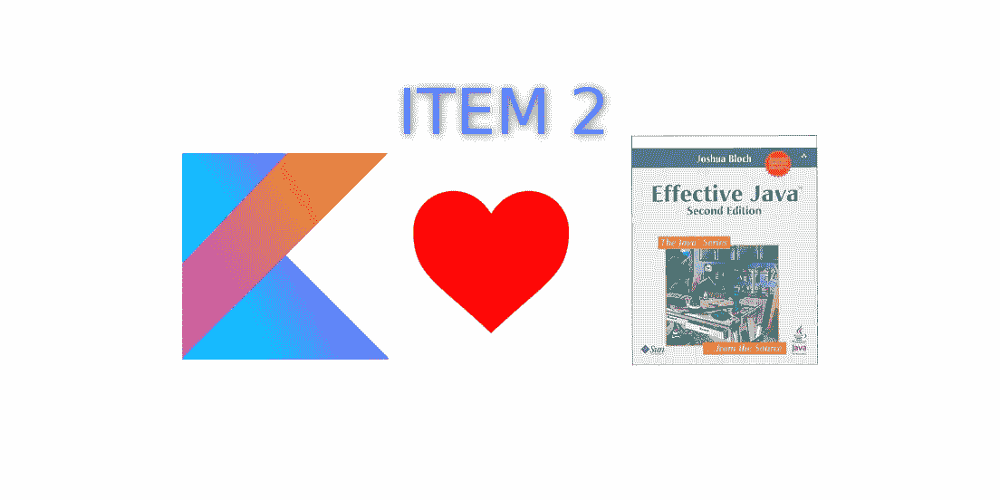

# Kotlin 中的有效 Java，第 2 项:考虑一个面临许多构造函数参数的构建器

> 原文：<https://blog.kotlin-academy.com/effective-java-in-kotlin-item-2-consider-a-builder-when-faced-with-many-constructor-parameters-1927e69608e1?source=collection_archive---------0----------------------->



这一条对 Java 程序员影响很大。当我们处理对象创建的不同变体时，这种情况并不少见。在有效的 Java 中提出的伟大论点使得开发人员使用构建器而不是伸缩构造器模式。虽然科特林改变了很多——它给了我们更好的可能性。我们很快就会看到它；)

这是来自*有效 Java 版本 2* 的第二条规则:

> 当面对许多构造函数时，使用构造函数

让我们来探索一下。

# 书中的提醒

在 Java 中，用可选的构造函数参数定义对象的一种常见方式是使用伸缩构造函数模式。当我们使用伸缩构造器模式时，我们为我们可以使用的每个集合或参数定义一个单独的构造器。这是科特林的一个例子:

```
**class** Dialog **constructor**(
        **val title**: String,
        **val text**: String?,
        **val onAccept**: (() -> Unit)?
) {
    constructor(title: String, text: String)
        : this(title, text, null) constructor(title: String)
        : this(title, "")
}// Usage
**val** dialog1 = Dialog(**"Some title"**, **"Great dialog",** **{** toast(**"I was clicked"**) **}**)**val** dialog2 = Dialog(**"Another dialog"**,**"I have no buttons"**)**val** dialog3 = Dialog(**"Dialog with just a title"**)
```

非常流行的 Android 例子是[我们如何定义自定义视图](https://www.intertech.com/Blog/android-custom-view-tutorial-part-1-combining-existing-views/)。

尽管这种模式在 JVM 世界中很流行，但 Effective Java 认为对于更大或更复杂的对象，我们应该使用 Builder 模式。Builder 首先以可读和简洁的方式收集参数，然后验证和实例化对象。这里有一个例子:

```
**class** Dialog **private constructor**(
        **val title**: String,
        **val text**: String?,
        **val onAccept**: (() -> Unit)?
) { **class** Builder(**val title**: String) {
        **var text**: String? = **null
        var onAccept**: (() -> Unit)? = **null** **fun** setText(text: String?): Builder {
            **this**.**text** = text
            **return this** } **fun** setOnAccept(onAccept: (() -> Unit)?): Builder {
            **this**.**onAccept** = onAccept
            **return this** } **fun** build() = Dialog(**title**, **text**, **onAccept**)
    }
}// Usage
**val** dialog1 = Dialog.Builder(**"Some title"**)
        .setText(**"Great dialog"**)
        .setOnAccept **{** toast(**"I was clicked"**) **}** .build()**val** dialog2 = Dialog.Builder(**"Another dialog"**)
        .setText(**"I have no buttons"**)
        .build()**val** dialog3 = Dialog.Builder(**"Dialog with just a title"**).build()
```

声明和用法都比伸缩构造器模式大，但是 builder 有非常重要的优势:

*   参数是显式的，所以我们在设置参数时可以看到每个参数的名称。
*   我们可以按任何顺序设置参数。
*   它更容易修改，因为当我们需要改变伸缩构造函数模式中的一些参数时，我们需要在所有允许它的构造函数中改变它。
*   具有填充值的构建器可以像工厂一样使用。

当我们需要设置可选参数时，这些特性使得构建器模式更加明确，更有弹性，更适合大多数类。

[](https://leanpub.com/effectivekotlin/c/3YYtCtqCC6a4)

# 命名可选参数

这一章中我最喜欢的部分，摘自《有效的 Java》第二版，如下所示:

> 构建器模式模拟 Ada 和 Python 中的命名可选参数。

在 Kotlin 中，我们不需要模拟指定的可选参数，因为我们可以直接使用它们。在大多数情况下，可选参数比构建器更好。只需比较上面的构建器模式和下面命名的可选参数。声明和用法都更简洁，更有表现力:

```
**class** Dialog(
        **val title**: String,
        **val text**: String? = **null**,
        **val onAccept**: (() -> Unit)? = **null** )// Usage **val** dialog1 = Dialog(
        title = **"Some title"**,
        text = **"Great dialog"**,
        onAccept = **{** toast(**"I was clicked"**) **}** )
**val** dialog2 = Dialog(
        title = **"Another dialog"**,
        text = **"I have no buttons"** )
**val** dialog3 = Dialog(title = **"Dialog with just a title"**)
```

带有命名可选参数的构造函数具有构建器模式的大部分优点:

*   参数是显式的，所以我们在设置参数时会为每个参数设置一个名称。
*   我们可以按任何顺序设置参数。
*   它更容易修改(甚至比构建器模式更容易)

在这个简单的例子中，带有命名可选参数的构造函数看起来更好。但是如果不同的参数需要不同的创建变量呢？假设我们为不同的参数集创建不同的对话框类型。我们可以在 builder 中轻松解决这个问题:

```
**interface** Dialog {
    **fun** show() **class** Builder(**val title**: String) {
        **var text**: String? = **null
        var onAccept**: (() -> Unit)? = **null** **fun** setText(text: String?): Builder {
            **this**.**text** = text
            **return this** } **fun** setOnAccept(onAccept: (() -> Unit)?): Builder {
            **this**.**onAccept** = onAccept
            **return this** } **fun** build(): Dialog = **when** {
            **text** != **null** && **onAccept** != **null** ->
                TitleTextAcceptationDialog(**title**, **text**!!, **onAccept**!!)
            **text** != **null** ->
                TitleTextDialog(**title**, **text**!!)
            **onAccept** != **null** ->
                TitleAcceptationDialog(**title**, **onAccept**!!)
            **else** -> TitleDialog(**title**)
        }
    }
}*// Usage* **val** *dialog1* = Dialog.Builder(**"Some title"**)
        .setText(**"Great dialog"**)
        .setOnAccept **{** toast(**"I was clicked"**) **}** .build()
**val** *dialog2* = Dialog.Builder(**"Another dialog"**)
        .setText(**"I have no buttons"**)
        .build()
**val** *dialog3* = Dialog.Builder(**"Dialog with just a title"**).build()
```

我们能使用命名的可选参数解决这类问题吗？是的，我们可以使用不同的构造函数或者使用工厂方法来达到相同的效果！以下是上述问题的示例解决方案:

```
**interface** Dialog {
    **fun** show()
}**fun** makeDialog(
    title: String, 
    text: String? = **null**, 
    onAccept: (() -> Unit)?
): Dialog = **when** {
    text != **null** && onAccept != **null** -> 
        TitleTextAcceptationDialog(title, text, onAccept)
    text != **null** -> 
        TitleTextDialog(title, text)
    onAccept != **null** -> 
        TitleAcceptationDialog(title, onAccept)
    **else** -> 
        TitleDialog(title)
}// Usage
**val** dialog1 = makeDialog(
        title = **"Some title"**,
        text = **"Great dialog"**,
        onAccept = **{** toast(**"I was clicked"**) **}** )
**val** dialog2 = makeDialog(
        title = **"Another dialog"**,
        text = **"I have no buttons"** )
**val** dialog3 = makeDialog(title = **"Dialog with just a title"**)
```

这是我们的另一个例子，我们再次看到命名参数优于构建器:

*   它更短——构造器或工厂方法比构建器模式更容易实现。我们不需要将每个可选参数的名称指定 4 次(作为属性、方法、参数和构造函数的名称)。类型不需要声明 3 次(在参数、属性和构造函数中)。这很重要，因为当我们想改变一些参数名时，我们只改变工厂方法中的一个声明，而不是改变 4 个假设相同的名字。
*   更简洁——当你想知道一个对象是如何构造的，你只需要一个方法，而不是分散在整个构建器类中。物体是如何保持的？他们互动吗？当我们有大建筑商时，这些问题就不那么容易回答了。另一方面，类的创建通常在工厂方法上是清楚的。
*   并发没有问题——这是一个罕见的问题，但是在 Kotlin 中函数参数总是不可变的，而在大多数构建器中属性是可变的。因此，对于构建器来说，实现线程安全的构建函数更加困难。

构建器模式的一个优点是带有填充参数的构建器可以作为工厂使用。虽然这是罕见的用法，所以这个优点是次要的。

构建器模式的另一个论点是，我们可以部分填充构建器，并进一步传递它。这样我们就可以定义方法来创建部分填充的构建器，我们仍然可以修改它(就像我们应用程序的默认对话框)。为了让构造函数或工厂方法具有类似的可能性，我们需要自动转换(在 Kotlin 中是可能的，但不会丢失名称和默认参数)。尽管这种对象创建方式非常罕见，并且通常也不是首选方式。如果我们想为应用程序定义默认对话框，我们可以使用函数创建它，并将所有定制元素作为可选参数传递。这种方法将对对话创建有更多的控制。

一般规则是，在大多数情况下，命名的可选参数应该优先于生成器模式。虽然这不是 Kotlin 给我们的唯一的新的构建模式。另一个非常流行的是用于对象构造的 DSL。我们来描述一下。

# 用于对象构造的 DSL

假设我们需要设置具有多个处理程序的侦听器。典型的类似 Java 的方法是使用对象表达式:

```
taskNameView.addTextChangedListener(**object** : TextWatcher {
    **override fun** afterTextChanged(s: Editable?) {
        *// ...* } **override fun** beforeTextChanged(s: CharSequence?, start: Int, count: Int, after: Int) {
        *// ...* } **override fun** onTextChanged(s: CharSequence?, start: Int, before: Int, count: Int) {
        *// no-op* }
})
```

这种方法实际上并不方便，可以很容易地用更简洁的工厂方法替换，该方法带有指定的可选参数:

```
**fun** makeTextWatcher(
        afterTextChanged: ((s: Editable?) -> Unit)? = **null**,
        beforeTextChanged: ((s: CharSequence?, start: Int, count: Int, after: Int) -> Unit)? = **null**,
        onTextChanged: ((s: CharSequence?, start: Int, before: Int, count: Int) -> Unit)? = **null** ) = **object** : TextWatcher {
    **override fun** afterTextChanged(s: Editable?) {
        afterTextChanged?.invoke(s)
    } **override fun** beforeTextChanged(s: CharSequence?, start: Int, count: Int, after: Int) {
        beforeTextChanged?.invoke(s, start, count, after)
    } **override fun** onTextChanged(s: CharSequence?, start: Int, before: Int, count: Int) {
        onTextChanged?.invoke(s, start, before, count)
    }
}// Usage
taskNameView.addTextChangedListener(makeTextWatcher(
        afterTextChanged = **{** s **->** *// ..* **}**,
        beforeTextChanged = **{** s, start, count, after **->** *// ...* **}** ))
```

注意，我们可以很容易地改进它，直接定义一个扩展函数给`TextView`:

```
taskNameView.addTextChangedListener(
    afterTextChanged = **{** s **->** *// ..* **}**,
    beforeTextChanged = **{** s, start, count, after **->** *// ...* **}** )
```

尽管我们可以进一步改进这种模式，并允许以下符号:

```
taskNameView.addTextChangedListener **{**
    setAfterTextChanged **{** s **->** *// ..* **}**,
    setBeforeTextChanged **{** s, start, count, after **->** *// ...* **}
}**
```

这是 DSL 的一个简单例子。支持这种符号的函数可以在流行的 Kotlin 库中找到，比如 [Anko](https://github.com/Kotlin/anko) 或 [Android-ktx](https://github.com/android/android-ktx) 。例如，这就是我们如何在 [Anko](https://github.com/Kotlin/anko) 中定义和显示警告对话框:

```
alert("Hi, I'm Roy", "Have you tried turning it off and on again?"){
    yesButton { toast("Oh…") }
    noButton {}
}.show()
```

问题是这种符号需要大量的声明来支持它们。这就是我们如何定义上面的`addOnTextChangedListener`:

```
fun TextView.addOnTextChangedListener(
    config: TextWatcherConfiguration.() -> Unit
) {
    val listener = TextWatcherConfiguration().apply { config() }
    addTextChangedListener(listener)
}class TextWatcherConfiguration : TextWatcher { private var beforeTextChangedCallback: (BeforeTextChangedFunction)? = null
    private var onTextChangedCallback: (OnTextChangedFunction)? = null
    private var afterTextChangedCallback: (AfterTextChangedFunction)? = null fun beforeTextChanged(callback: BeforeTextChangedFunction) {
       beforeTextChangedCallback = callback
    } fun onTextChanged(callback: OnTextChangedFunction) {
        onTextChangedCallback = callback
    } fun afterTextChanged(callback: AfterTextChangedFunction) {
        afterTextChangedCallback = callback
    } override fun beforeTextChanged(
        s: CharSequence, 
        start: Int, 
        count: Int, 
        after: Int
    ) {
        beforeTextChangedCallback?.invoke(s.toString(), start, count, after)
    } override fun onTextChanged(
         s: CharSequence, 
         start: Int, 
         before: Int, 
         count: Int
    ) {
        onTextChangedCallback?.invoke(s.toString(), start, before, count)
    } override fun afterTextChanged(s: Editable) {
        afterTextChangedCallback?.invoke(s)
    }
}private typealias BeforeTextChangedFunction = 
    (text: String, start: Int, count: Int, after: Int) -> Unit
private typealias OnTextChangedFunction = 
    (text: String, start: Int, before: Int, count: Int) -> Unit
private typealias AfterTextChangedFunction = 
    (s: Editable) -> Unit
```

为单一甚至两种用途作出这样的声明是不合理的。另一方面，当我们制作一个库时，这不是一个问题。这就是为什么在大多数情况下我们使用库中定义的 DSL 的原因。当我们定义它们时，它们是非常强大的。注意，在 DSL 内部，我们可以包含控制结构(`if`、`for`等)。)，定义变量等。这是一个使用 DSL 为 [Kt 生成 HTML 的例子。学院门户](https://github.com/MarcinMoskala/KotlinAcademyApp):

```
**private fun** RDOMBuilder<DIV>.authorDiv(
    author: String?, 
    authorUrl: String?
) {
    author ?: **return** *div*(classes = **"main-text multiline space-top"**) **{** +**"Author: "
        if** (authorUrl.*isNullOrBlank*()) {
            +author
        } **else** {
            *a*(href = authorUrl) **{** +author **}** }
    **}** }
```

除了声明之外，我们还在那里放置了指定如何定义这个元素的逻辑。这样，DSL 通常比带有指定可选参数的构造函数或工厂方法更强大。它也更复杂，更难定义。

# 当我们已经有了构建器时，简单的 DSL

在一些 Android 项目中可以观察到有趣的解决方案，其中开发人员实现了简化的 DSL，重用了现有的构建器。

假设我们使用来自提供 builder 作为创建方法的库(或框架)的对话框(假设它是用 Java 实现的):

```
**val** *dialog1* = Dialog.Builder(**"Some title"**)
        .setText(**"Great dialog"**)
        .setOnAccept **{** toast(**"I was clicked"**) **}** .build()
```

这就是我们如何实现和使用非常简单的 DSL 构建器:

```
**fun** Dialog(title: String, init: Dialog.Builder.()->Unit) = 
    Dialog.Builder(title).apply(init).build()// Usage **val** dialog1 = Dialog(**"Some title"**) {
     text = **"Great dialog"**
     setOnAccept **{** toast(**"I was clicked"**) **}**
}
```

(只有在 Java 中定义了这个方法，我们才能像属性一样设置`text`。)

这样我们就拥有了 DSL 的大部分优势和非常简单的声明。这也显示了 DSL 和 builder 模式有多少共同点。他们有相似的哲学，但是 DSL 就像是构建模式的下一个层次。

[](https://kt.academy/Android_Online_May.html)

# 摘要

来自有效 Java 的参数在 Kotlin 中仍然有效，builder 模式比以前的 Java 替代方案更合理。尽管 Kotlin 引入了通过名称指定参数并提供默认参数。由于这一点，我们有了更好的替代模式。Kotlin 还提供了允许使用 DSL 的特性。定义良好的 DSL 甚至是更好的选择，因为它提供了更大的灵活性，并允许在对象定义中包含逻辑。

定义如何创建复杂的对象并不是一个简单的问题，它通常需要经验。虽然科特林给我们的可能性非常重要，它们积极地影响着科特林的发展。

# 有效科特林

这是第一篇关于有效科特林的文章。当我们看到兴趣，我们将出版下一部分。在 Kot。学院我们也在研究关于这个主题的书:

[](https://leanpub.com/effectivekotlin) [## 有效科特林

### 这本书对官方的(Kotlin 和 Google 对 Kotlin 的最佳实践)和…

leanpub.com](https://leanpub.com/effectivekotlin) 

它将涵盖更广泛的主题，并深入其中的每一个问题。它还将包括 Kotlin 和 Google 团队发布的最佳实践、与我们合作的 Kotlin 团队成员的经验，以及“Kotlin 中的有效 Java”系列中涉及的主题。为了支持它并使我们更快地发布它，[使用此链接并订阅](https://leanpub.com/effectivekotlin)。

你需要 Kotlin 工作室吗？访问[我们的网站](https://www.kt.academy/)，看看我们能为您做些什么。

了解卡帕头最新的重大新闻。学院，[订阅时事通讯](https://kotlin-academy.us17.list-manage.com/subscribe?u=5d3a48e1893758cb5be5c2919&id=d2ba84960a)，[观察 Twitter](https://twitter.com/ktdotacademy) 并在 medium 上关注我们。

在 Twitter 上引用我，用 [@MarcinMoskala](https://twitter.com/marcinmoskala) 。

我要感谢 [Ilya Ryzhenkov](https://twitter.com/orangy) 的更正和重要建议。

[](http://eepurl.com/diMmGv)

喜欢的话记得**拍**。请注意，如果您按住鼓掌按钮，您可以留下更多的掌声。