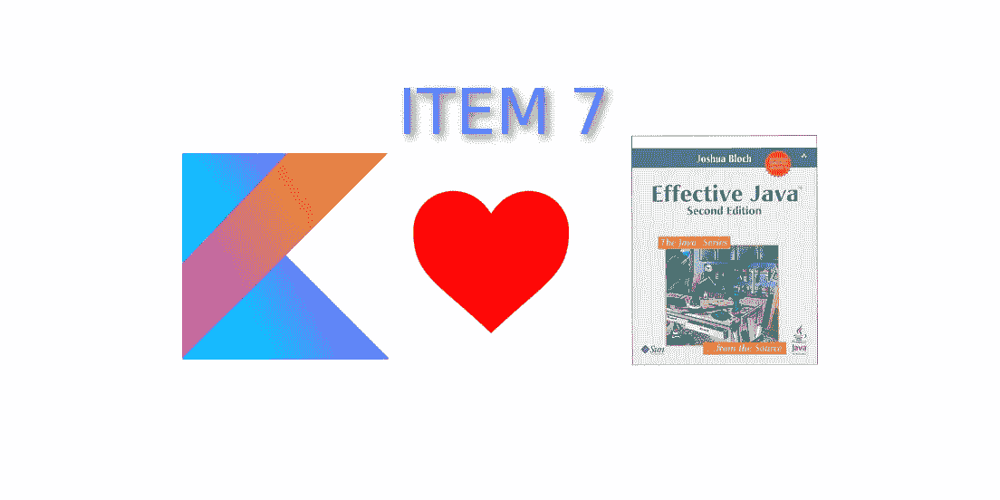

# Kotlin 中的有效 Java，第 7 项:消除过时的对象引用

> 原文：<https://blog.kotlin-academy.com/effective-java-in-kotlin-item-7-eliminate-obsolete-object-references-9a197b6fb728?source=collection_archive---------1----------------------->



使用自动内存管理语言(如 Java，垃圾收集器[GC]完成所有工作)的程序员很少考虑释放对象。它会导致内存泄漏，在某些情况下会导致`OutOfMemoryError`。最重要的一条规则是不使用的对象应该被释放。让我们看一个来自[书](https://www.amazon.com/Effective-Java-3rd-Joshua-Bloch/dp/0134685997)(移到 Kotlin)的例子，它是一个堆栈实现:

```
**class** Stack {
    **private var elements**: Array<Any?> = 
        *arrayOfNulls*(**DEFAULT_INITIAL_CAPACITY**)
    **private var size** = 0

    **fun** push(e: Any) {
        ensureCapacity()
        **elements**[**size**++] = e
    }

    **fun** pop(): Any? {
        **if** (**size** == 0)
            **throw** EmptyStackException()
        **return elements**[--**size**]
    }

    */**
     * Ensure space for at least one more element, roughly
     * doubling the capacity each time the array needs to grow.
     */* **private fun** ensureCapacity() {
        **if** (**elements**.**size** == **size**)
            **elements** = Arrays.copyOf(**elements**, 2 * **size** + 1)
    }

    **companion object** {
        **private const val DEFAULT_INITIAL_CAPACITY** = 16
    }
}
```

你能发现这里的问题吗？花一分钟考虑一下。

[](https://leanpub.com/effectivekotlin/c/3YYtCtqCC6a4)

问题是，当我们弹出时，我们只是减少大小，但我们没有释放数组上的元素。假设堆栈上有 1000 个元素，我们一个接一个地弹出了几乎所有的元素，我们的大小现在等于 1。我们应该只有一个元素，并且只能访问一个元素，但是我们的堆栈仍然保存 1000 个元素，并且不允许 GC 销毁它们。更多这样的问题，我们可能会有`OutOfMemoryError`。怎么才能修好？解决方案很简单:

```
**fun** pop(): Any? {
    **if** (**size** == 0)
        **throw** EmptyStackException()
    **val** elem = **elements**[--**size**]
    **elements**[**size**] = **null
    return** elem
}
```

这是一个非常罕见的例子，也是一个巨大的错误，但是有一些日常用品我们可以从这条规则中获益。比方说，我们需要`mutableLazy`财产委托。它应该像 lazy 一样工作，但也应该允许属性状态突变。我可以做如下实现:

```
**fun** <T> mutableLazy(initializer: () -> T): ReadWriteProperty<Any?, T> = MutableLazy(initializer)

**private class** MutableLazy<T>(
    **val initializer**: () -> T
) : ReadWriteProperty<Any?, T> {

    **private var value**: T? = **null
    private var initialized** = **false

    override fun** getValue(
        thisRef: Any?, 
        property: KProperty<*>
    ): T {
        *synchronized*(**this**) **{
            if** (!**initialized**) {
                **value** = **initializer**()
                **initialized** = **true** }
            **return value as** T
        **}** }

    **override fun** setValue(
        thisRef: Any?, 
        property: KProperty<*>, 
        value: T
    ) {
        *synchronized*(**this**) **{
            this**.**value** = value
            **initialized** = **true
        }** }
}
```

用法:

```
**var** *game*: Game? **by** *mutableLazy* **{** readGameFromSave() **}

fun** setUpActions() {
    startNewGameButton.setOnClickListener **{** *game* = makeNewGame()
        startGame()
    **}** resumeGameButton.setOnClickListener **{** startGame()
    **}** }
```

上面的`mutableLazy`实现是正确的，但是它有一个缺陷:`initializer`在使用后没有被删除。这意味着只要对实例`MutableLazy`的引用存在，它就被持有，即使它不再有用。这就是如何改进`MutableLazy`实现的方法:

```
**fun** <T> mutableLazy(initializer: () -> T): ReadWriteProperty<Any?, T> = MutableLazy(initializer)

**private class** MutableLazy<T>(
    **var initializer**: (() -> T)?
) : ReadWriteProperty<Any?, T> {

    **private var value**: T? = **null

    override fun** getValue(
        thisRef: Any?, 
        property: KProperty<*>
    ): T {
        *synchronized*(**this**) **{
            val** initializer = **initializer
            if** (initializer != **null**) {
                **value** = initializer()
                **this**.**initializer** = **null** }
            **return value as** T
        **}** }

    **override fun** setValue(
        thisRef: Any?, 
        property: KProperty<*>, 
        value: T
    ) {
        *synchronized*(**this**) **{
            this**.**value** = value
            **this**.**initializer** = **null
        }** }
}
```

当我们将`initializer`设置为`null`时，之前的值可以被 GC 回收。

这种优化有多重要？为很少使用的对象而烦恼并不重要。有一种说法，过早的优化是纯粹的罪恶之源。虽然将`null`设置为未使用的对象很好，但这样做不会花费您太多成本。尤其是当它是一个函数类型(在 Kotlin/JVM 中经常是一个匿名类)或者是一个未知类(`Any`或者泛型类型的时候。上面的例子是`Stack`，它可能被用来装重物。).当我们使用通用工具，尤其是库时，我们应该关心更深层次的优化。例如，在 Kotlin stdlib 的 lazy 委托的所有 3 个实现中，我们可以看到初始化器在使用后被设置为`null`:

```
**private class** SynchronizedLazyImpl<**out** T>(
    initializer: () -> T, lock: Any? = **null** ) : Lazy<T>, Serializable { **private var initializer**: (() -> T)? = initializer
    **private var _value**: Any? = UNINITIALIZED_VALUE**private val lock** = lock ?: **this

    override val value**: T
        **get**() {
            **val** _v1 = **_value
            if** (_v1 !== UNINITIALIZED_VALUE) {
                @Suppress(**"UNCHECKED_CAST"**)
                **return** _v1 **as** T
            }

            **return** *synchronized*(**lock**) **{
                val** _v2 = **_value
                if** (_v2 !== UNINITIALIZED_VALUE) {
                    @Suppress(**"UNCHECKED_CAST"**) (_v2 **as** T)
                } **else** {
                    **val** typedValue = **initializer**!!()
                    **_value** = typedValue
                    **initializer** = **null** typedValue
                }
            **}** }

    **override fun** isInitialized(): Boolean = **_value** !== UNINITIALIZED_VALUE

    **override fun** toString(): String = **if** (isInitialized()) **value**.*toString*() **else "Lazy value not initialized yet."

    private fun** writeReplace(): Any = InitializedLazyImpl(**value**)
}
```

一般规则是:

> 当我们保持状态时，我们应该在头脑中一直有内存管理。但是，在改变实现之前，我们应该为我们的项目找到最佳的折衷方案，不仅要考虑内存和性能，还要考虑解决方案的可读性和可伸缩性。当我们做一个应用程序时，大多数情况下可读性更重要。当我们开发一个库时，通常性能和内存更重要。

我们需要讨论一些常见的内存泄漏来源。首先，缓存保存着可能永远不会用到的对象。这是缓存背后的想法，但当我们遭受内存不足错误时，它不会帮助我们。解决方案是使用[弱引用](https://www.google.com/search?q=weak+reference&oq=weak+reference&aqs=chrome..69i57j0l5.2684j0j1&sourceid=chrome&ie=UTF-8)。如果需要内存，对象仍然可以被 GC 收集，但是它们通常会存在并被使用。

另一个常见的问题是回调和侦听器的问题。开发人员经常注册它们，当不再需要时就不再注销它们。同样，解决方案是使用弱引用注册回调。

最大的问题是，内存泄漏有时很难预测，直到应用程序崩溃时才会显现出来。这就是为什么我们应该使用特殊的工具来寻找它们。最基本的工具是堆分析器。我们也有一些帮助查找数据泄漏的库。例如，Android 的一个流行库是 LeakCanary，每当检测到内存泄漏时，它就会显示一个通知。

[](https://www.kt.academy/#workshops-offer)

# 关于作者

[马尔金·莫斯卡兹拉](http://marcinmoskala.com/)([@马尔金莫斯卡拉](https://twitter.com/marcinmoskala))是一名培训师兼顾问，目前专注于给**在 Android 和高级 Kotlin 工作坊** ( [填写表格](https://marcinmoskala.typeform.com/to/iwKnN9)，我们可以谈谈你的需求)。他还是一名演讲者，撰写了关于 kot Lin Android 开发的文章和书籍。

你需要 Kotlin 工作室吗？访问[我们的网站](https://www.kt.academy/)看看我们能为您做些什么。

了解卡帕头最新的重大新闻。学院，[订阅时事通讯](https://kotlin-academy.us17.list-manage.com/subscribe?u=5d3a48e1893758cb5be5c2919&id=d2ba84960a)，[观察 Twitter](https://twitter.com/ktdotacademy) 并在 medium 上关注我们。

[](http://eepurl.com/diMmGv)