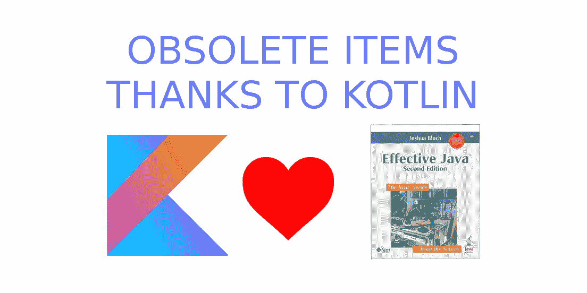

# Kotlin 中有效的 Java，由于 Kotlin 而过时的项目(第三版中的项目 3、4、16、40、61)

> 原文：<https://blog.kotlin-academy.com/effective-java-in-kotlin-obsolete-items-thanks-to-kotlin-items-3-4-16-40-61-from-3rd-edition-31952da308f4?source=collection_archive---------1----------------------->



Kotlin 是对 Java 的巨大改进。它是在已知 Java 主要缺陷的情况下设计的，因此它可以一劳永逸地解决许多问题。让我们讨论一下来自约书亚·布洛赫的[有效的 Java 书](https://www.amazon.com/Effective-Java-3rd-Joshua-Bloch/dp/0134685997)中的一些观点，因为我们使用了科特林，这些观点不再适用。

## 第 3 项:用私有构造函数或枚举类型强制 singleton 属性

该项的目的是确保单例不会有一个以上的实例。这本书展示了几个如何做的好模式。它在 Kotlin 中不适用，因为我们有对单例模式的内置支持，称为*对象声明*:

```
object ThisIsSingleton {
    val prop = 10
    fun method() = 20
}// Usage
print(ThisIsSingleton.prop) // 10
print(ThisIsSingleton.method()) // 20
```

它不仅更容易使用和声明，而且是绝对安全的。实际上，Kotlin 在幕后使用了 Effective Java 模式中首次描述的正确的单例声明。

[](https://leanpub.com/effectivekotlin/c/3YYtCtqCC6a4)

## 第 4 项:用私有构造函数强制实现非可实现性

这一点是 Java 不允许顶级函数，所以所有这样的函数都作为静态成员放在 util 类中:

```
// Java
class StringUtils {
    public static String trim(s: String) { /*...*/ }
}
```

这在科特林没有意义，因为它给了我们更好的选择。直接对等的是顶级函数:

```
fun trim(s: String): String { /*...*/}
```

尽管在这种情况下我们宁愿定义顶级扩展函数:

```
fun String.trim(): String { /*...*/}
```

两者都在 JVM 中被编译成类中的静态方法，该方法不能被初始化。

另一种方法是对象声明:

```
object StringUtils {
    fun trim(s: String): String { /*...*/}
}
```

可以初始化对象声明，但这是我们可以使用的一个设计好的行为:

```
**interface** CarFactory {
    **val prize**: Int
    **fun** makeCar(): Car
}

**object** Fiat126PFactory: CarFactory {
    **override val prize**: Int = 500
    **override fun** makeCar(): Car = *TODO*()
}

**object** OpelAstraFactory: CarFactory {
    **override val prize**: Int = 2_500
    **override fun** makeCar(): Car = *TODO*()
}

**object** FerrariFactory: CarFactory {
    **override val prize**: Int = 500_000
    **override fun** makeCar(): Car = *TODO*()
}

**val** *factories* = *listOf*(
    Fiat126PFactory, 
    OpelAstraFactory, 
    FerrariFactory
)
**val** *cheapestCar* = *factories*.*minBy* **{ it**.**prize }**?.makeCar()
```

## 第 16 条:在公共类中，使用访问器方法，而不是公共字段

这是对 Java 最明显的改进。嗯，在 Java 中我们有**字段**，而在 Kotlin 中我们有**属性**。它们看起来几乎一样，但是关键的区别在于，对于 Kotlin 属性，我们总是可以设置自定义 setter。这意味着它们被封装。为了在 Java 中实现这一点，我们需要使用 field、getter 和 setter。我们来看一些例子。以下是科特林的财产:

```
var name: String = "Marcin Moskala"
```

相当于下面的 Java 字段和访问器:

```
// Java
@NotNull
**private** String *name* = **"Marcin Moskala"**;

@NotNull
**public** String getName() {
   **return** *name*;
}

**public void** setName(@NotNull String name) {
   Intrinsics.*checkParameterIsNotNull*(var0, **"<set-?>"**);
   **this**.*name* = name;
}
```

每个属性用法实际上都在使用 setters 和 getters。我们总是可以设置自定义的 setters 和 getters:

```
**var** *name*: String = **"Marcin Moskala"
    get**() = **field**.*trim*()
    **set**(value) {
        **if**(value.*isNotEmpty*())
            **field** = value
    }
```

会编译成这样:

```
// Java
@NotNull
**private** String *name* = **"Marcin Moskala"**;

@NotNull
**public** String getName() {
   **return** StringsKt.*trim*(*name*).toString();
}

**public void** setName(@NotNull String value) {
   **if** (value.length() > 0) {
      *name* = value;
   }
}
```

在这一点上，Kotlin 确保了有效 Java 所建议的行为，很难绕过它。我们总是可以改变属性 setter 和 getter，而不改变 Kotlin 中的用法。

## **第 40 项:始终使用覆盖注释**

与 Java `Override`注释不同，`override`修饰符在 Kotlin 中是必需的。这是这本书建议的顶峰。

## **第 61 项:比起装箱的原语，更喜欢原语类型**

你在科特林见过原始类型吗？当我阅读编译的 Kotlin 代码时，我经常看到它们。关键是 Kotlin 中的每个类型都像一个装箱的类型，但是只要有可能，Kotlin 编译器就在幕后使用原语。这意味着只要有可能，Kotlin `Int`就是`int`，当需要一些 OOP 特性时(比如可空性或泛型的用法)，就是`Integer`。有人可能会考虑特定的`Int`用法来允许编译器在幕后使用原语，但我认为这绝对是一个可怕的想法。潜在的性能和内存改进将是次要的，而代码中引入的混乱将是实质性的。我能想到的唯一合理的情况是，当我们需要对一组原语进行操作时。我在另一篇文章的[中用`Integer`代替`int`的案例一起描述过。现在只要记住你不需要担心 Kotlin 中的原语，因为 Kotlin 编译器会为你努力工作并优化你的代码。](/effective-kotlin-use-arrays-with-primitives-for-performance-critical-processing-297283ed1f90)

[](https://www.kt.academy/)

# 摘要

Kotlin 引入了一些特性，使得优秀的编程变得更加容易。这就是为什么一些有效的 Java 项目已经过时，我们不再需要担心它们了。也有许多项目仍然有效，但 Kotlin [使它们更容易应用](/effective-java-in-kotlin-item-2-consider-a-builder-when-faced-with-many-constructor-parameters-1927e69608e1)或[引入了更多的可能性](/effective-java-in-kotlin-item-1-consider-static-factory-methods-instead-of-constructors-8d0d7b5814b2)。在下一部分，我们将讨论书中更多的条目。还有我的一套有效的科特林法则。我将在下一本书中介绍它们，但我也在[单独的文章](https://blog.kotlin-academy.com/effective-kotlin/home)中分享了其中一些。

# 有效科特林

这篇文章是“有效的科特林”系列的一部分，与我将要出版的书有关。您会发现 Kotlin 中有一组可读性、可伸缩性和性能的最佳实践:

[](https://leanpub.com/effectivekotlin) [## 有效科特林

### 这本书对好的实践进行了深入的分析，包括官方的(Kotlin 和 Google 对 Kotlin 的最佳实践)和…

leanpub.com](https://leanpub.com/effectivekotlin) 

它将涵盖更广泛的主题，并深入其中的每一个问题。它还将包括 Kotlin 和 Google 团队发布的最佳实践、与我们合作的 Kotlin 团队成员的经验，以及“Kotlin 中的有效 Java”系列中涉及的主题。为了支持它并使我们更快地发布它，[使用此链接并订阅](https://leanpub.com/effectivekotlin)。

你需要 Kotlin 工作室吗？访问[我们的网站](https://www.kt.academy/)，看看我们能为您做些什么。

为您带来关于 [Kt 的最新重大新闻。学院](https://blog.kotlin-academy.com/)、[订阅快讯](https://kotlin-academy.us17.list-manage.com/subscribe?u=5d3a48e1893758cb5be5c2919&id=d2ba84960a)、[观察推特](https://twitter.com/kot_academy)关注。

在 Twitter 上引用我，用 [@MarcinMoskala](https://twitter.com/marcinmoskala) 。使用以下链接订阅时事通讯:

[](http://eepurl.com/diMmGv)