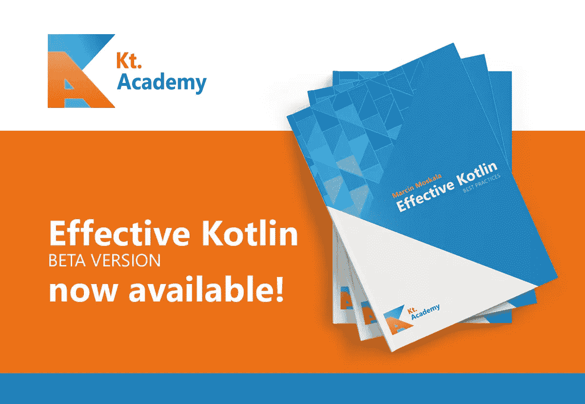

# 有效的 Kotlin 测试版

> 原文：<https://blog.kotlin-academy.com/effective-kotlin-beta-release-6fbf1b68ed3d?source=collection_archive---------1----------------------->

嗨，科特林人，

好消息是，Effective Kotlin 的测试版刚刚发布，读者终于可以使用它了:

详情:[https://blog . kot Lin-academy . com/effective-kot Lin-beta-release-bbf 2e 0 CB 9c 3 f](/effective-kotlin-beta-release-bbf2e0cb9c3f)

如果您错过了我们的最新文章，请查看以下列表:

*   [颤振和科特林多平台关系](/flutter-and-kotlin-multiplatform-relationship-890616005f57)——科特林多平台和颤振能协同工作吗？
*   【HTTP mocking:一个简单的 HTTP mocking 库，供 Kotlin 处理离线模式——当你的应用失去联系远程服务器的能力时会发生什么？

我们还有一个即将举行的在线研讨会，您可能会感兴趣:

*   [面向 Android 开发者的 kot Lin](https://kt.academy/publicWorkshop/androidNovOn)—2019 年 11 月 4 日至 6 日，9:00 至 17:00

如果您在波兰，您可能也会对我们在华沙和克拉科夫组织的研讨会感兴趣:

*   [面向 Android 开发者的 kot Lin](https://kt.academy/pl/publicWorkshop/androidSep)—2019 年 9 月 16 日至 18 日，9:00 至 17:00
*   [面向开发者的 kot Lin](https://kt.academy/pl/publicWorkshop/kotlinSep)—2019 年 9 月 30 日至 10 月 2 日，9:00–17:00
*   [有效科特林](https://kt.academy/pl/publicWorkshop/effectiveOct)—2019 年 10 月 3 日至 4 日，9:00 至 17:00

您可以随时在这里查看我们计划的所有公开研讨会或从这些提案[中询问贵公司的私人研讨会](https://kt.academy/workshop#workshops-offer)。

感谢您阅读我们的文章并和我们一起学习 Kotlin，

卡帕头。学院团队