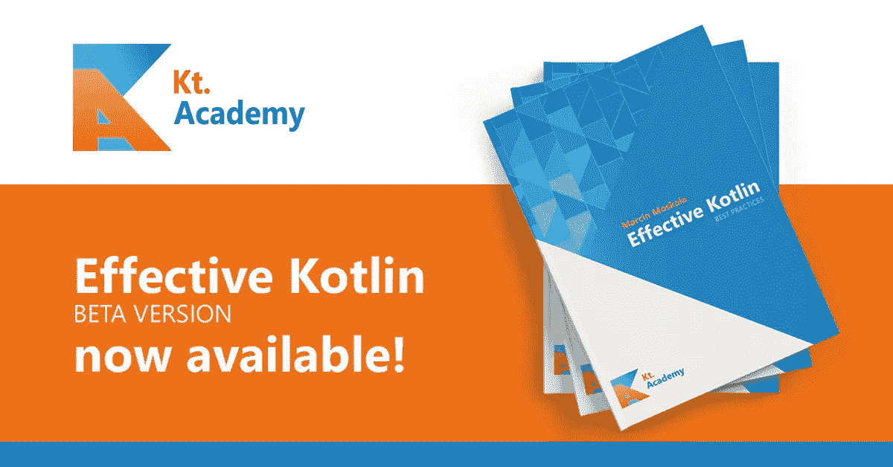

# 有效的 Kotlin 测试版

> 原文：<https://blog.kotlin-academy.com/effective-kotlin-beta-release-bbf2e0cb9c3f?source=collection_archive---------0----------------------->

> 更新:这本书现在很稳定，有电子书版[和纸质版](https://leanpub.com/effectivekotlin/)两种版本。

我花了两年时间。在过去的 6 个月里，写作和研究这个话题是我的兼职工作。它由 12 个人和 6 个 alpha 测试人员审查。数百人留下了他们的电子邮件，以便在文章发表后得到通知。在每次会议上，我都被问到这个问题。它终于来了。**今天，首个正式版的有效科特林终于发行了。**

 [## 有效科特林

### Kotlin 代码质量最佳实践综合指南:安全性、可读性、代码设计和效率。

leanpub.com](https://leanpub.com/effectivekotlin/) 

这是一个测试版，这意味着它可能仍然会在某些地方发生变化。这样做的主要原因是给自己多一点时间，直到我冻结项目标题和编号。我也希望听到你的反馈。这是我们仍然可以在一些建议在我们的社区普及之前修改它们的时候。

本书旨在改变我们如何更好地使用 Kotlin，如何更负责任地使用它。这不是一个容易的目标。这就是为什么我从分析对其他语言最有影响力的最佳实践书籍开始:

*   约书亚·布洛赫的《有效的 Java》
*   Bill Wagner 的有效 C#
*   布雷特·斯拉特金的《有效的 Python》
*   Scott Meyers 的有效 C++

这本书也深受其他书籍的影响:

*   史蒂夫·麦康奈尔完成的代码
*   罗伯特·c·马丁的干净代码
*   罗伯特·马丁的清洁建筑
*   计算机程序的结构和解释

我的目标是从 Kotlin 开发中提取最重要的规则和知识。**我有自己作为开发者、教师、顾问的经历，但我不怕站在巨人的肩膀上看得更多。我的目标是写一本最好的书，让科特林社区变得更好，我相信我已经尽了全力。**

即使是最好的规则，如果被误解或被用到极致，也会带来麻烦。我感到了这种责任，尤其是在过去的 6 个月里，当我重新思考每一条规则以确保它不会造成伤害的时候。我还向科特林世界的重要人物请教了许多规则。当然，评审人员都是经验丰富的开发人员，有些还是他们公司的技术领导。在实践中，所有规则都在一定程度上得到了检验。我已经在以老师的身份教他们，以顾问的身份建议他们。通过这种方式，我可以看到当人们应用它们时它们是如何工作的，并且我就它们进行了许多有趣的对话。这些都让我对这本书的实用性充满信心。

这本书的版本是 0.7 测试版，现在只有电子书。 Beta 状态意味着其 TOC 可以改变。这也意味着我对你的反馈和建议特别感兴趣。现在也更便宜了——电子书的最低价格定为 15 美元。一旦它将达到稳定版本，所有那些较早购买它的人将被更新，电子书的最低价格将改为 20 美元。

这本书将于 11 月出版，印刷版售价 30 美元。

最后，我真的为这本书感到骄傲，我收到了所有评论者和测试者非常热情的反馈。我希望你也会喜欢它，当你喜欢的时候，记得把这本书传播出去。它是自行出版的，所以你的帮助尤其重要。

如果你想购买这个测试版，这里有链接:

 [## 有效科特林

### 这本书对官方的(Kotlin 和 Google 对 Kotlin 的最佳实践)和…

leanpub.com](https://leanpub.com/effectivekotlin/) 

另一方面，这里是免费样品的链接:

# 点击👏帮助其他人了解这本书。

为了获得最新的有效科特林书籍，[订阅时事通讯](http://eepurl.com/gy6P1b)并观察[有效科特林推特](https://twitter.com/EffectiveKotlin)。