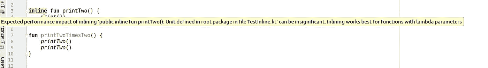

# 有效的 Kotlin:考虑高阶函数的内联修饰符

> 原文：<https://blog.kotlin-academy.com/effective-kotlin-consider-inline-modifier-for-higher-order-functions-758afcaffc11?source=collection_archive---------0----------------------->


您可能已经注意到，所有的集合处理函数都是内联的。你有没有问过自己，为什么他们是这样定义的？例如，下面是 Kotlin stdlib 中的一个简化的`filter`函数:

```
**inline fun** <T> Iterable<T>.filter(predicate: (T)->Boolean): List<T>{
    **val** destination = ArrayList<T>()
    **for** (element **in this**) 
        **if** (predicate(element))
            destination.add(element)
    **return** destination
}
```

这个`inline`修改器有多重要？假设我们有 5 000 件产品，我们需要合计购买的价格。我们可以简单地通过以下方式实现:

```
users.*filter* **{ it**.**bought }**.*sumByDouble* **{ it**.**price }**
```

在我的机器中，平均计算需要 38 毫秒。如果这个功能不是`inline`会是多少钱？在我的机器上平均 42 毫秒。[自己去查](https://github.com/MarcinMoskala/effective-kotlin-tests/blob/master/src/main/kotlin/org/kotlinacademy/InlineFilterBenchmark.kt)。这看起来不是很多，但是当您每次使用方法进行集合处理时，您可以注意到这大约 10%的差异。

当我们修改 lambda 表达式中的局部变量时，可以观察到更大的差异。比较以下功能:

```
**inline fun** repeat(times: Int, action: (Int) -> Unit) {
    **for** (index **in** 0 *until* times) {
        action(index)
    }
}

**fun** noinlineRepeat(times: Int, action: (Int) -> Unit) {
    **for** (index **in** 0 *until* times) {
        action(index)
    }
}
```

您可能已经注意到，除了 name，唯一的区别是 first 有`inline`修饰符，而 second 没有。用法也是一样的:

```
**var** a = 0
repeat(100_000_000) **{** a += 1
**}****var** b = 0
*noinlineRepeat*(100_000_000) **{** b += 1
**}**
```

这里我们在执行时间上有很大的不同。`inlineRepeat`平均用时 0.335 ns，而`noinlineRepeat`平均用时 153 980 484.884 ns。是 46.6 万倍以上！[自己去查](https://github.com/MarcinMoskala/effective-kotlin-tests/blob/master/src/main/kotlin/org/kotlinacademy/InlineRepeatBenchmark.kt)。

为什么这如此重要？这种性能改进有什么代价吗？我们什么时候应该使用行内修饰符？这些都是非常重要的问题，我们会努力回答。尽管一切都需要从更基本的问题开始:行内修饰符是做什么的？

[](https://leanpub.com/effectivekotlin/c/3YYtCtqCC6a4)

# 行内修饰符是做什么的？

我们知道函数通常是如何被调用的。执行跳转到函数体，调用所有语句，然后跳转回调用函数的地方。

尽管当一个函数用`inline`修饰符标记时，编译器会对它进行不同的处理。在代码编译期间，它用自己的主体替换这样的函数调用。`print`是`inline`的功能:

```
**public inline fun** print(message: Int) {
    System.out.print(message)
}
```

当我们定义以下`main`时:

```
**fun** main(args: Array<String>) {
    *print*(2)
    *print*(2)
}
```

编译后，它将如下所示:

```
**fun** main(args: Array<String>) {
    System.*out*.print(2)
    System.*out*.print(2)
}
```

有一点小小的不同，那就是我们不需要跳转到另一个函数然后返回。虽然这种影响可以忽略不计。这就是为什么当您自己定义这种内联函数时，IDEA IntelliJ 中会出现以下警告:



当我们有 lambda 参数时，IntelliJ 为什么建议使用 inline？因为当我们内联函数体时，我们不需要从参数中创建 lambdas，相反，我们可以将它们内联到调用中。对上述`repeat`函数的调用:

```
repeat(100) { println(**"A"**) }
```

会这样处理编译:

```
**for** (index **in** 0 *until* 1000) {
    println(**"A"**)
}
```

正如你所看到的，lambda 表达式的主体替换了内联函数中的调用。让我们看另一个例子。此`filter`功能用途:

```
val users2 = users.*filter* **{ it**.**bought }**
```

将替换为:

```
**val** destination = ArrayList<T>()
**for** (element **in this**) 
    **if** (predicate(element))
        destination.add(element)
val users2 = destination
```

这是一个重要的改进。是因为 JVM 没有天真的支持 lambda 表达式。解释 lambda 表达式是如何编译的相当复杂，但一般来说，有两种选择:

*   匿名类
*   单独的类

让我们看看例子。我们有下面的λ表达式:

```
val lambda: ()->Unit = {
    // body
}
```

它可能是 JVM anonymus 类:

```
// Java
Function0 lambda = **new** Function0() {**public** Object invoke() {
      // code
   }
};
```

或者它可能是在一个单独文件中定义的普通类:

```
// Java
// Additional class in separate file
public class TestInlineKt$lambda implements Function0 {
**public** Object invoke() {
      // code
   }
}// Usage
Function0 lambda = **new** TestInlineKt$lambda()
```

第二种选择更快，只要有可能就使用。当我们需要使用局部变量时，第一个选项(匿名类)是必要的。

这就是为什么我们在修改局部变量时，`repeat`和`noinlineRepeat`会有如此大的差异。非内联函数中的 Lambda 需要编译成匿名类。这是一笔巨大的成本，因为它们的创建和使用都比较慢。当我们使用内联函数时，我们根本不需要创建任何额外的类。你自己检查一下。将这段代码编译和反编译成 Java:

```
**fun** main(args: Array<String>) {
    **var** a = 0
    *repeat*(100_000_000) **{** a += 1
    **}
    var** b = 0
    *noinlineRepeat*(100_000_000) **{** b += 1
    **}** }
```

您会发现与此类似的内容:

```
// Java
**public static final void** main(@NotNull String[] args) {
   **int** a = 0;
   **int** times$iv = 100000000;
   **int** var3 = 0;

   **for**(**int** var4 = times$iv; var3 < var4; ++var3) {
      ++a;
   }

   **final** IntRef b = **new** IntRef();
   b.element = 0;
   noinlineRepeat(100000000, (Function1)(**new** Function1() {**public** Object invoke(Object var1) {
         ++b.element;
         **return** Unit.INSTANCE;
      }
   }));
}
```

在`filter`的例子中，改进不是很明显，因为非内联版本的 lambda 表达式被编译成普通类。它的创建和使用很快，但仍然有成本，所以我们有大约 10%的差异。

[](https://kotlin-academy.us17.list-manage.com/subscribe?u=5d3a48e1893758cb5be5c2919&id=d2ba84960a)

# 收集流处理与传统方式

内联修饰符是一个关键元素，它使得流方式的集合处理与基于循环的经典处理一样有效。它经过了一次又一次的测试，传统的处理在代码可读性方面的代价是巨大的，而在性能方面的改进很小或者没有。例如，下面的代码:

```
return data.filter { filterLoad(it) }.map { mapLoad(it) }
```

工作原理和执行时间与此相同:

```
val list = ArrayList<String>()
for (it in data) {
    if (filterLoad(it)) {
        val value = mapLoad(it)
        list.add(value)
    }
}
return list
```

基准测试的具体结果(此处代码为):

```
Benchmark           (size) Mode  Cnt        Score    Error  Units
filterAndMap           10  avgt  200      561.249 ±      1  ns/op
filterAndMap         1000  avgt  200    29803.183 ±    127  ns/op
filterAndMap       100000  avgt  200  3859008.234 ±  50022  ns/op

filterAndMapManual     10  avgt  200      526.825 ±      1  ns/op
filterAndMapManual   1000  avgt  200    28420.161 ±     94  ns/op
filterAndMapManual 100000  avgt  200  3831213.798 ±  34858  ns/op
```

从程序的角度来看，这两个功能几乎相等。虽然从可读性的角度来看，第一个选项要好得多。这就是为什么我们总是倾向于使用智能集合处理功能，而不是自己实现整个处理。此外，如果我们需要其他不是 stdlib 的集合处理函数，请毫不犹豫地编写自己的函数。例如，这是我在上一个项目中添加的函数，当时我需要转置列表列表:

```
**fun** <E> List<List<E>>.transpose(): List<List<E>> {
    **if** (isEmpty()) **return this

    val** width = *first*().**size
    if** (*any* **{ it**.**size** != width **}**) {
        **throw** IllegalArgumentException(**"All nested lists must have the same size, but sizes were ${***map* **{ it**.**size }}"**)
    }

    **return** (0 *until* width).*map* **{** col **->** (0 *until* **size**).*map* **{** row **-> this**[row][col] **}
    }** }
```

只要记得写一些单元测试:

```
**class** TransposeTest {

    **private val list** = *listOf*(*listOf*(1, 2, 3), *listOf*(4, 5, 6))

    @Test
    **fun** `Transposition of transposition is identity`() {
        Assert.assertEquals(**list**, **list**.*transpose*().*transpose*())
    }

    @Test
    **fun** `Simple transposition test`() {
        **val** transposed = *listOf*(*listOf*(1, 4), *listOf*(2, 5), *listOf*(3, 6))
        assertEquals(transposed, **list**.*transpose*())
    }
}
```

# 内嵌修改量的成本

内联不应该使用得太频繁，因为它也有成本。假设我真的很喜欢打印 2。我首先定义了以下函数:

```
**inline fun** twoPrintTwo() {
    *print*(2)
    *print*(2)
}
```

对我来说还不够，所以我增加了这个功能:

```
**inline fun** twoTwoPrintTwo() {
    *twoPrintTwo*()
    *twoPrintTwo*()
}
```

还是不满意。我定义了以下函数:

```
**inline fun** twoTwoTwoPrintTwo() {
    *twoTwoPrintTwo*()
    *twoTwoPrintTwo*()
}

**fun** twoTwoTwoTwoPrintTwo() {
    *twoTwoTwoPrintTwo*()
    *twoTwoTwoPrintTwo*()
}
```

然后我决定检查一下我在编译的代码中有什么，所以我把它编译成 JVM 字节码，再反编译成 Java。`twoTwoPrintTwo`已经相当大了:

```
**public static final void** twoTwoPrintTwo() {
   **byte** var1 = 2;
   System.***out***.print(var1);
   var1 = 2;
   System.***out***.print(var1);
   var1 = 2;
   System.***out***.print(var1);
   var1 = 2;
   System.***out***.print(var1);
}
```

但是`twoTwoTwoTwoPrintTwo`真的很吓人:

```
**public static final void** twoTwoTwoTwoPrintTwo() {
   **byte** var1 = 2;
   System.***out***.print(var1);
   var1 = 2;
   System.***out***.print(var1);
   var1 = 2;
   System.***out***.print(var1);
   var1 = 2;
   System.***out***.print(var1);
   var1 = 2;
   System.***out***.print(var1);
   var1 = 2;
   System.***out***.print(var1);
   var1 = 2;
   System.***out***.print(var1);
   var1 = 2;
   System.***out***.print(var1);
   var1 = 2;
   System.***out***.print(var1);
   var1 = 2;
   System.***out***.print(var1);
   var1 = 2;
   System.***out***.print(var1);
   var1 = 2;
   System.***out***.print(var1);
   var1 = 2;
   System.***out***.print(var1);
   var1 = 2;
   System.***out***.print(var1);
   var1 = 2;
   System.***out***.print(var1);
   var1 = 2;
   System.***out***.print();
}
```

这显示了内联函数的主要问题:当我们过度使用它们时，代码增长非常快。这实际上是为什么 IntelliJ 在我们使用它们时会给出警告并且不太可能改进的一个原因。

[](https://www.kt.academy/)

# 内嵌修饰符使用的不同方面

内联修饰符，由于它的特性，比我们在本文中看到的变化要大得多。它允许非局部返回和具体化的泛型类型。它也有一些局限性。虽然这与有效的 Kotlin 系列无关，并且这是一篇单独文章的材料。如果你想让我写，就在推特上或者评论里表达出来。

# 一般来说，我们什么时候应该使用行内修饰符？

我们使用`inline`修饰符最重要的情况是当我们用参数函数定义类似 util 的函数时。集合或字符串处理(如`filter`、`map`或`joinToString`)或只是独立的函数(如`repeat`)就是很好的例子。

这就是为什么`inline`修饰符对于库开发者来说是一个重要的优化。他们应该知道它是如何工作的，它的改进和成本是什么。当我们用函数类型参数定义自己的 util 函数时，我们将在项目中使用`inline`修饰符。

当我们没有函数类型参数、具体化类型参数，并且不需要非局部返回时，那么我们很可能不应该使用`inline`修饰符。这就是为什么我们会在 Android Studio 或 IDEA IntelliJ 上有一个警告。

其他情况更复杂，我们需要基于直觉。在本系列的后面，我们将看到，有时并不清楚哪种优化更好。在这种情况下，我们需要基于测量或某人的专业知识。

# 有效科特林

这是第一篇关于有效科特林的文章。当我们看到兴趣，我们将出版下一部分。在 Kot。学院我们也在研究关于这个主题的书:

[](https://leanpub.com/effectivekotlin) [## 有效科特林

### 这本书对官方的(Kotlin 和 Google 对 Kotlin 的最佳实践)和…

leanpub.com](https://leanpub.com/effectivekotlin) 

它将涵盖更广泛的主题，并深入其中的每一个问题。它还将包括 Kotlin 和 Google 团队发布的最佳实践、与我们合作的 Kotlin 团队成员的经验，以及“Kotlin 中的有效 Java”系列中涉及的主题。为了支持它并使我们更快地发布它，[使用此链接并订阅](https://leanpub.com/effectivekotlin)。

你需要 Kotlin 工作室吗？访问[我们的网站](https://www.kt.academy/)，看看我们能为您做些什么。

了解卡帕头最新的重大新闻。学院，[订阅时事通讯](https://kotlin-academy.us17.list-manage.com/subscribe?u=5d3a48e1893758cb5be5c2919&id=d2ba84960a)，[观察 Twitter](https://twitter.com/ktdotacademy) 并在 medium 上关注我们。

在 Twitter 上引用我，用 [@MarcinMoskala](https://twitter.com/marcinmoskala) 。

喜欢的话记得**拍**。请注意，如果您按住鼓掌按钮，您可以留下更多的掌声。

感谢 [Ilya Ryzhenkov](https://twitter.com/orangy) 的指正和重要建议。