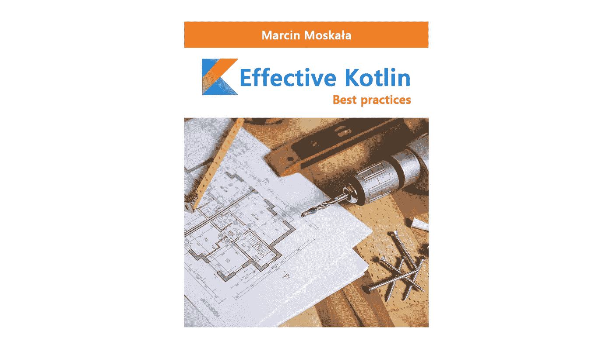

# 有效的 Kotlin —早期访问计划

> 原文：<https://blog.kotlin-academy.com/effective-kotlin-early-access-program-8e5d0ee9dbcd?source=collection_archive---------2----------------------->

更新:我们已经关闭了超过 400 个提交的列表！非常感谢你的热情。现在我们已经在 EAP 过程中。

[有效科特林书](https://leanpub.com/effectivekotlin)离每周完成越来越近。今天，我想邀请您参与本书的创作。我很高兴地宣布，我们开始 EAP(早期接入计划)，您可以参与其中。

# 它是如何工作的？

要参与该计划，您需要填写本文末尾的表格。在发送的提案中，我们将选择一组审阅者。如果你被选中，我们会在接下来的周末里，一个接一个地给你发送有效的科特林书的章节。对于每一章，我们将征求您的意见。不仅仅是修正还有感受，喜欢什么，困惑什么，听起来怪怪的却不知道为什么……一切！你给我们的评论越多越好。

# 你会得到什么？

我们为参与该计划的所有人提供一些福利:

*   你可以免费提前使用这本书。
*   每一个活跃的评论者都会在书中被指名道姓的感谢。
*   我还会把 3 个最活跃的评论者的简历放在书里。
*   每一个活跃的评论家将会收到一本书的签名本，并附上个人的感谢信。
*   你会对这本书产生影响。

详细情况将与我们对您的建议的答复一起发送。

> 觉得服气？填写下面的表格！

如果你想在书出版时得到通知[，在这里注册](https://leanpub.com/effectivekotlin)！